# 🤖 Basic ADK Agent Example

[](https://google.github.io/adk-docs/)
[](.)
[](https://www.python.org/downloads/)

> 🎯 **Your First Step into AI Agent Development** - Learn the fundamentals of creating intelligent agents with Google's ADK

## 🧠 What is an ADK Agent?

The `LlmAgent` (often aliased simply as `Agent`) is the **brain** 🧠 of your AI application. It's a core component in ADK that acts as the "thinking" part of your system.

### 🔋 Core Capabilities

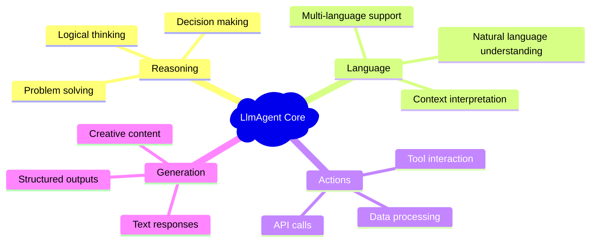

| Capability | Description | Use Cases |
|------------|-------------|-----------|
| 🧮 **Reasoning** | Logical thinking and problem-solving | Analysis, planning, strategy |
| 🗣️ **Language Understanding** | Natural language processing | Chat, Q&A, translation |
| 🎯 **Decision Making** | Dynamic behavior based on context | Routing, tool selection |
| 📝 **Response Generation** | Creating human-like responses | Content creation, explanations |
| 🛠️ **Tool Interaction** | External system integration | APIs, databases, services |

### 🆚 Deterministic vs. Non-Deterministic Agents

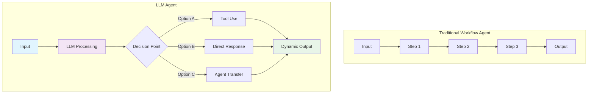

> 💡 **Key Insight**: Unlike deterministic workflow agents that follow predefined paths, an `LlmAgent`'s behavior is **non-deterministic**. It uses the LLM to interpret instructions and context, deciding dynamically how to proceed!

## 📁 Required Agent Structure

For ADK to discover and run your agents properly (especially with `adk web`), your project **must** follow this specific structure:

### 🏗️ Project Architecture

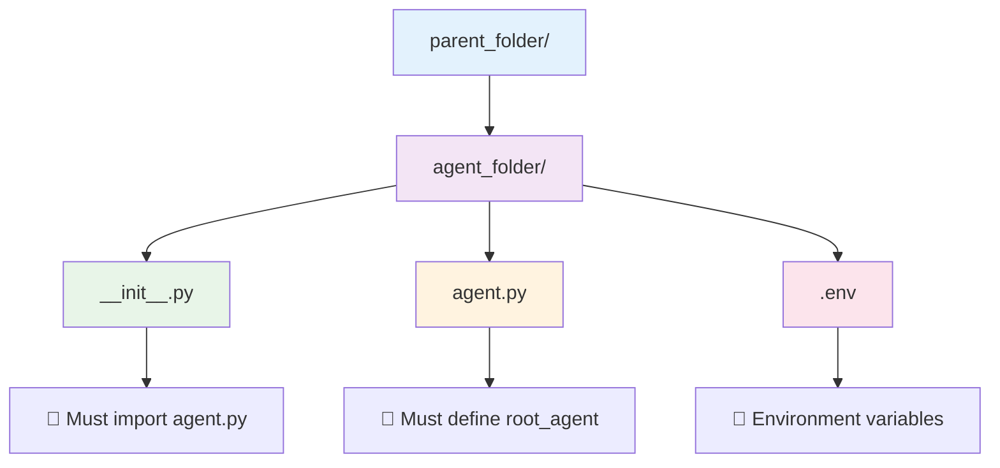

```
parent_folder/
    agent_folder/         # 📦 Your agent's package directory
        __init__.py       # 📝 Must import agent.py
        agent.py          # 🎯 Must define root_agent
        .env              # 🔑 Environment variables
```

### 🔧 Essential Components

| Component | Purpose | Requirements | Example |
|-----------|---------|--------------|---------|
| 📄 **`__init__.py`** | Agent Discovery | `from . import agent` | Makes agent discoverable |
| 🎯 **`agent.py`** | Entry Point | Define `root_agent` | Main agent definition |
| 🔑 **`.env`** | Configuration | API keys, settings | `GOOGLE_API_KEY=...` |
| 📍 **Command Location** | Execution Context | Run from parent folder | `adk web` from parent |

### ⚠️ Important Notes

> 🚨 **Critical**: Always run `adk` commands from the **parent directory**, not from inside the agent directory!

```bash
# ✅ Correct - from parent folder
cd parent_folder/
adk web

# ❌ Wrong - from agent folder  
cd parent_folder/agent_folder/
adk web  # This won't work!
```

## 🔧 Key Components Deep Dive

### 1️⃣ Identity Configuration

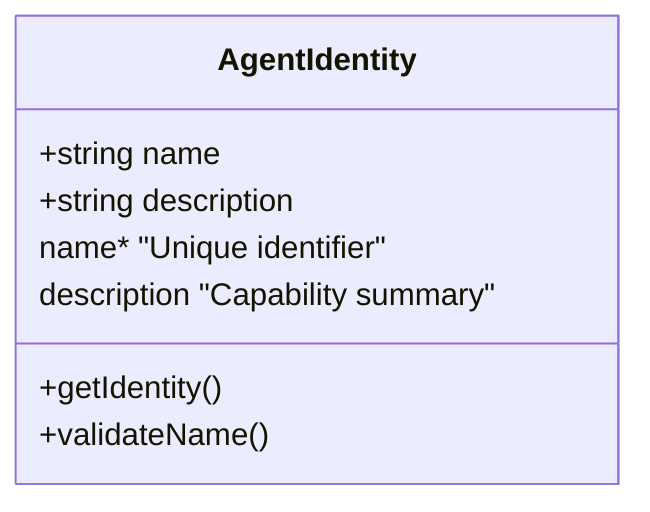

| Property | Status | Purpose | Example |
|----------|--------|---------|---------|
| 🏷️ **name** | Required | Unique string identifier | `"greeting_agent"` |
| 📝 **description** | Recommended | Capability summary for routing | `"Friendly agent for greetings"` |

### 2️⃣ Model Selection

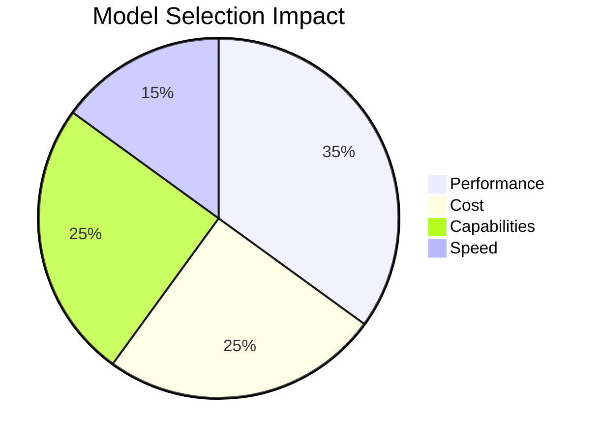

| Model | Performance | Cost | Best For |
|-------|-------------|------|----------|
| 🚀 **gemini-2.0-flash** | High | Medium | General purpose |
| ⚡ **gemini-1.5-pro** | Very High | High | Complex reasoning |
| 💨 **gemini-1.5-flash** | Medium | Low | Simple tasks |

### 3️⃣ Instructions (The Magic ✨)

**The most critical parameter** for shaping your agent's behavior!

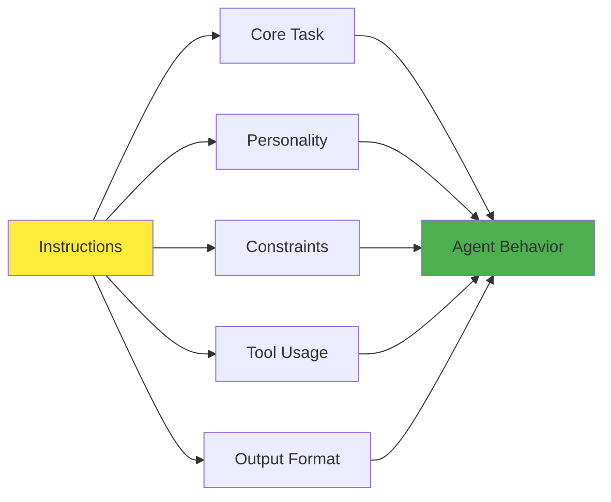

#### 📋 Instruction Components

| Component | Purpose | Example |
|-----------|---------|---------|
| 🎯 **Core Task** | Primary objective | "Help users with greetings" |
| 🎭 **Personality** | Behavioral style | "Be friendly and welcoming" |
| 🚫 **Constraints** | Behavioral limits | "Keep responses concise" |
| 🛠️ **Tool Usage** | How to use tools | "Use translation tool for languages" |
| 📄 **Output Format** | Response structure | "Respond in markdown format" |

### 4️⃣ Tools Integration

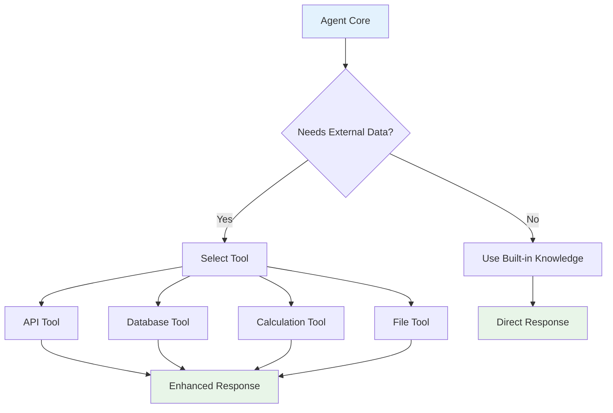

## 🚀 Getting Started

### 📋 Prerequisites Checklist

- [ ] ✅ Virtual environment activated
- [ ] 🔑 Google API key configured
- [ ] 📁 Proper folder structure
- [ ] 📦 Dependencies installed

### 🔧 Environment Setup

```bash
# 🔌 Activate virtual environment (from parent directory)
# macOS/Linux:
source ../.venv/bin/activate

# Windows CMD:
..\.venv\Scripts\activate.bat

# Windows PowerShell:
..\.venv\Scripts\Activate.ps1
```

### 🔑 API Key Configuration

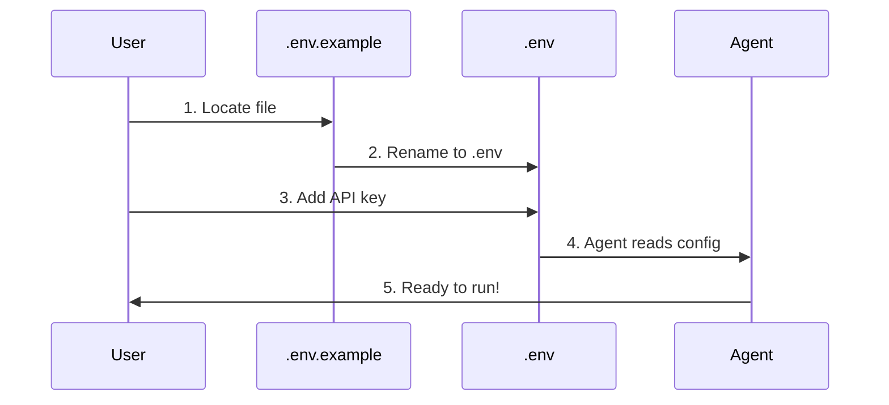

| Step | Action | Command/Location |
|------|--------|------------------|
| 1️⃣ | **Locate Template** | Find `.env.example` in agent folder |
| 2️⃣ | **Rename File** | Change to `.env` |
| 3️⃣ | **Add API Key** | `GOOGLE_API_KEY=your_key_here` |
| 4️⃣ | **Verify Setup** | Check agent loads correctly |

## 🎮 Running the Example

### 🌐 Interactive Web UI (Recommended)

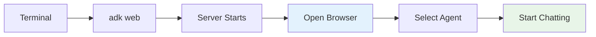

#### 🔄 Step-by-Step Process

| Step | Action | Details |
|------|--------|---------|
| 1️⃣ | **Navigate** | `cd 1-basic-agent` |
| 2️⃣ | **Start Server** | `adk web` |
| 3️⃣ | **Open Browser** | Visit `http://localhost:8000` |
| 4️⃣ | **Select Agent** | Choose from dropdown (top-left) |
| 5️⃣ | **Start Chatting** | Use textbox at bottom |

### 🛠️ Alternative Run Methods

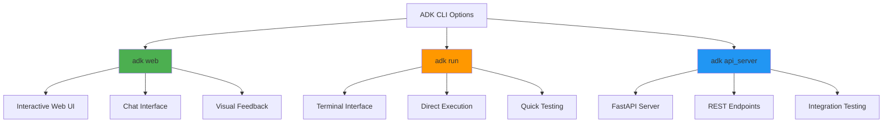

| Method | Command | Use Case | Interface |
|--------|---------|----------|-----------|
| 🌐 **Web UI** | `adk web` | Interactive testing | Browser-based |
| 💻 **Terminal** | `adk run [agent_name]` | Quick testing | Command line |
| 🔌 **API Server** | `adk api_server` | Integration testing | REST API |

### 🔧 Troubleshooting Guide

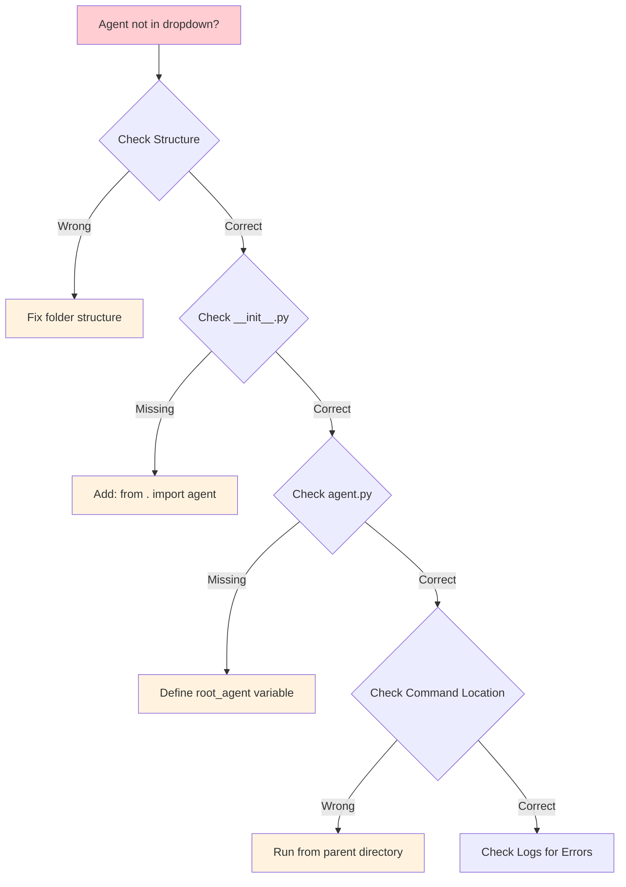

#### 🚨 Common Issues & Solutions

| Issue | Possible Cause | Solution |
|-------|----------------|----------|
| 🚫 **Agent not in dropdown** | Wrong directory | Run `adk web` from parent folder |
| 🔍 **Import errors** | Missing `__init__.py` import | Add `from . import agent` |
| 🎯 **Agent not found** | Missing `root_agent` | Define in `agent.py` |
| 🔑 **API errors** | Invalid key | Check `.env` file |

## 💬 Example Prompts to Try

### 🌍 Multi-Language Greetings

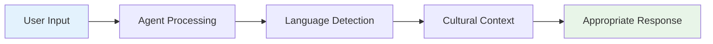

| Category | Prompt Examples | Expected Response Type |
|----------|-----------------|----------------------|
| 🇪🇸 **Spanish** | "How do you say hello in Spanish?" | Language translation |
| 🇯🇵 **Japanese** | "What's a formal greeting in Japanese?" | Cultural context |
| 🇫🇷 **French** | "Tell me how to greet someone in French" | Detailed explanation |
| 🤝 **Professional** | "How should I greet a business client?" | Professional advice |
| 👋 **Casual** | "What's a casual way to say hi?" | Informal suggestions |

### 🎯 Test Scenarios

#### 🔰 Basic Tests
- ✅ Simple greeting requests
- ✅ Language-specific queries  
- ✅ Cultural context questions

#### 🔄 Advanced Tests  
- ✅ Multi-part conversations
- ✅ Context retention
- ✅ Error handling

## 🎉 Success Indicators

### ✅ Your Agent is Working When:

| Indicator | Description | What to Look For |
|-----------|-------------|------------------|
| 🎯 **Responsive** | Answers quickly | < 3 second responses |
| 🧠 **Contextual** | Understands prompts | Relevant answers |
| 🎭 **Consistent** | Maintains personality | Friendly, helpful tone |
| 🔄 **Interactive** | Engages in conversation | Asks follow-up questions |

## 🚪 Exit Options

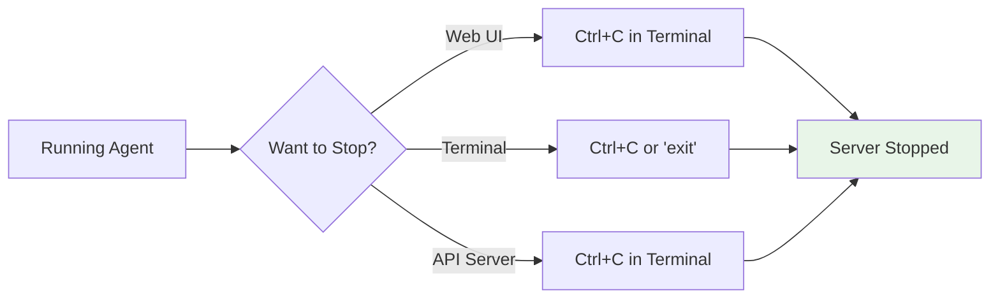

> 🛑 **Stop the conversation** or server by pressing `Ctrl+C` in your terminal

## 🎓 What You've Learned

This example demonstrates the **fundamentals of agent creation** with ADK:

### 🏆 Key Achievements

- [ ] 🤖 Created your first AI agent
- [ ] 📁 Understood project structure requirements  
- [ ] 🔧 Configured development environment
- [ ] 🌐 Used multiple interaction methods
- [ ] 💬 Tested conversational capabilities
- [ ] 🔧 Learned troubleshooting techniques

### 🚀 Next Steps

Ready to level up? Check out these advanced examples:

| Next Example | Focus | Complexity |
|--------------|-------|------------|
| 🛠️ **Tool Agent** | External integrations | ⭐⭐ |
| 🔄 **LiteLLM Agent** | Model flexibility | ⭐⭐ |
| 📊 **Structured Outputs** | Data formatting | ⭐⭐ |

---

<div align="center">

### 🎉 Congratulations! 

You've successfully created and run your first ADK agent! 

[](../2-tool-agent/)
[](../)

*Ready to add superpowers to your agent? Let's explore tools! 🛠️*

</div>