# ⚡ Sequential Agent Systems in ADK

[](https://google.github.io/adk-docs/)
[](.)
[](https://www.python.org/downloads/)
[](.)
[](.)

> 🎯 **Master Systematic Workflow Processing** - Learn to design and implement sophisticated pipeline architectures where agents execute in carefully orchestrated sequences to achieve complex, multi-stage objectives

## 📐 Sequential Processing Paradigm

### 🔬 **Theoretical Foundation**

**Sequential Agent Systems** represent a fundamental paradigm in computational workflow design, where complex problems are decomposed into discrete, ordered processing stages. Each stage transforms the input data according to specific algorithmic requirements, creating a deterministic pipeline that ensures consistent, reproducible outcomes.

### 📊 **Processing Architecture Taxonomy**

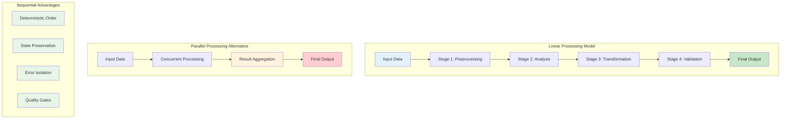

### 🎯 **Paradigm Comparison Matrix**

| **Processing Model** | **Determinism** | **State Management** | **Error Handling** | **Scalability** | **Use Cases** |
|---------------------|-----------------|---------------------|-------------------|-----------------|---------------|
| 🔄 **Sequential** | ✅ Guaranteed | ✅ Preserved | ✅ Isolated | ⚠️ Limited | Quality pipelines |
| ⚡ **Parallel** | ❌ Variable | ⚠️ Complex | ❌ Distributed | ✅ High | Performance tasks |
| 🌐 **Hybrid** | ⚠️ Conditional | ✅ Managed | ✅ Comprehensive | ✅ Excellent | Enterprise systems |

## 🏗️ **Architectural Framework**

### 🔧 **Pipeline Component Hierarchy**

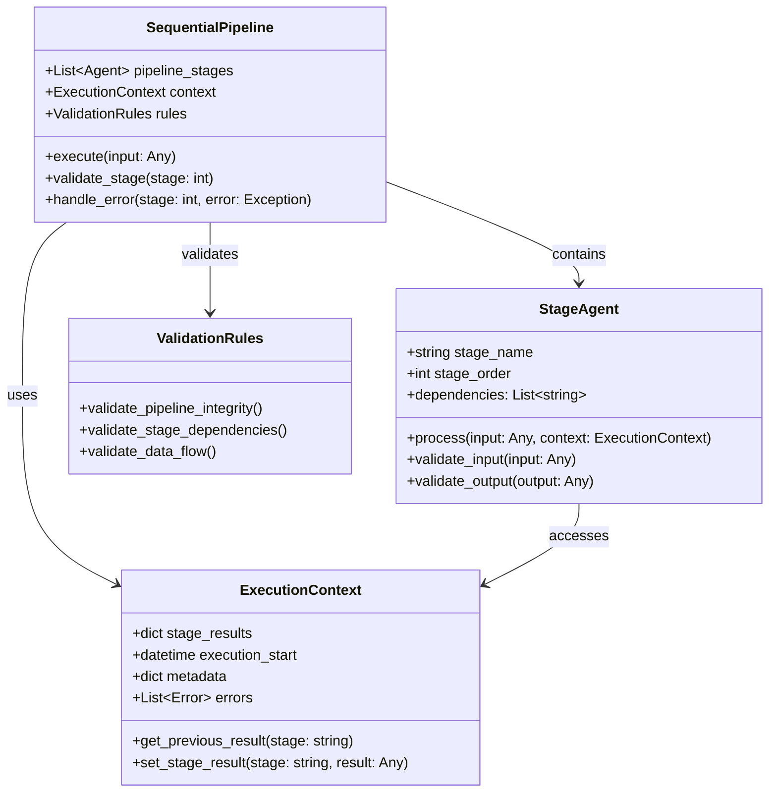

### 📋 **Stage Execution Protocol**

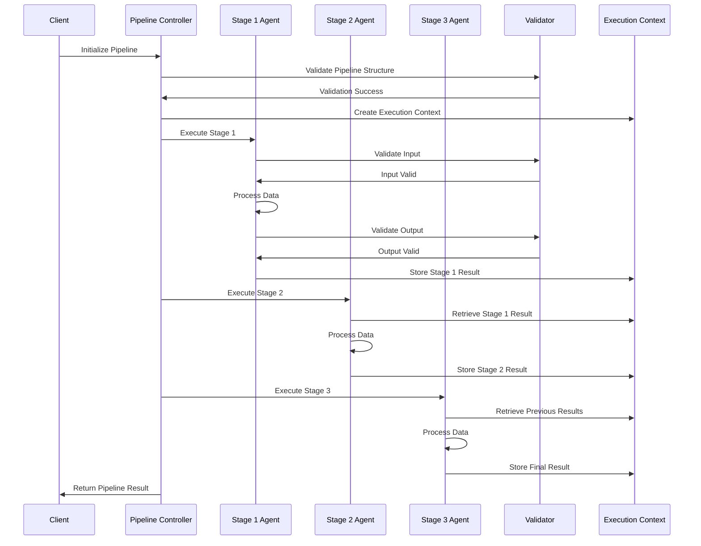

## 🎯 **Implementation Exemplar: Document Processing Pipeline**

### 📄 **Use Case Specification**

Our exemplar implementation demonstrates a sophisticated **Document Intelligence Pipeline** that processes unstructured text through multiple specialized stages to extract actionable insights.

### 🔄 **Pipeline Stage Architecture**

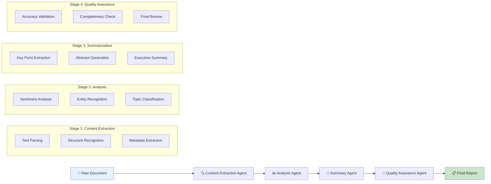

### 📊 **Agent Specialization Matrix**

| **Agent** | **Primary Function** | **Input Dependencies** | **Output Specifications** | **Quality Metrics** |
|-----------|---------------------|----------------------|---------------------------|-------------------|
| 🔍 **Content Extraction** | Text & structure parsing | Raw document files | Structured text objects | Parse accuracy >95% |
| 📊 **Analysis** | Semantic understanding | Extracted content | Analysis metadata | Entity precision >90% |
| 🎯 **Summary** | Information synthesis | Analysis results | Condensed summaries | Relevance score >85% |
| 💎 **Quality Assurance** | Validation & verification | All previous outputs | Quality assessment | Error rate <5% |

## 🏗️ **Project Structure Framework**

### 📁 **Hierarchical Organization Schema**

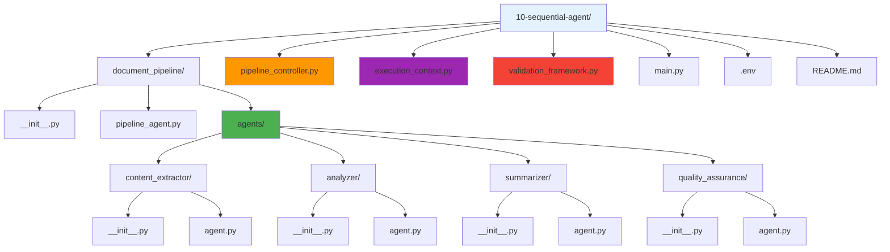

```
10-sequential-agent/
│
├── document_pipeline/              # 🎯 Main Pipeline Package
│   ├── __init__.py                # 📦 Package initialization
│   ├── pipeline_agent.py          # 🔄 Sequential coordinator
│   └── agents/                    # 🏢 Processing Specialists
│       ├── content_extractor/     # 🔍 Stage 1: Content extraction
│       │   ├── __init__.py        # 📦 Agent package
│       │   └── agent.py           # 🤖 Extraction specialist
│       ├── analyzer/              # 📊 Stage 2: Analysis processing
│       │   ├── __init__.py        # 📦 Agent package
│       │   └── agent.py           # 🧠 Analysis specialist
│       ├── summarizer/            # 🎯 Stage 3: Summarization
│       │   ├── __init__.py        # 📦 Agent package
│       │   └── agent.py           # ✨ Summary specialist
│       └── quality_assurance/     # 💎 Stage 4: Quality control
│           ├── __init__.py        # 📦 Agent package
│           └── agent.py           # 🔍 QA specialist
│
├── pipeline_controller.py         # 🎛️ Execution orchestration
├── execution_context.py          # 📊 State management
├── validation_framework.py       # ✅ Quality assurance
├── main.py                       # 🚀 Application entry point
├── .env                         # 🔑 Environment configuration
└── README.md                    # 📖 Documentation
```

## 🔧 **Core Components Deep Dive**

### 1️⃣ **Pipeline Controller Architecture**

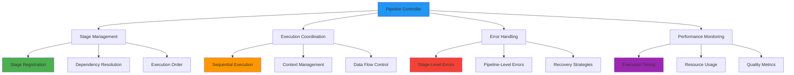

#### 🎛️ **Controller Implementation Schema**

```python
class PipelineController:
    """
    Advanced sequential pipeline orchestration system.
    
    Manages the execution of multi-stage agent workflows with
    comprehensive error handling, state management, and validation.
    """
    
    def __init__(self, stages: List[StageAgent], validation_rules: ValidationRules):
        self.stages = stages
        self.validation_rules = validation_rules
        self.execution_context = ExecutionContext()
        
    async def execute_pipeline(self, input_data: Any) -> PipelineResult:
        """Execute the complete sequential pipeline."""
        # Implementation details...
        
    def validate_pipeline_integrity(self) -> ValidationResult:
        """Ensure pipeline structure and dependencies are valid."""
        # Implementation details...
```

### 2️⃣ **Execution Context Management**

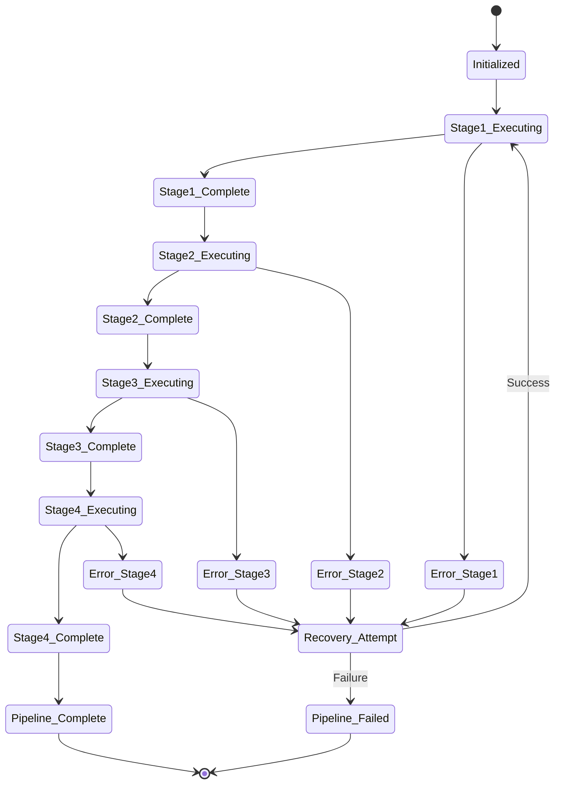

### 3️⃣ **Inter-Stage Communication Protocol**

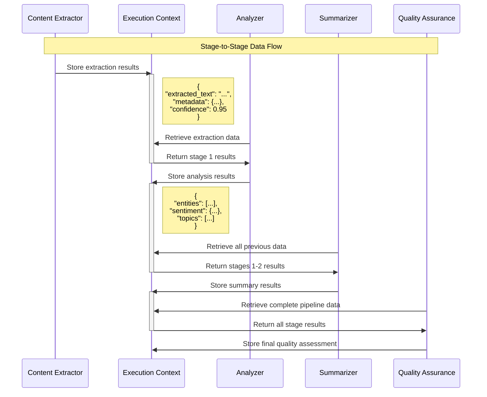

## 🚀 **Deployment and Execution Framework**

### 📋 **Prerequisites Verification Matrix**

| **Component** | **Requirement** | **Verification Method** | **Status** |
|---------------|-----------------|------------------------|------------|
| 🐍 **Python Runtime** | Version 3.8+ | `python --version` | ⬜ |
| 🔑 **API Configuration** | Google API Key | Environment validation | ⬜ |
| 📦 **Dependencies** | ADK packages | `pip list \| grep adk` | ⬜ |
| 🏗️ **Project Structure** | Directory hierarchy | File system check | ⬜ |
| 💾 **Virtual Environment** | Isolated dependencies | `which python` | ⬜ |

### 🔧 **Environment Configuration Protocol**

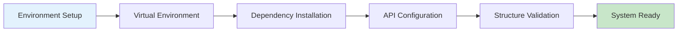

#### 🔌 **Activation Procedures**

```bash
# 🔌 Virtual Environment Activation Protocol
# Linux/macOS Systems:
source ../.venv/bin/activate

# Windows Command Prompt:
..\.venv\Scripts\activate.bat

# Windows PowerShell:
..\.venv\Scripts\Activate.ps1

# ✅ Verification Command:
which python  # Should point to .venv/bin/python
```

#### 🔑 **Configuration Specifications**

```bash
# Environment Variable Configuration
GOOGLE_API_KEY=your_google_api_key_here
PIPELINE_LOG_LEVEL=INFO
EXECUTION_TIMEOUT=300
VALIDATION_STRICT_MODE=true
```

## 🎮 **Operational Execution Framework**

### 🌐 **Interactive Web Interface**

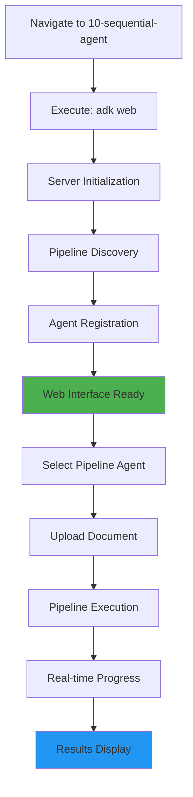

### 💻 **Command-Line Interface**

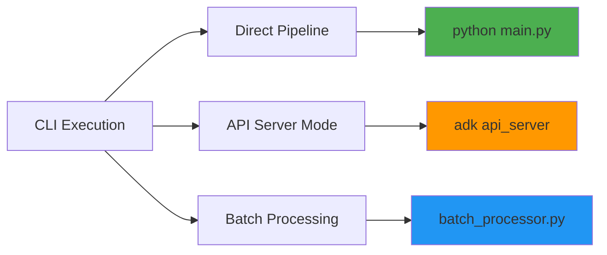

### 📊 **Execution Methods Comparison**

| **Method** | **Interface** | **Use Case** | **Advantages** | **Limitations** |
|------------|---------------|--------------|----------------|-----------------|
| 🌐 **Web UI** | Browser-based | Interactive testing | Visual feedback, real-time monitoring | Single document focus |
| 💻 **CLI Direct** | Command line | Development, debugging | Fast execution, detailed logs | Limited visualization |
| 🔌 **API Server** | REST endpoints | Integration testing | Programmatic access, scalability | Setup complexity |
| 📦 **Batch Mode** | File processing | Production workflows | High throughput, automation | Less interactive control |

## 💬 **Comprehensive Testing Scenarios**

### 📄 **Document Processing Test Cases**

```mermaid
graph TB
    A[Test Document Categories] --> B[Technical Documentation]
    A --> C[Business Reports]
    A --> D[Academic Papers]
    A --> E[Legal Documents]
    A --> F[Marketing Content]
    
    B --> B1[API Documentation]
    B --> B2[User Manuals]
    B --> B3[Technical Specifications]
    
    C --> C1[Financial Reports]
    C --> C2[Project Proposals]
    C --> C3[Strategic Plans]
    
    D --> D1[Research Papers]
    D --> D2[Thesis Documents]
    D --> D3[Conference Proceedings]
    
    E --> E1[Contracts]
    E --> E2[Legal Briefs]
    E --> E3[Compliance Documents]
    
    F --> F1[Product Brochures]
    F --> F2[Campaign Materials]
    F --> F3[Social Media Content]
    
    style A fill:#2196f3
    style B1 fill:#4caf50
    style C1 fill:#ff9800
    style D1 fill:#9c27b0
    style E1 fill:#f44336
    style F1 fill:#795548
```

### 🎯 **Expected Processing Outcomes**

#### 📊 **Stage-Specific Output Validation**

| **Stage** | **Input Type** | **Processing Focus** | **Output Validation** | **Quality Threshold** |
|-----------|----------------|---------------------|----------------------|---------------------|
| 🔍 **Content Extraction** | Raw documents | Text parsing, structure | Extracted text completeness | >95% content recovery |
| 📊 **Analysis** | Structured text | Entity recognition, sentiment | Metadata accuracy | >90% entity precision |
| 🎯 **Summarization** | Analysis results | Key point synthesis | Summary relevance | >85% content coverage |
| 💎 **Quality Assurance** | All previous outputs | Comprehensive validation | Final quality score | >92% overall quality |

### 🔄 **Interactive Testing Protocol**

#### 📋 **Systematic Test Execution**

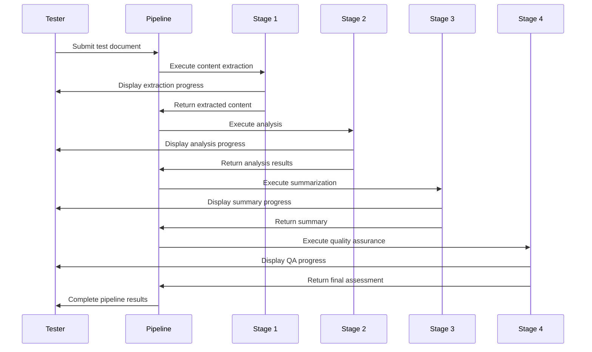

## 🎉 **Success Validation Framework**

### ✅ **Performance Indicators Matrix**

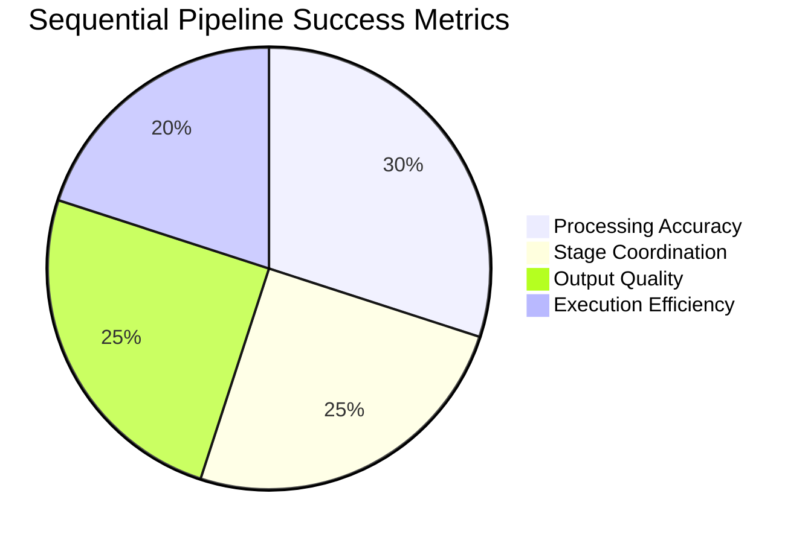

### 📊 **Comprehensive Validation Checklist**

| **Validation Category** | **Specific Indicators** | **Measurement Method** | **Target Threshold** |
|------------------------|-------------------------|------------------------|---------------------|
| 🎯 **Processing Accuracy** | Content extraction completeness | Automated comparison | >95% accuracy |
| 🔄 **Stage Coordination** | Seamless data flow between stages | Pipeline execution logs | Zero coordination errors |
| 💎 **Output Quality** | Final summary relevance and completeness | Human evaluation metrics | >90% quality score |
| ⚡ **Execution Efficiency** | Total pipeline processing time | Performance monitoring | <30 seconds per document |
| 🛡️ **Error Handling** | Graceful failure recovery | Error simulation testing | 100% error capture |
| 📈 **Scalability** | Multiple document processing | Load testing protocols | Linear performance scaling |

### 🔧 **Advanced Validation Procedures**

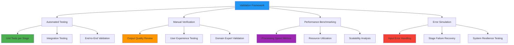

## 🔄 **Advanced Sequential Patterns**

### 🏗️ **Complex Pipeline Architectures**

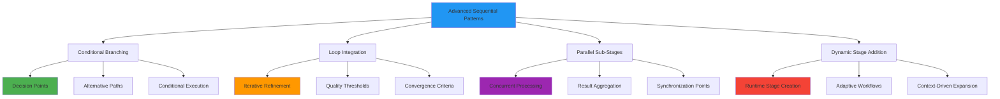

### 📊 **Enterprise Scaling Strategies**

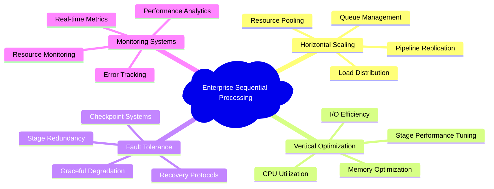

### 🎯 **Quality Assurance Integration**

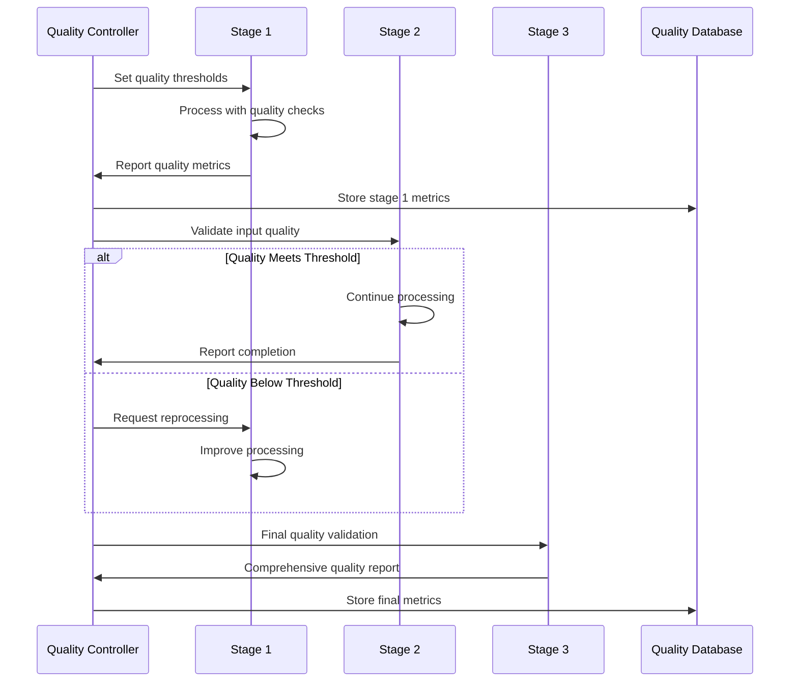

## 🏭 **Production Deployment Considerations**

### 🗄️ **Enterprise Architecture Framework**

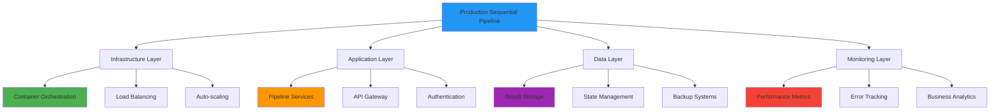

### 📊 **Performance Optimization Matrix**

| **Optimization Target** | **Implementation Strategy** | **Expected Impact** | **Monitoring Metrics** |
|------------------------|----------------------------|-------------------|----------------------|
| 🚀 **Processing Speed** | Parallel sub-stage execution | 40-60% faster processing | Stage execution time |
| 💾 **Memory Efficiency** | Streaming data processing | 50% memory reduction | Memory utilization |
| 🔄 **Throughput** | Pipeline parallelization | 3x throughput increase | Documents per hour |
| 🛡️ **Reliability** | Comprehensive error handling | 99.9% uptime | Error rate, recovery time |
| 📈 **Scalability** | Microservice architecture | Linear scaling capability | Resource scaling metrics |

### 🔐 **Security and Compliance Framework**

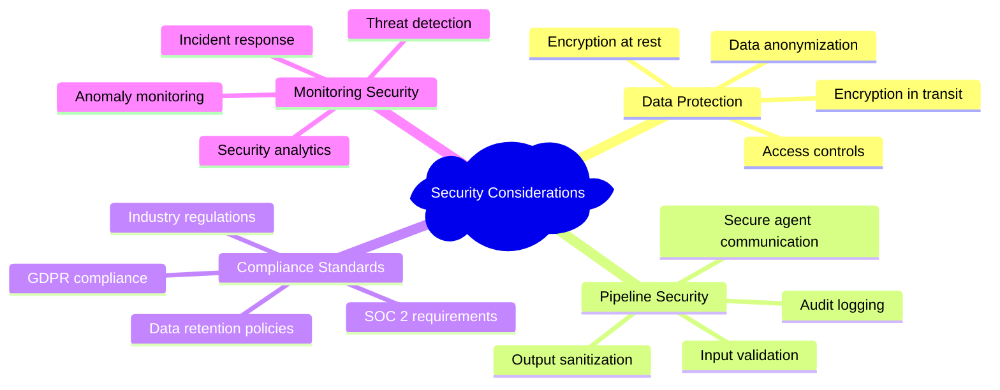

## 🚪 **Troubleshooting and Diagnostics**

### 🔧 **Systematic Issue Resolution**

```mermaid
flowchart TD
    A[Pipeline Issue Detected] --> B{Stage-Specific Error?}
    B -->|Yes| C[Identify Failed Stage]
    B -->|No| D{Data Flow Issue?}
    D -->|Yes| E[Check Inter-Stage Communication]
    D -->|No| F{Performance Issue?}
    F -->|Yes| G[Analyze Resource Utilization]
    F -->|No| H{Quality Issue?}
    H -->|Yes| I[Review Quality Thresholds]
    H -->|No| J[Check System Configuration]
    
    C --> K[Stage-Specific Debugging]
    E --> L[Communication Protocol Review]
    G --> M[Performance Optimization]
    I --> N[Quality Parameter Adjustment]
    J --> O[System-Wide Diagnostics]
    
    style A fill:#f44336
    style K fill:#ff9800
    style L fill:#ff9800
    style M fill:#ff9800
    style N fill:#ff9800
    style O fill:#ff9800
```

### 🛠️ **Diagnostic Command Suite**

```bash
# 🔍 Pipeline Structure Validation
python -c "from document_pipeline.pipeline_agent import pipeline; pipeline.validate_structure()"

# 📊 Stage Dependency Analysis  
python -c "from pipeline_controller import controller; controller.analyze_dependencies()"

# ⚡ Performance Profiling
python -m cProfile main.py --profile-stages

# 🔧 Integration Testing
python -m pytest tests/integration/ -v

# 📈 Performance Benchmarking
python benchmark_pipeline.py --document-set=test_documents/
```

### 📊 **Issue Classification Matrix**

| **Issue Category** | **Symptoms** | **Root Causes** | **Resolution Strategy** |
|-------------------|--------------|-----------------|------------------------|
| 🔄 **Stage Execution** | Stage failures, timeouts | Code errors, resource limits | Debug individual stages |
| 📡 **Communication** | Data not passed between stages | Context management issues | Review data flow protocols |
| ⚡ **Performance** | Slow processing, high resource usage | Inefficient algorithms, bottlenecks | Profile and optimize |
| 💎 **Quality** | Poor output quality, validation failures | Threshold misalignment | Adjust quality parameters |
| 🏗️ **Configuration** | Pipeline not loading, discovery issues | Structure or dependency problems | Validate project structure |

## 🎓 **Learning Outcomes and Mastery**

### 🏆 **Competency Achievement Matrix**

| **Competency Level** | **Skills Acquired** | **Practical Applications** | **Assessment Criteria** |
|---------------------|-------------------|---------------------------|------------------------|
| 🔰 **Foundation** | Basic pipeline concepts | Simple sequential workflows | Can create 2-3 stage pipelines |
| 🎯 **Intermediate** | Advanced stage coordination | Complex document processing | Handles error recovery and validation |
| 🚀 **Advanced** | Enterprise-scale deployment | Production-ready systems | Implements monitoring and optimization |
| 🏆 **Expert** | Architectural design | Custom pipeline frameworks | Creates reusable pipeline patterns |

### 📊 **Knowledge Validation Checklist**

- [ ] 🏗️ Designed and implemented multi-stage sequential pipelines
- [ ] 🔄 Mastered inter-stage communication and data flow protocols
- [ ] 💎 Integrated comprehensive quality assurance mechanisms
- [ ] ⚡ Optimized pipeline performance for production scenarios
- [ ] 🛡️ Implemented robust error handling and recovery systems
- [ ] 📊 Applied monitoring and analytics for pipeline observability
- [ ] 🔧 Troubleshot complex sequential processing issues
- [ ] 🏭 Understood enterprise deployment and scaling strategies

### 🚀 **Advanced Learning Pathways**

```mermaid
graph TD
    A[Current: Sequential Agent Mastery] --> B[Parallel Processing]
    A --> C[Loop Integration]
    A --> D[Enterprise Architecture]
    
    B --> E[Concurrent Agent Execution]
    B --> F[Resource Pool Management]
    
    C --> G[Iterative Refinement Systems]
    C --> H[Adaptive Learning Pipelines]
    
    D --> I[Microservice Architectures]
    D --> J[Cloud-Native Deployment]
    D --> K[Observability Systems]
    
    style A fill:#4caf50
    style B fill:#2196f3
    style C fill:#ff9800
    style D fill:#9c27b0
```

| **Next Learning Module** | **Focus Area** | **Complexity** | **Key Concepts** |
|-------------------------|----------------|-----------------|------------------|
| 🔄 **Parallel Agent** | Concurrent processing | ⭐⭐⭐⭐ | Parallel coordination, resource management |
| 🔁 **Loop Agent** | Iterative refinement | ⭐⭐⭐⭐⭐ | Self-improving systems, convergence |
| 📊 **Callbacks** | Real-time monitoring | ⭐⭐⭐ | Event-driven architecture, observability |

## 📚 **Academic and Professional Resources**

### 🔗 **Authoritative Documentation**

| **Resource Category** | **Specific Focus** | **Reference Link** | **Relevance Level** |
|----------------------|-------------------|-------------------|-------------------|
| 📖 **ADK Sequential Processing** | Official framework documentation | [ADK Sequential Guide](https://google.github.io/adk-docs/agents/sequential/) | 🔥 Essential |
| 🏗️ **Pipeline Architecture** | System design patterns | [Architecture Patterns](https://google.github.io/adk-docs/architecture/pipelines/) | 🎯 High |
| 📊 **Performance Optimization** | Scaling and efficiency | [Performance Guide](https://google.github.io/adk-docs/performance/sequential/) | ⚡ Advanced |
| 🔧 **Troubleshooting** | Diagnostic methodologies | [Debugging Reference](https://google.github.io/adk-docs/troubleshooting/) | 🛠️ Practical |

### 🎯 **Industry Best Practices Framework**

```mermaid
mindmap
  root)Sequential Processing Best Practices(
    Design Principles
      Single Responsibility Principle
      Clear Stage Boundaries
      Minimal Coupling
      Maximum Cohesion
    Implementation Standards
      Comprehensive Error Handling
      Detailed Logging
      Performance Monitoring
      Quality Validation
    Operational Excellence
      Automated Testing
      Continuous Integration
      Deployment Automation
      Incident Response
    Maintenance Strategies
      Code Documentation
      Architecture Reviews
      Performance Tuning
      Capacity Planning
```

### 📊 **Performance Benchmarking Standards**

| **Benchmark Category** | **Industry Standard** | **Measurement Unit** | **Target Threshold** |
|-----------------------|----------------------|---------------------|---------------------|
| 📄 **Processing Latency** | Document processing time | Seconds per document | <30 seconds |
| 🔄 **Throughput Rate** | Documents per unit time | Documents per hour | >120 documents/hour |
| 💾 **Resource Efficiency** | Memory utilization | MB per document | <500 MB average |
| ✅ **Quality Assurance** | Output accuracy | Percentage accuracy | >95% validation success |
| 🛡️ **Reliability** | System uptime | Percentage availability | >99.5% uptime |

---

<div align="center">

### 🎉 **Sequential Processing Mastery Achieved!**

**You have successfully completed the advanced sequential agent processing curriculum**

[](../11-parallel-agent/)
[](../8-stateful-multi-agent/)
[](../)

*Advance to concurrent processing mastery with Parallel Agent systems! 🔄*

</div>
