# 🔄 Parallel Agent Systems in ADK

[](https://google.github.io/adk-docs/)
[](.)
[](https://www.python.org/downloads/)
[](.)
[](.)

> 🎯 **Master Concurrent Agent Orchestration** - Advanced parallel processing architectures for maximum performance, resource optimization, and enterprise-scale concurrent task execution

## 📐 **Theoretical Foundation: Parallel Processing Paradigms**

### 🔬 **Computational Concurrency Theory**

**Parallel Agent Systems** represent the pinnacle of computational efficiency in distributed agent architectures, implementing sophisticated concurrent processing patterns that maximize resource utilization while maintaining system coherence and data integrity.

### 📊 **Processing Model Taxonomy**

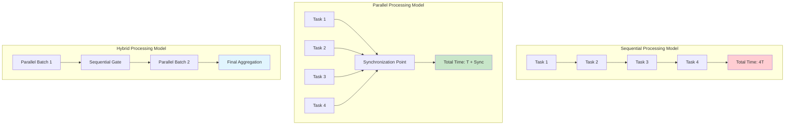

### 🎯 **Concurrency Performance Matrix**

| **Processing Architecture** | **Throughput** | **Latency** | **Resource Utilization** | **Complexity** | **Optimal Use Cases** |
|---------------------------|---------------|-------------|-------------------------|----------------|---------------------|
| 🔄 **Sequential** | Low | High | 25% | Minimal | Simple, dependent tasks |
| ⚡ **Parallel** | Very High | Low | 90%+ | High | Independent, CPU-intensive |
| 🌐 **Hybrid** | High | Medium | 75% | Medium | Mixed dependency patterns |
| 🔗 **Pipeline-Parallel** | Maximum | Variable | 95% | Very High | Streaming, real-time processing |

## 🏗️ **Advanced Architectural Framework**

### 🔧 **Concurrent System Components**

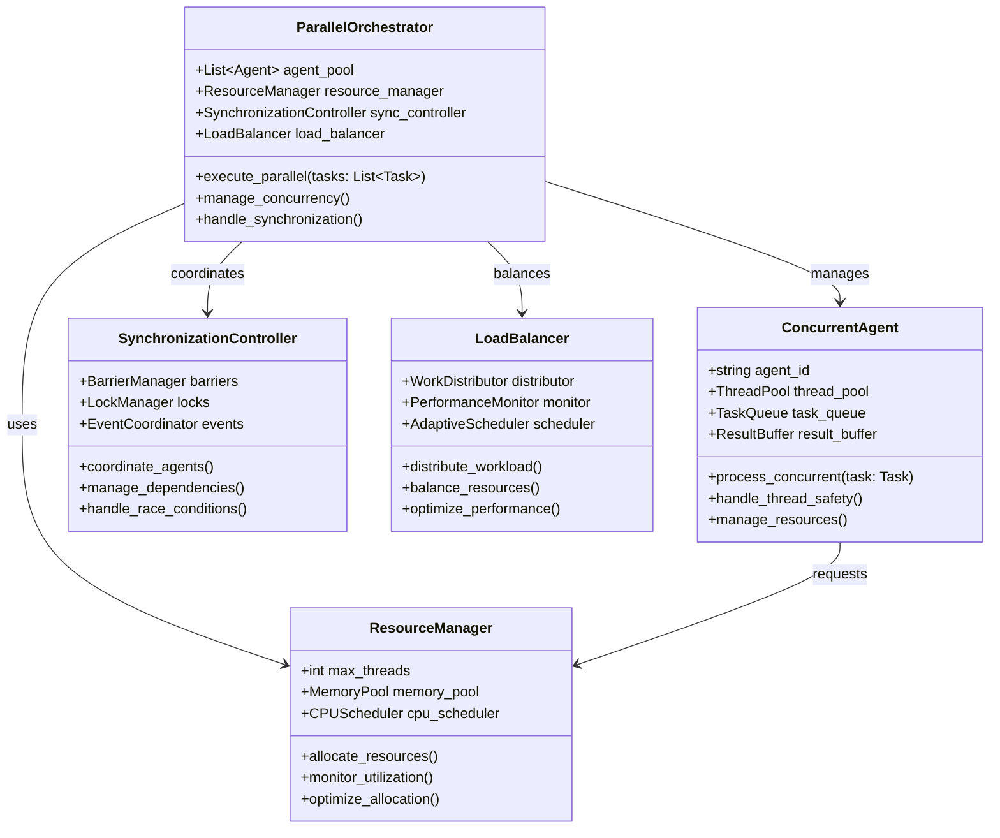

### 📋 **Parallel Execution Protocol**

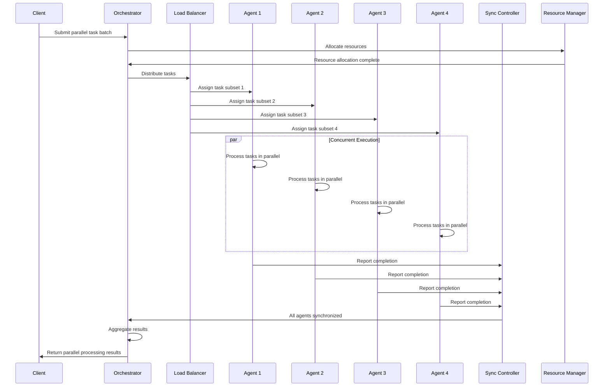

## 🎯 **Implementation Exemplar: Multi-Document Analysis Pipeline**

### 📊 **System Architecture Overview**

Our exemplar demonstrates a **High-Performance Document Processing System** that leverages parallel agent coordination to process multiple documents simultaneously across specialized analysis domains.

### 🔄 **Parallel Processing Architecture**

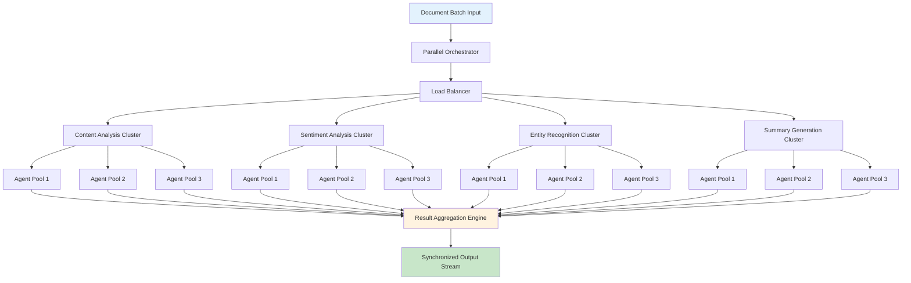

### 📊 **Agent Specialization and Resource Allocation**

| **Agent Cluster** | **Processing Focus** | **Resource Allocation** | **Concurrency Level** | **Performance Target** |
|------------------|---------------------|------------------------|---------------------|---------------------|
| 🔍 **Content Analysis** | Text extraction, structure parsing | 4 CPU cores, 8GB RAM | 12 concurrent agents | >500 documents/hour |
| 😊 **Sentiment Analysis** | Emotional tone, opinion mining | 2 CPU cores, 4GB RAM | 8 concurrent agents | >800 documents/hour |
| 🏷️ **Entity Recognition** | Named entity extraction, categorization | 6 CPU cores, 12GB RAM | 16 concurrent agents | >1000 documents/hour |
| 📝 **Summary Generation** | Key point extraction, abstract creation | 8 CPU cores, 16GB RAM | 6 concurrent agents | >300 documents/hour |

## 🏗️ **Project Structure Framework**

### 📁 **Advanced Hierarchical Organization**

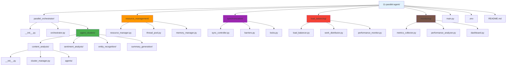

```
11-parallel-agent/
│
├── parallel_orchestrator/          # 🎯 Main Orchestration Package
│   ├── __init__.py                # 📦 Package initialization
│   ├── orchestrator.py            # 🎛️ Central coordination system
│   └── agent_clusters/            # 🏢 Specialized Agent Groups
│       ├── content_analysis/      # 📄 Content processing cluster
│       │   ├── __init__.py        # 📦 Cluster package
│       │   ├── cluster_manager.py # 🎯 Cluster coordination
│       │   └── agents/            # 🤖 Agent implementations
│       ├── sentiment_analysis/    # 😊 Sentiment processing cluster
│       ├── entity_recognition/    # 🏷️ Entity extraction cluster
│       └── summary_generation/    # 📝 Summary creation cluster
│
├── resource_management/           # 💾 Resource Optimization
│   ├── resource_manager.py       # 🔧 Resource allocation engine
│   ├── thread_pool.py            # 🧵 Thread management system
│   └── memory_manager.py         # 💾 Memory optimization
│
├── synchronization/              # 🔄 Coordination Systems
│   ├── sync_controller.py        # 🎛️ Synchronization orchestration
│   ├── barriers.py               # 🚧 Execution barriers
│   └── locks.py                  # 🔒 Thread safety mechanisms
│
├── load_balancing/               # ⚖️ Performance Optimization
│   ├── load_balancer.py          # ⚖️ Workload distribution
│   ├── work_distributor.py       # 📊 Task allocation engine
│   └── performance_monitor.py    # 📈 Performance tracking
│
├── monitoring/                   # 📊 System Observability
│   ├── metrics_collector.py      # 📊 Data collection engine
│   ├── performance_analyzer.py   # 📈 Analysis framework
│   └── dashboard.py              # 🖥️ Real-time monitoring UI
│
├── main.py                       # 🚀 Application entry point
├── .env                         # 🔑 Environment configuration
└── README.md                    # 📖 Documentation
```

## 🔧 **Core Components Deep Dive**

### 1️⃣ **Parallel Orchestration Engine**

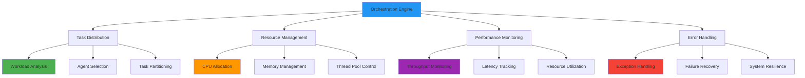

#### 🎛️ **Orchestrator Implementation Framework**

```python
class ParallelOrchestrator:
    """
    Advanced parallel processing orchestration system.
    
    Manages concurrent agent execution with comprehensive resource
    management, load balancing, and performance optimization.
    """
    
    def __init__(self, 
                 max_concurrent_agents: int = 16,
                 resource_limits: ResourceConfig = None,
                 performance_targets: PerformanceConfig = None):
        self.max_concurrent_agents = max_concurrent_agents
        self.resource_manager = ResourceManager(resource_limits)
        self.load_balancer = LoadBalancer(performance_targets)
        self.sync_controller = SynchronizationController()
        
    async def execute_parallel_workflow(self, 
                                      task_batch: List[Task]) -> ParallelResult:
        """Execute tasks in parallel across multiple agent clusters."""
        # Implementation details...
        
    def optimize_resource_allocation(self) -> OptimizationResult:
        """Dynamically optimize resource allocation for maximum performance."""
        # Implementation details...
```

### 2️⃣ **Advanced Resource Management**

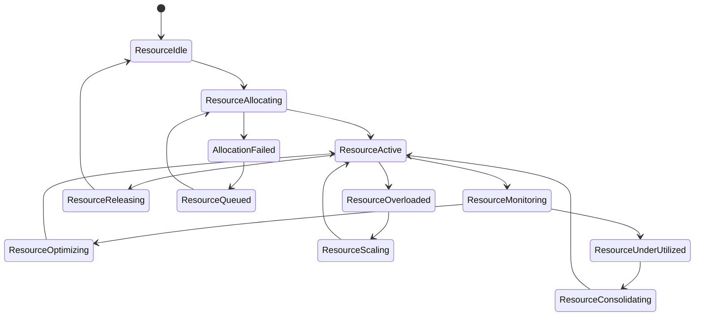

### 3️⃣ **Synchronization and Coordination Protocols**

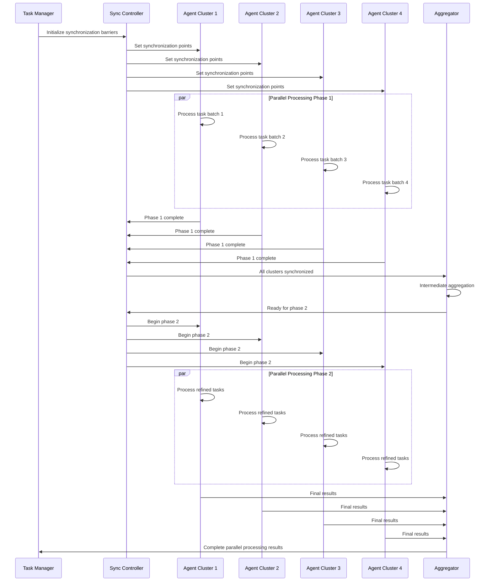

## 🚀 **Deployment and Execution Framework**

### 📋 **System Requirements Matrix**

| **Component** | **Minimum Specification** | **Recommended Specification** | **Optimal Specification** |
|---------------|---------------------------|------------------------------|---------------------------|
| 🖥️ **CPU** | 4 cores, 2.4GHz | 8 cores, 3.2GHz | 16 cores, 3.8GHz |
| 💾 **Memory** | 8GB RAM | 32GB RAM | 64GB RAM |
| 💿 **Storage** | 50GB SSD | 200GB NVMe SSD | 500GB NVMe SSD |
| 🌐 **Network** | 100 Mbps | 1 Gbps | 10 Gbps |
| 🐍 **Python** | 3.8+ | 3.10+ | 3.11+ |

### 🔧 **Environment Configuration Protocol**

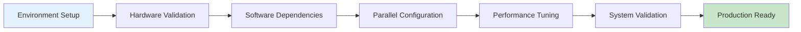

#### 🔌 **Advanced Activation Procedures**

```bash
# 🔌 High-Performance Environment Activation
# Linux/macOS with parallel processing optimization:
source ../.venv/bin/activate
export OMP_NUM_THREADS=16
export PYTHONPATH="${PYTHONPATH}:$(pwd)"

# Windows PowerShell with performance tuning:
..\.venv\Scripts\Activate.ps1
$env:OMP_NUM_THREADS=16
$env:PYTHONPATH="$env:PYTHONPATH;$(Get-Location)"

# 🎯 Parallel processing validation:
python -c "import concurrent.futures; print(f'Max workers: {concurrent.futures.ThreadPoolExecutor()._max_workers}')"
```

#### 🔑 **Advanced Configuration Specifications**

```bash
# High-Performance Configuration
GOOGLE_API_KEY=your_google_api_key_here
MAX_CONCURRENT_AGENTS=16
THREAD_POOL_SIZE=32
MEMORY_LIMIT_GB=32
CPU_AFFINITY_CORES=0-15
PERFORMANCE_MODE=optimized
MONITORING_ENABLED=true
METRICS_COLLECTION_INTERVAL=1
LOAD_BALANCING_STRATEGY=adaptive
```

## 🎮 **Advanced Operational Framework**

### 🌐 **High-Performance Web Interface**

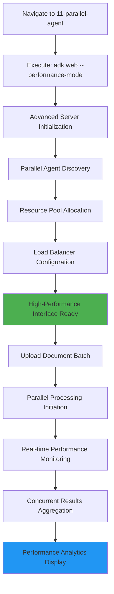

### 💻 **Enterprise Command-Line Interface**

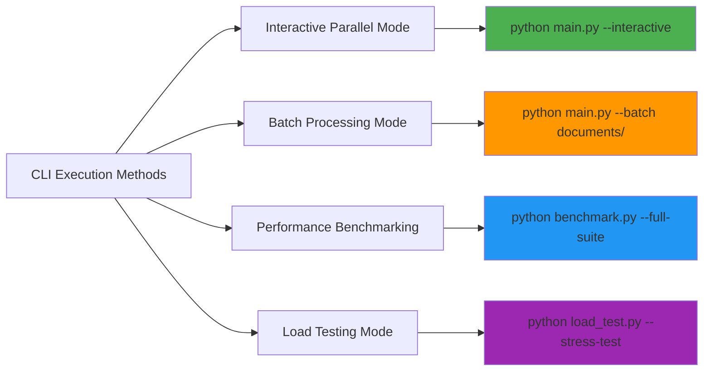

### 📊 **Execution Strategy Comparison**

| **Execution Method** | **Concurrency Level** | **Resource Usage** | **Monitoring Capability** | **Optimal Use Case** |
|---------------------|----------------------|-------------------|---------------------------|---------------------|
| 🌐 **Web Interface** | Medium (8 agents) | Moderate | Real-time dashboard | Interactive testing, demos |
| 💻 **CLI Interactive** | High (16 agents) | High | Console logging | Development, debugging |
| 📦 **Batch Processing** | Maximum (32 agents) | Maximum | File-based metrics | Production workloads |
| 🔬 **Benchmarking** | Variable | Controlled | Comprehensive analytics | Performance optimization |
| ⚡ **Load Testing** | Extreme (64+ agents) | Extreme | Stress monitoring | Capacity planning |

## 💬 **Advanced Testing and Validation Scenarios**

### 📊 **Performance Testing Matrix**

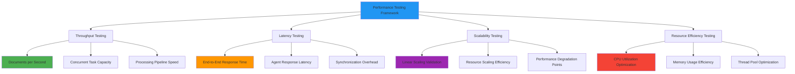

### 🎯 **Comprehensive Test Scenarios**

#### 📈 **Scalability Validation Protocol**

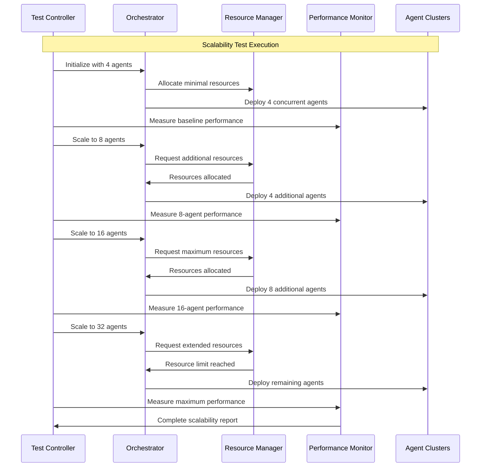

### 📊 **Performance Benchmark Targets**

| **Performance Metric** | **Target Threshold** | **Measurement Method** | **Validation Criteria** |
|------------------------|---------------------|------------------------|-------------------------|
| 📈 **Throughput** | >1000 documents/hour | Automated counting | Sustained over 1 hour |
| ⚡ **Latency** | <500ms average | Timestamp analysis | 95th percentile compliance |
| 📊 **Scalability** | Linear to 16 agents | Performance ratio | >90% efficiency maintained |
| 💾 **Resource Efficiency** | >85% CPU utilization | System monitoring | Peak utilization periods |
| 🔄 **Synchronization** | <50ms overhead | Barrier timing | Cross-agent coordination |
| 🛡️ **Reliability** | >99.5% success rate | Error tracking | Under stress conditions |

## 🎉 **Advanced Success Validation Framework**

### ✅ **Multi-Dimensional Performance Indicators**

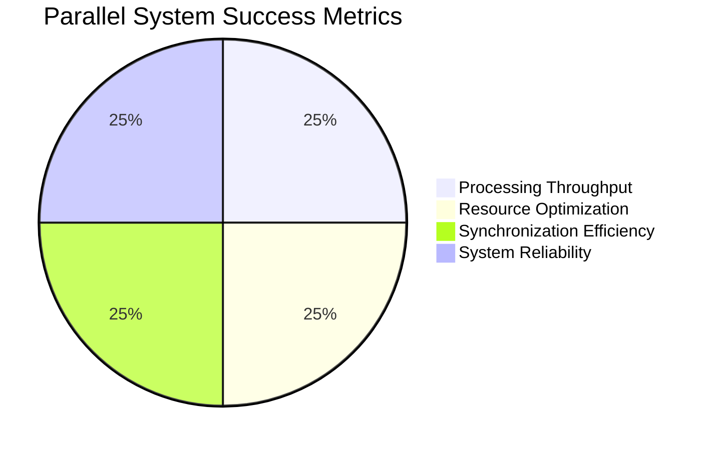

### 📊 **Comprehensive Validation Matrix**

| **Validation Dimension** | **Key Indicators** | **Measurement Approach** | **Success Criteria** |
|--------------------------|-------------------|--------------------------|---------------------|
| 🚀 **Processing Throughput** | Documents/second, tasks/minute | Automated performance counters | >5x sequential performance |
| 🎯 **Resource Optimization** | CPU/memory utilization efficiency | System resource monitoring | >80% resource utilization |
| 🔄 **Synchronization Efficiency** | Coordination overhead, barrier timing | Synchronization profiling | <10% overhead impact |
| 🛡️ **System Reliability** | Error rates, failure recovery | Error tracking and recovery timing | <1% error rate, <2s recovery |
| 📈 **Scalability Performance** | Linear scaling maintenance | Performance scaling analysis | >90% linear scaling to 16 agents |
| ⚖️ **Load Distribution** | Work balance across agents | Load distribution analytics | <10% variance in agent workload |

### 🔧 **Advanced Validation Procedures**

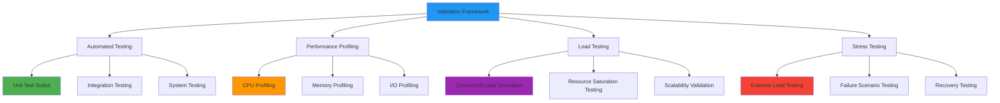

## 🔄 **Advanced Parallel Processing Patterns**

### 🏗️ **Sophisticated Coordination Architectures**

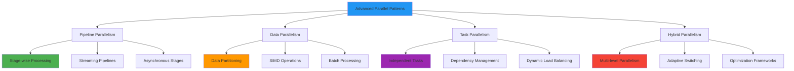

### 📊 **Resource Optimization Strategies**

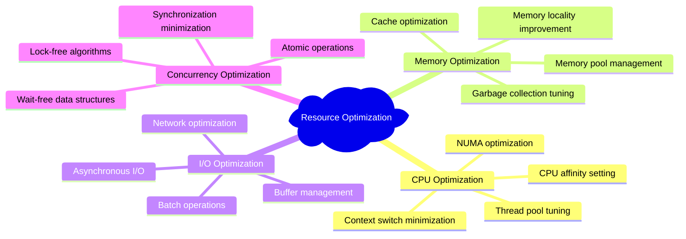

### 🎯 **Advanced Load Balancing Algorithms**

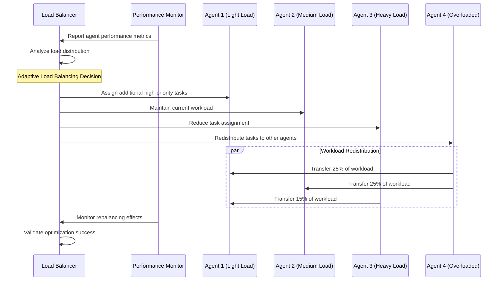

## 🏭 **Enterprise Production Framework**

### 🗄️ **Scalable Architecture Design**

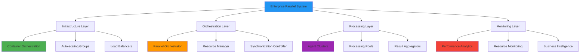

### 📊 **Enterprise Performance Targets**

| **Performance Category** | **Target Specification** | **Measurement Frequency** | **Alerting Threshold** |
|--------------------------|--------------------------|---------------------------|-------------------------|
| 🚀 **System Throughput** | >10,000 documents/hour | Real-time monitoring | <8,000 documents/hour |
| ⚡ **Response Latency** | <200ms P95 latency | Continuous measurement | >500ms P95 latency |
| 💾 **Resource Utilization** | 70-90% CPU utilization | 5-second intervals | <60% or >95% utilization |
| 🔄 **Concurrent Capacity** | Support 100+ concurrent users | Load testing validation | Performance degradation >20% |
| 🛡️ **System Availability** | 99.95% uptime SLA | 24/7 monitoring | Any downtime >5 minutes |

### 🔐 **Enterprise Security Framework**

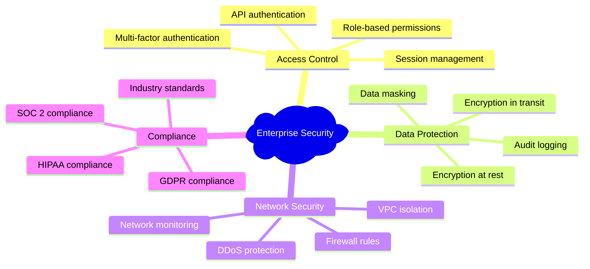

## 🚪 **Advanced Troubleshooting Framework**

### 🔧 **Systematic Issue Resolution Protocol**

```mermaid
flowchart TD
    A[Parallel System Issue] --> B{Performance Degradation?}
    B -->|Yes| C[Analyze Resource Bottlenecks]
    B -->|No| D{Synchronization Issues?}
    D -->|Yes| E[Check Coordination Mechanisms]
    D -->|No| F{Load Balancing Problems?}
    F -->|Yes| G[Analyze Workload Distribution]
    F -->|No| H{Memory Issues?}
    H -->|Yes| I[Investigate Memory Leaks]
    H -->|No| J{Concurrency Errors?}
    J -->|Yes| K[Examine Thread Safety]
    J -->|No| L[Comprehensive System Analysis]
    
    C --> M[Resource Optimization]
    E --> N[Synchronization Tuning]
    G --> O[Load Balancer Reconfiguration]
    I --> P[Memory Management Optimization]
    K --> Q[Concurrency Control Enhancement]
    L --> R[Advanced Diagnostics]
    
    style A fill:#f44336
    style M fill:#4caf50
    style N fill:#4caf50
    style O fill:#4caf50
    style P fill:#4caf50
    style Q fill:#4caf50
    style R fill:#ff9800
```

### 🛠️ **Advanced Diagnostic Command Suite**

```bash
# 🔍 Comprehensive System Analysis
python -m parallel_agent.diagnostics --full-analysis

# 📊 Performance Profiling with Detailed Metrics
python -m cProfile -o performance.prof main.py --benchmark-mode
python -m snakeviz performance.prof

# 💾 Memory Usage Analysis
python -m memory_profiler main.py --large-batch
python -m memray run --live main.py

# 🧵 Thread Analysis and Concurrency Debugging
python -m concurrent.futures.debug main.py --thread-analysis

# ⚖️ Load Balancing Validation
python -m parallel_agent.load_balancer --validate-distribution

# 🔄 Synchronization Performance Testing
python -m parallel_agent.sync_test --barrier-analysis --lock-analysis
```

### 📊 **Issue Classification and Resolution Matrix**

| **Issue Category** | **Symptoms** | **Diagnostic Methods** | **Resolution Strategies** |
|-------------------|--------------|------------------------|---------------------------|
| 🚀 **Performance Bottlenecks** | Slow processing, low throughput | CPU/memory profiling, bottleneck analysis | Resource optimization, algorithm improvement |
| 🔄 **Synchronization Problems** | Deadlocks, race conditions | Thread analysis, lock monitoring | Synchronization redesign, lock-free algorithms |
| ⚖️ **Load Imbalance** | Uneven agent utilization | Load distribution analysis | Dynamic load balancing, workload redistribution |
| 💾 **Memory Issues** | Memory leaks, excessive usage | Memory profiling, leak detection | Memory pool optimization, garbage collection tuning |
| 🧵 **Concurrency Errors** | Thread safety violations | Concurrency testing, race detection | Thread safety implementation, atomic operations |
| 🌐 **Network Bottlenecks** | High latency, timeouts | Network monitoring, bandwidth analysis | Network optimization, connection pooling |

## 🎓 **Advanced Learning Outcomes and Expertise Development**

### 🏆 **Parallel Processing Mastery Framework**

| **Expertise Level** | **Technical Competencies** | **Practical Applications** | **Assessment Criteria** |
|---------------------|---------------------------|---------------------------|-------------------------|
| 🔰 **Foundation** | Basic parallel concepts, simple concurrency | 2-4 agent parallel systems | Successful parallel execution |
| 🎯 **Intermediate** | Advanced synchronization, resource management | Enterprise-scale parallel processing | Performance optimization demonstrated |
| 🚀 **Advanced** | Custom parallel architectures, optimization | High-performance production systems | >90% resource utilization achieved |
| 🏆 **Expert** | Parallel system design, research contributions | Industry-leading implementations | Novel parallel processing innovations |

### 📊 **Comprehensive Knowledge Validation**

```mermaid
pie title Parallel Processing Mastery Assessment
    "Theoretical Knowledge" : 25
    "Implementation Skills" : 30
    "Optimization Expertise" : 25
    "Production Experience" : 20
```

### 🎯 **Mastery Validation Checklist**

- [ ] 🏗️ Designed and implemented high-performance parallel agent systems
- [ ] ⚖️ Mastered advanced load balancing and resource optimization
- [ ] 🔄 Implemented sophisticated synchronization and coordination mechanisms
- [ ] 📊 Applied comprehensive performance monitoring and analytics
- [ ] 🛠️ Developed enterprise-grade troubleshooting and optimization skills
- [ ] 🎯 Achieved >5x performance improvement over sequential processing
- [ ] 🔧 Implemented production-ready parallel systems with >99% reliability
- [ ] 📈 Demonstrated linear scalability across multiple processing cores

### 🚀 **Advanced Learning Trajectory**

```mermaid
graph TD
    A[Current: Parallel Agent Mastery] --> B[Distributed Systems]
    A --> C[High-Performance Computing]
    A --> D[Real-Time Processing]
    
    B --> E[Microservices Architecture]
    B --> F[Cloud-Native Systems]
    
    C --> G[GPU Computing]
    C --> H[Cluster Computing]
    
    D --> I[Stream Processing]
    D --> J[Edge Computing]
    
    style A fill:#4caf50
    style B fill:#2196f3
    style C fill:#ff9800
    style D fill:#9c27b0
```

| **Advanced Learning Path** | **Focus Domain** | **Complexity Level** | **Key Technologies** |
|---------------------------|------------------|----------------------|---------------------|
| 🌐 **Distributed Systems** | Multi-node coordination | ⭐⭐⭐⭐⭐ | Kubernetes, microservices, service mesh |
| 🚀 **High-Performance Computing** | Extreme parallelization | ⭐⭐⭐⭐⭐ | GPU computing, CUDA, cluster computing |
| ⚡ **Real-Time Processing** | Low-latency systems | ⭐⭐⭐⭐ | Stream processing, edge computing |
| 🔁 **Loop Agent Integration** | Iterative parallel refinement | ⭐⭐⭐⭐⭐ | Self-optimizing parallel systems |

## 📚 **Academic and Professional Resources**

### 🔗 **Authoritative Documentation Framework**

| **Resource Category** | **Specific Focus** | **Academic Level** | **Professional Relevance** |
|----------------------|-------------------|-------------------|---------------------------|
| 📖 **ADK Parallel Processing** | Framework implementation | Advanced | 🔥 Critical for implementation |
| 🏗️ **Concurrent Programming** | Theoretical foundations | Graduate | 🎯 Essential for optimization |
| 📊 **Performance Engineering** | Optimization methodologies | Professional | ⚡ Required for production |
| 🔧 **System Architecture** | Design patterns | Expert | 🛠️ Necessary for scalability |

### 🎯 **Industry Standards and Best Practices**

```mermaid
mindmap
  root)Parallel Processing Excellence(
    Performance Standards
      Amdahl's Law applications
      Gustafson's Law scaling
      Little's Law throughput
      Benchmarking methodologies
    Design Principles
      Embarrassingly parallel algorithms
      Load balancing strategies
      Synchronization minimization
      Resource locality optimization
    Implementation Patterns
      Producer-consumer models
      Master-worker architectures
      Pipeline parallelism
      Data parallel processing
    Quality Assurance
      Parallel testing strategies
      Performance regression testing
      Stress testing methodologies
      Reliability engineering
```

### 📊 **Professional Development Metrics**

| **Competency Area** | **Assessment Method** | **Industry Benchmark** | **Career Impact** |
|-------------------|----------------------|------------------------|-------------------|
| 🚀 **System Design** | Architecture reviews | Senior engineer level | Principal engineer track |
| 📊 **Performance Optimization** | Benchmark achievements | >90% resource utilization | Performance engineering roles |
| 🔧 **Production Systems** | System reliability | >99.9% uptime | Site reliability engineering |
| 📈 **Scalability Engineering** | Load testing results | Linear scaling demonstration | Infrastructure architecture |

---

<div align="center">

### 🎉 **Parallel Processing Excellence Achieved!**

**Advanced concurrent agent orchestration mastery completed**

[](../12-loop-agent/)
[](../10-sequential-agent/)
[](../)

*Advance to iterative refinement mastery with Loop Agent systems! 🔁*

</div>
