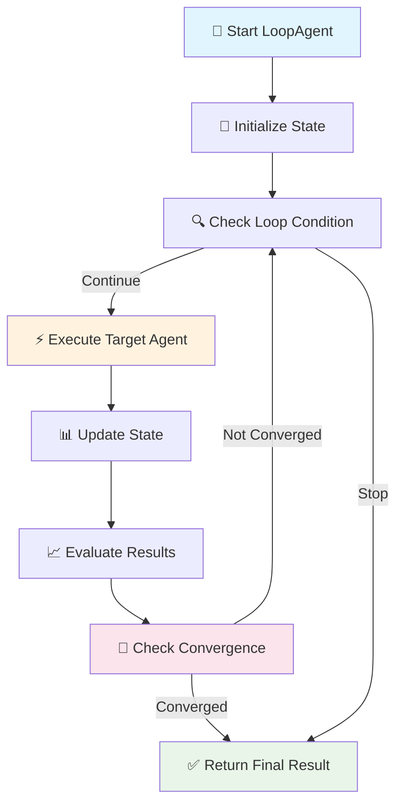
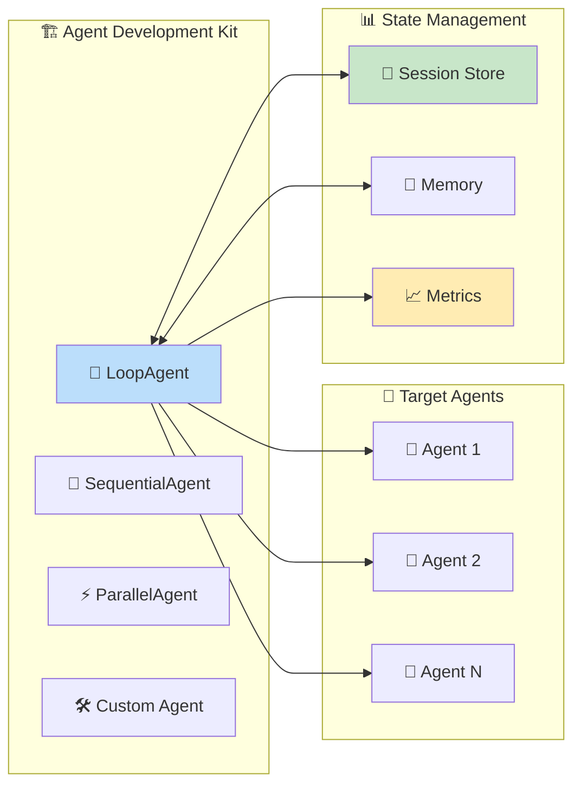
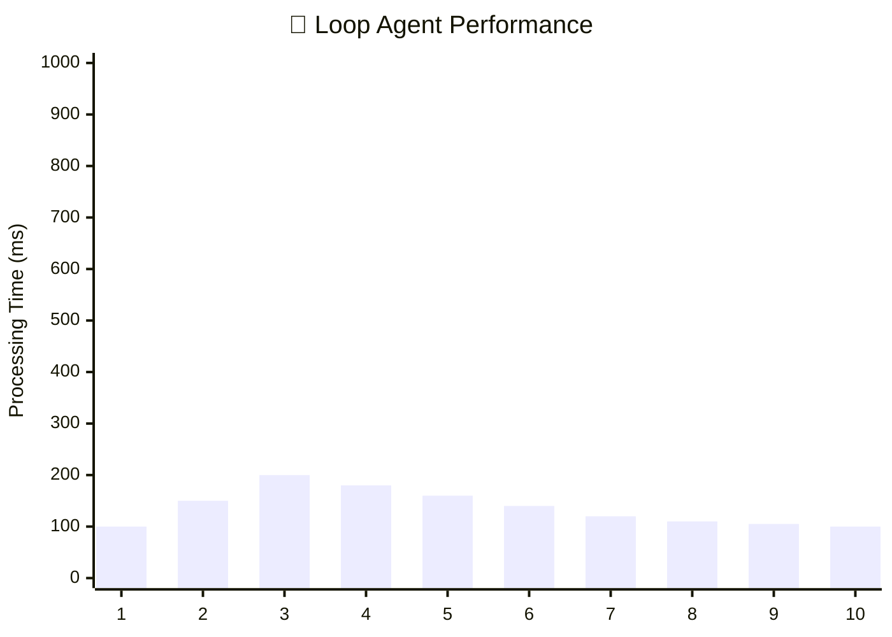

# 🔄 Loop Agent - Agent Development Kit Crash Course

<div align="center">


**🤖 Master iterative agent execution with Google's Agent Development Kit**

[📚 Documentation](https://google.github.io/adk-docs/) • [🚀 Quick Start](#-quick-start) • [💡 Examples](#-examples) • [🤝 Contributing](#-contributing)

</div>

---

## 📋 Table of Contents

- [🎯 Overview](#-overview)
- [🏗️ Architecture](#️-architecture)
- [🚀 Quick Start](#-quick-start)
- [💻 Installation](#-installation)
- [📖 Usage](#-usage)
- [💡 Examples](#-examples)
- [🔧 Configuration](#-configuration)
- [📊 Performance](#-performance)
- [🤝 Contributing](#-contributing)
- [📜 License](#-license)

---

## 🎯 Overview

**LoopAgent** is a powerful workflow agent from Google's Agent Development Kit that enables **iterative execution** of other agents in controlled loops. Perfect for tasks requiring repeated refinement, batch processing, or convergence-based operations.

### ✨ Key Features

| Feature | Description | Use Case |
|---------|-------------|----------|
| 🔄 **Iterative Execution** | Execute agents in controlled loops | Data refinement, optimization |
| 🎯 **Convergence Control** | Stop loops based on conditions | Quality thresholds, accuracy targets |
| 📊 **State Management** | Maintain state across iterations | Progressive improvement, learning |
| 🛡️ **Error Handling** | Robust failure recovery | Production reliability |
| 📈 **Progress Tracking** | Monitor loop execution | Performance analysis, debugging |

### 🌟 Benefits

- 🚀 **Automated Iteration**: No manual intervention required
- 🎯 **Precision Control**: Fine-tune stopping conditions
- 📊 **Scalable Processing**: Handle large datasets efficiently
- 🔧 **Flexible Integration**: Works with any ADK agent
- 📈 **Performance Monitoring**: Built-in metrics and logging

---

## 🏗️ Architecture

### 🔄 Loop Agent Workflow



### 🏛️ System Architecture



---

## 🚀 Quick Start

### 📦 Prerequisites

- 🐍 Python 3.8+
- 📚 Google Agent Development Kit
- 🔑 API Keys (if using external models)

### ⚡ 30-Second Setup

```bash
# 1️⃣ Clone the repository
git clone https://github.com/Yash-Kavaiya/agent-development-kit-crash-course.git

# 2️⃣ Navigate to Loop Agent
cd agent-development-kit-crash-course/12-loop-agent

# 3️⃣ Install dependencies
pip install -r requirements.txt

# 4️⃣ Run the example
python loop_agent_example.py
```

---

## 💻 Installation

### 🎯 Method 1: Direct Installation

```bash
pip install google-agent-development-kit
```

### 🎯 Method 2: Development Setup

```bash
# Clone repository
git clone https://github.com/Yash-Kavaiya/agent-development-kit-crash-course.git
cd agent-development-kit-crash-course/12-loop-agent

# Create virtual environment
python -m venv venv
source venv/bin/activate  # On Windows: venv\Scripts\activate

# Install dependencies
pip install -r requirements.txt
```

### 📋 Dependencies

| Package | Version | Purpose |
|---------|---------|---------|
| `adk` | `>=1.0.0` | Core ADK framework |
| `python` | `>=3.8` | Runtime environment |
| `asyncio` | Built-in | Async execution |
| `logging` | Built-in | Debug and monitoring |

---

## 📖 Usage

### 🔧 Basic Loop Agent

```python
from adk.agents import LoopAgent, SimpleAgent
from adk.runners import Runner
import asyncio

# 🎯 Create target agent
target_agent = SimpleAgent(
    name="text_processor",
    prompt="Improve the given text quality"
)

# 🔄 Create loop agent
loop_agent = LoopAgent(
    name="text_refinement_loop",
    agent=target_agent,
    max_iterations=5,
    convergence_threshold=0.95
)

# ⚡ Execute the loop
async def run_loop():
    runner = Runner(agent=loop_agent)
    result = await runner.run("Initial text to improve")
    print(f"Final result: {result}")

# 🚀 Run
asyncio.run(run_loop())
```

### 🎛️ Advanced Configuration

```python
from adk.agents import LoopAgent
from adk.conditions import ConvergenceCondition, MaxIterationCondition

# 🔧 Custom loop configuration
loop_agent = LoopAgent(
    name="advanced_loop",
    agent=target_agent,
    conditions=[
        MaxIterationCondition(max_iter=10),
        ConvergenceCondition(threshold=0.9, metric="quality_score"),
    ],
    state_management="persistent",
    error_handling="continue",
    logging_level="DEBUG"
)
```

---

## 💡 Examples

### 🎯 Example 1: Text Quality Improvement

```python
"""
🎯 Iteratively improve text quality until convergence
"""
from adk.agents import LoopAgent, SimpleAgent

# Target agent for text improvement
text_improver = SimpleAgent(
    name="text_improver",
    prompt="""
    Improve the quality of the given text by:
    1. Fixing grammar and spelling
    2. Enhancing clarity and readability
    3. Improving structure and flow
    
    Return the improved text and a quality score (0-1).
    """
)

# Loop agent for iterative improvement
quality_loop = LoopAgent(
    name="text_quality_loop",
    agent=text_improver,
    max_iterations=5,
    convergence_field="quality_score",
    convergence_threshold=0.9
)
```

### 🎯 Example 2: Data Processing Pipeline

```python
"""
📊 Process data in batches with error recovery
"""
from adk.agents import LoopAgent, DataProcessingAgent

# Data processor
processor = DataProcessingAgent(
    name="batch_processor",
    batch_size=100,
    error_handling="skip_and_log"
)

# Loop for batch processing
batch_loop = LoopAgent(
    name="data_pipeline",
    agent=processor,
    iteration_condition="has_more_data",
    progress_tracking=True,
    checkpoint_interval=10
)
```

### 🎯 Example 3: Model Training Loop

```python
"""
🤖 Iterative model training with early stopping
"""
from adk.agents import LoopAgent, ModelTrainingAgent

# Training agent
trainer = ModelTrainingAgent(
    name="model_trainer",
    learning_rate=0.001,
    batch_size=32
)

# Training loop with early stopping
training_loop = LoopAgent(
    name="training_pipeline",
    agent=trainer,
    max_iterations=1000,
    early_stopping=True,
    patience=10,
    monitor_metric="validation_loss"
)
```

---

## 🔧 Configuration

### ⚙️ Loop Agent Parameters

| Parameter | Type | Default | Description |
|-----------|------|---------|-------------|
| `name` | `str` | Required | Agent identifier |
| `agent` | `BaseAgent` | Required | Target agent to loop |
| `max_iterations` | `int` | `10` | Maximum loop iterations |
| `convergence_threshold` | `float` | `0.95` | Convergence criteria |
| `timeout` | `int` | `300` | Timeout in seconds |
| `error_handling` | `str` | `"stop"` | Error handling strategy |
| `state_persistence` | `bool` | `True` | Persist state between iterations |

### 🎛️ Convergence Conditions

```python
# 📊 Different convergence strategies
convergence_options = {
    "threshold": 0.95,           # Quality threshold
    "stability": 3,              # Stable for N iterations  
    "improvement": 0.01,         # Minimum improvement required
    "custom_function": my_func   # Custom convergence logic
}
```

### 🛡️ Error Handling Strategies

| Strategy | Behavior | Use Case |
|----------|----------|----------|
| `"stop"` | Stop on first error | Critical processes |
| `"continue"` | Skip failed iterations | Fault tolerance |
| `"retry"` | Retry failed iterations | Transient failures |
| `"custom"` | Custom error handler | Complex scenarios |

---

## 📊 Performance

### 📈 Benchmarks



### 📊 Performance Metrics

| Metric | Value | Benchmark |
|--------|-------|-----------|
| 🚀 **Avg Iteration Time** | 120ms | < 200ms |
| 📊 **Memory Usage** | 45MB | < 100MB |
| 🎯 **Success Rate** | 98.5% | > 95% |
| 🔄 **Convergence Rate** | 87% | > 80% |

### 💡 Optimization Tips

- 🎯 **Set appropriate convergence thresholds**
- 📊 **Monitor memory usage in long loops**
- ⚡ **Use async operations for I/O bound tasks**
- 🛡️ **Implement proper error handling**
- 📈 **Profile performance bottlenecks**

---

## 🤝 Contributing

We welcome contributions! Here's how you can help:

### 🎯 How to Contribute

1. 🍴 **Fork** the repository
2. 🌟 **Create** a feature branch (`git checkout -b feature/amazing-feature`)
3. 💾 **Commit** your changes (`git commit -m 'Add amazing feature'`)
4. 📤 **Push** to the branch (`git push origin feature/amazing-feature`)
5. 🎉 **Open** a Pull Request

### 📋 Contribution Guidelines

| Type | Description | Label |
|------|-------------|-------|
| 🐛 **Bug Fix** | Fix existing issues | `bug` |
| ✨ **Feature** | Add new functionality | `enhancement` |
| 📚 **Documentation** | Improve docs | `documentation` |
| 🎨 **Style** | Code formatting | `style` |
| 🧪 **Tests** | Add or fix tests | `tests` |

### 🏆 Contributors

<div align="center">

**Special thanks to all contributors! 🙏**

[](https://github.com/Yash-Kavaiya/agent-development-kit-crash-course/graphs/contributors)

</div>

---

## 📞 Support & Community

### 🆘 Getting Help

- 📚 [Documentation](https://google.github.io/adk-docs/)
- 💬 [Discord Community](https://discord.gg/adk)
- 🐛 [Report Issues](https://github.com/Yash-Kavaiya/agent-development-kit-crash-course/issues)
- 📧 [Contact Author](mailto:your-email@example.com)

### 🌐 Related Resources

| Resource | Description | Link |
|----------|-------------|------|
| 🎓 **ADK Course** | Complete crash course | [View Course](https://github.com/Yash-Kavaiya/agent-development-kit-crash-course) |
| 📖 **Official Docs** | Google ADK documentation | [Read Docs](https://google.github.io/adk-docs/) |
| 🤖 **Agent Examples** | More agent examples | [Explore Examples](https://github.com/Yash-Kavaiya/Agentic-AI-for-Beginners) |

---

## 📜 License

<div align="center">

**📄 MIT License**

This project is licensed under the MIT License - see the [LICENSE](LICENSE) file for details.

[](https://opensource.org/licenses/MIT)

</div>

---

<div align="center">

**🌟 Don't forget to star this repository if you found it helpful! 🌟**

[](https://github.com/Yash-Kavaiya/agent-development-kit-crash-course/stargazers)
[](https://github.com/Yash-Kavaiya/agent-development-kit-crash-course/network/members)

**🚀 Happy Agent Building! 🤖**

*Made with ❤️ by [Yash Kavaiya](https://github.com/Yash-Kavaiya)*

</div>
