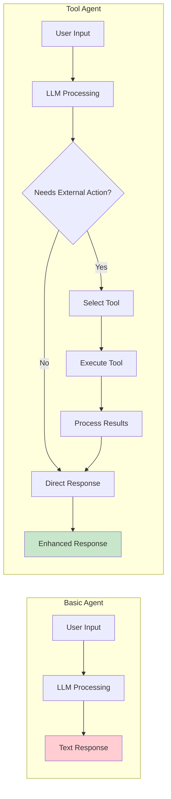
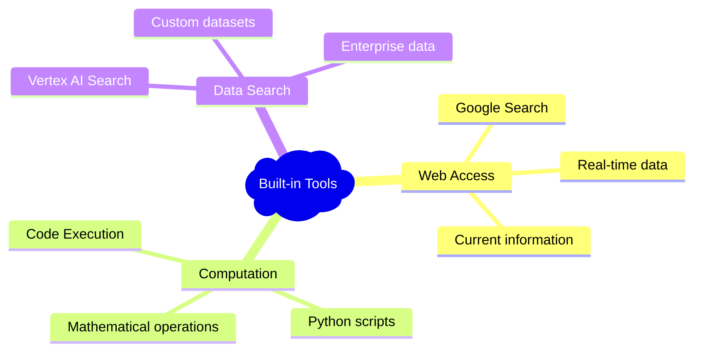
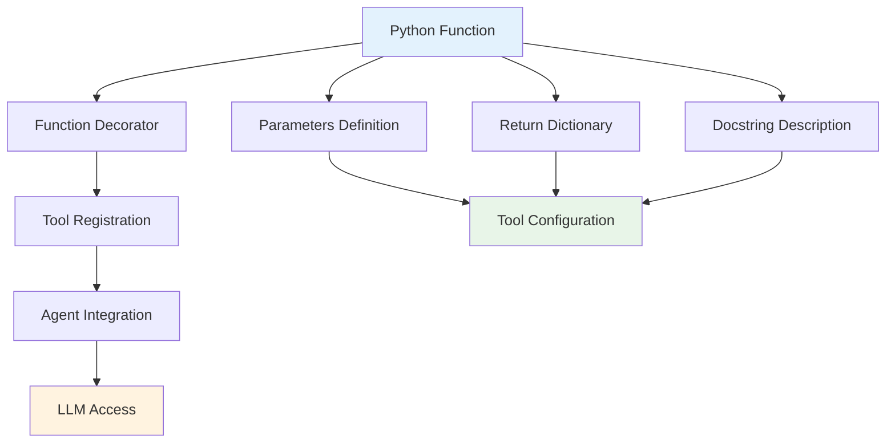
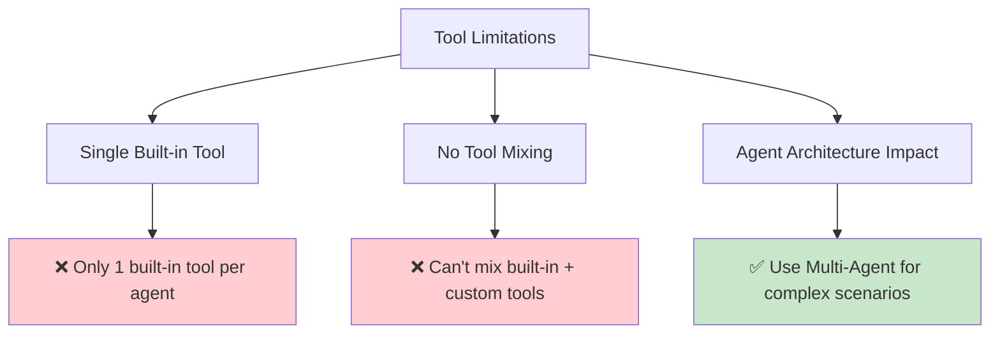
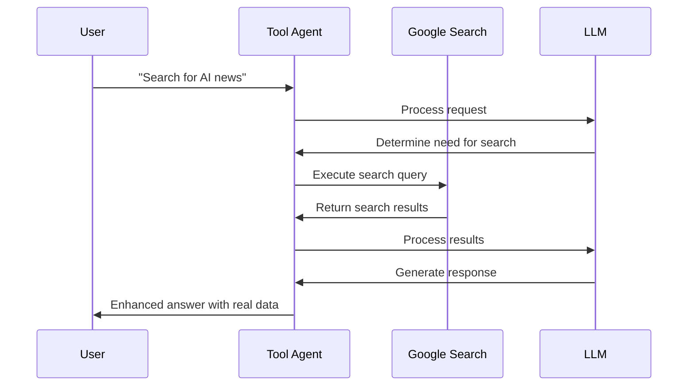
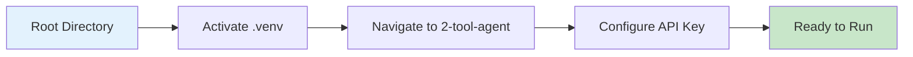
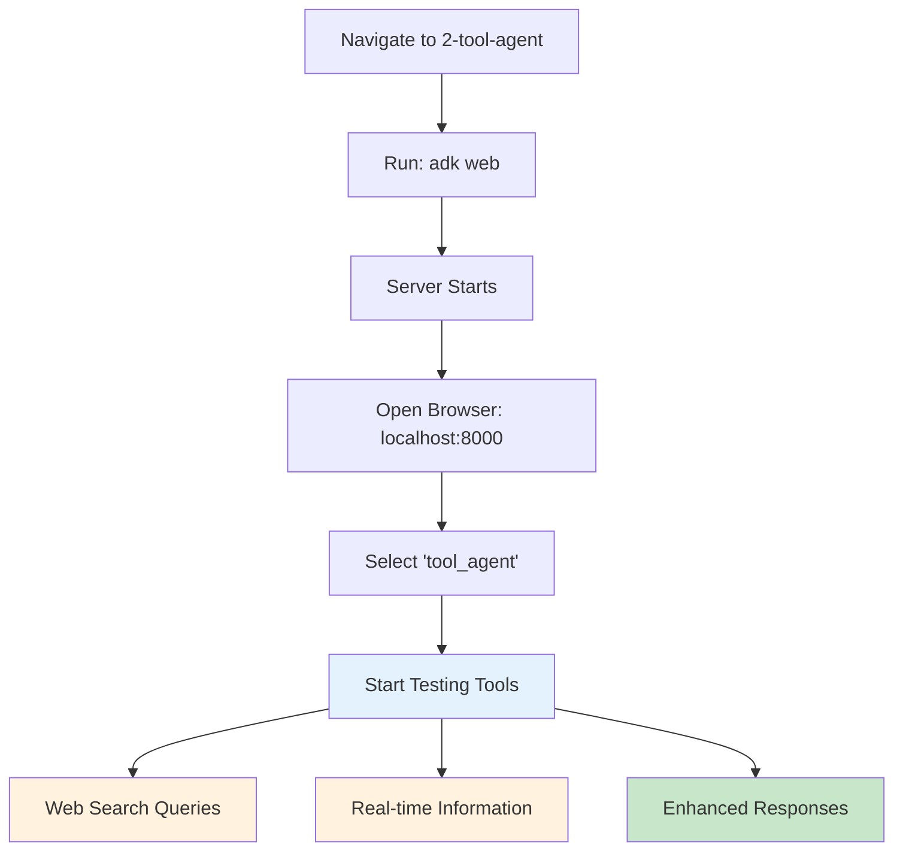
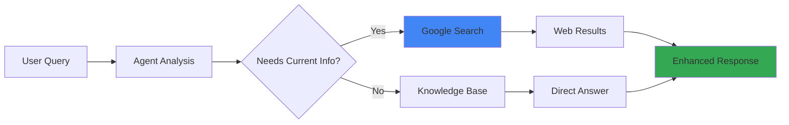
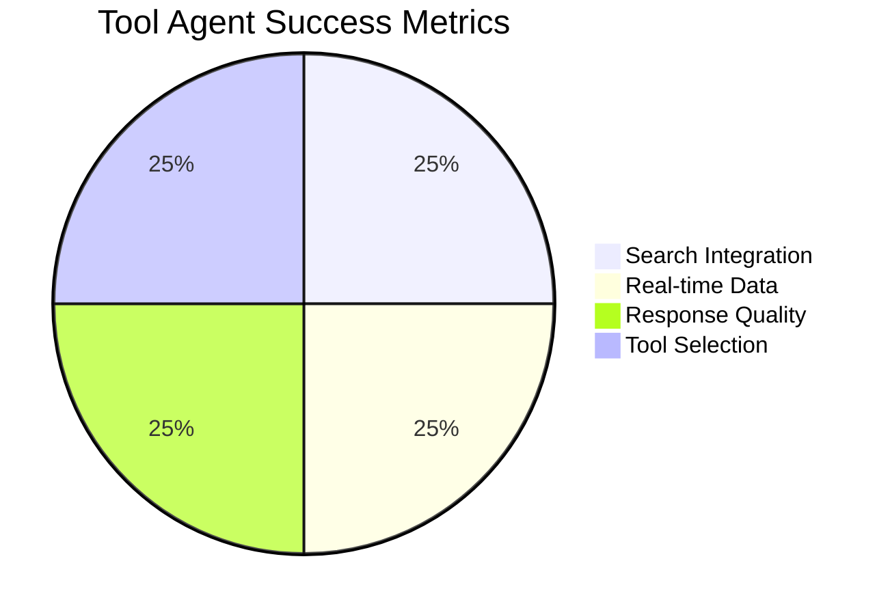

# 🛠️ Tool Agent Example

[](https://google.github.io/adk-docs/)
[](.)
[](https://www.python.org/downloads/)
[](.)

> 🎯 **Supercharge Your Agent with External Capabilities** - Learn to integrate tools that extend your agent beyond text generation

## 🧰 What is a Tool Agent?

A **Tool Agent** is an enhanced ADK agent that goes beyond simple text responses by incorporating **tools** that enable interaction with external systems, data retrieval, and specific function execution.

### 🔋 Core Enhancement



### 📊 Capability Comparison

| Feature | Basic Agent | Tool Agent | Benefit |
|---------|-------------|------------|---------|
| 🧠 **Text Generation** | ✅ | ✅ | Foundation capability |
| 🔍 **Web Search** | ❌ | ✅ | Real-time information |
| 💻 **Code Execution** | ❌ | ✅ | Dynamic computations |
| 🗄️ **Data Retrieval** | ❌ | ✅ | External data access |
| 🔧 **Custom Functions** | ❌ | ✅ | Specialized tasks |
| 📈 **API Integration** | ❌ | ✅ | System connectivity |

## 🔧 Key Components

### 1️⃣ Built-in Tools

ADK provides powerful **pre-built tools** ready for immediate use:



#### 🌟 Available Built-in Tools

| Tool | Purpose | Use Cases | Status |
|------|---------|-----------|--------|
| 🔍 **Google Search** | Web information retrieval | News, facts, research | ✅ Active |
| 💻 **Code Execution** | Python code running | Calculations, data processing | ✅ Active |
| 🗄️ **Vertex AI Search** | Custom data search | Enterprise search, documents | ✅ Active |

### 2️⃣ Custom Function Tools

Create **specialized tools** tailored to your specific needs:



#### 🏗️ Custom Tool Best Practices

| Aspect | Requirement | Best Practice | Example |
|--------|-------------|---------------|---------|
| 📝 **Parameters** | JSON-serializable types | Use string, int, list, dict | `param: str` |
| 🚫 **Default Values** | Not supported | Define all parameters | No `param="default"` |
| 📤 **Return Type** | Dictionary preferred | Status + result structure | `{"status": "success", "result": "..."}` |
| 📖 **Docstrings** | Clear descriptions | LLM-friendly explanations | Focus on tool purpose |

#### ✨ Return Format Template

```python
def custom_tool() -> dict:
    """Tool description for LLM understanding"""
    return {
        "status": "success",           # success/error
        "error_message": None,         # Error details if any
        "result": "actual_data"        # Main result
    }
```

## ⚠️ Important Limitations

### 🚨 Critical Constraints



### 1️⃣ Single Built-in Tool Restriction

> 🚫 **Critical Limitation**: Each root agent can only use **ONE** built-in tool

#### ❌ Not Supported Pattern

```python
# This will NOT work
root_agent = Agent(
    name="RootAgent",
    model="gemini-2.0-flash",
    description="Root Agent",
    tools=[built_in_code_execution, google_search],  # ❌ Multiple built-in tools
)
```

#### ✅ Supported Pattern

```python
# This WILL work
root_agent = Agent(
    name="SearchAgent",
    model="gemini-2.0-flash", 
    description="Web Search Agent",
    tools=[google_search],  # ✅ Single built-in tool
)
```

### 2️⃣ Tool Mixing Restriction

> 🚫 **Cannot combine** built-in tools with custom function tools in the same agent

#### ❌ Not Supported Pattern

```python
def get_current_time() -> dict:
    """Get the current time"""
    return {"current_time": datetime.now().strftime("%Y-%m-%d %H:%M:%S")}

# This will NOT work
root_agent = Agent(
    name="RootAgent",
    model="gemini-2.0-flash",
    description="Root Agent", 
    tools=[google_search, get_current_time],  # ❌ Mixed tool types
)
```

#### ✅ Workaround Solutions

| Approach | Description | Use Case |
|----------|-------------|----------|
| 🤖 **Multi-Agent Setup** | Separate agents for different tools | Complex workflows |
| 🔄 **Agent Switching** | Route between specialized agents | Tool-specific tasks |
| 🏗️ **Agent Tool Pattern** | Use agents as tools | Advanced orchestration |

## 💡 Implementation Example

### 🔍 Understanding the Architecture



### 🏗️ Code Structure Breakdown

| Component | Purpose | Configuration |
|-----------|---------|---------------|
| 🏷️ **Name & Description** | Agent identity | "tool_agent", clear capability description |
| 🧠 **Model** | LLM selection | "gemini-2.0-flash" for balanced performance |
| 📝 **Instructions** | Behavior guidance | How to use tools effectively |
| 🛠️ **Tools** | External capabilities | google_search for web access |

### 🎛️ Configuration Example

```python
# Tool Agent Configuration
root_agent = Agent(
    name="tool_agent",
    model="gemini-2.0-flash",
    description="Agent with Google Search capability",
    instructions="Use search when you need current information",
    tools=[google_search]  # Built-in tool integration
)
```

## 🚀 Getting Started

### 📋 Prerequisites Checklist

- [ ] ✅ Virtual environment activated
- [ ] 🔑 Google API key configured  
- [ ] 📁 Proper project structure
- [ ] 🛠️ Tool dependencies available

### 🔧 Environment Setup



#### 🔌 Virtual Environment Activation

```bash
# 🔌 Activate virtual environment (from parent directory)
# macOS/Linux:
source ../.venv/bin/activate

# Windows CMD:
..\.venv\Scripts\activate.bat

# Windows PowerShell:
..\.venv\Scripts\Activate.ps1
```

#### 🔑 API Key Configuration

| Step | Action | Details |
|------|--------|---------|
| 1️⃣ | **Locate Template** | Find `.env.example` in tool_agent folder |
| 2️⃣ | **Rename File** | Change to `.env` |
| 3️⃣ | **Add API Key** | `GOOGLE_API_KEY=your_key_here` |
| 4️⃣ | **Verify Setup** | Check tool agent loads correctly |

## 🎮 Running the Example

### 🌐 Interactive Web UI (Recommended)



### 🛠️ Available Run Methods

| Method | Command | Interface | Best For |
|--------|---------|-----------|----------|
| 🌐 **Web UI** | `adk web` | Browser-based | Interactive testing |
| 💻 **Terminal** | `adk run tool_agent` | Command line | Quick validation |
| 🔌 **API Server** | `adk api_server` | REST endpoints | Integration testing |

### 📝 Step-by-Step Process

| Step | Action | Expected Result |
|------|--------|-----------------|
| 1️⃣ | Navigate to directory | `cd 2-tool-agent` |
| 2️⃣ | Start web server | `adk web` |
| 3️⃣ | Open browser | Visit `http://localhost:8000` |
| 4️⃣ | Select agent | Choose "tool_agent" from dropdown |
| 5️⃣ | Test functionality | Try search-based queries |

## 💬 Example Prompts to Try

### 🔍 Search-Powered Queries



### 📊 Query Categories

| Category | Example Prompts | Tool Usage |
|----------|-----------------|------------|
| 📰 **Current News** | "Search for recent news about artificial intelligence" | Google Search |
| 🔬 **Research** | "Find information about Google's Agent Development Kit" | Google Search |
| 🚀 **Technology** | "What are the latest advancements in quantum computing?" | Google Search |
| 📈 **Market Data** | "Current stock prices for tech companies" | Google Search |
| 🌐 **Real-time Info** | "Today's weather in San Francisco" | Google Search |

### 🎯 Testing Scenarios

#### 🔰 Basic Tool Tests
- ✅ Simple web search queries
- ✅ Current event questions
- ✅ Fact verification requests

#### 🔄 Advanced Tool Tests
- ✅ Multi-step research tasks
- ✅ Comparative information gathering
- ✅ Real-time data integration

## 🎉 Success Indicators

### ✅ Your Tool Agent is Working When:



| Indicator | Description | What to Look For |
|-----------|-------------|------------------|
| 🔍 **Search Integration** | Uses Google Search when needed | Queries trigger web searches |
| 📊 **Real-time Data** | Provides current information | Fresh, up-to-date responses |
| 🎯 **Tool Selection** | Chooses appropriate tools | Smart tool usage decisions |
| 📝 **Enhanced Responses** | Richer, more informative answers | Citations and current data |

## 🚪 Exit & Troubleshooting

### 🛑 Stopping the Agent

```bash
# Press Ctrl+C in terminal to stop any running ADK command
Ctrl+C
```

### 🔧 Common Issues

| Issue | Cause | Solution |
|-------|-------|----------|
| 🚫 **Tool not working** | API key missing | Check `.env` file |
| 🔍 **No search results** | Network/permissions | Verify Google API access |
| 🤖 **Agent not found** | Wrong directory | Run from parent folder |

## 🎓 What You've Learned

### 🏆 Key Achievements

- [ ] 🛠️ Integrated external tools with agents
- [ ] 🔍 Implemented Google Search capability
- [ ] ⚠️ Understood tool limitations and constraints  
- [ ] 🏗️ Learned tool architecture patterns
- [ ] 🔧 Configured and tested tool functionality
- [ ] 📊 Enhanced agent capabilities beyond text

### 🚀 Next Steps

Ready for more advanced concepts?

| Next Example | Focus | Complexity | Tools Used |
|--------------|-------|------------|------------|
| 🔄 **LiteLLM Agent** | Model flexibility | ⭐⭐ | Multiple LLM providers |
| 📊 **Structured Outputs** | Data formatting | ⭐⭐ | Pydantic models |
| 💾 **Sessions & State** | Memory management | ⭐⭐⭐ | State persistence |

## 📚 Additional Resources

### 🔗 Official Documentation

| Resource | Focus | Link |
|----------|-------|------|
| 🛠️ **Types of Tools** | Tool overview | [ADK Tools Documentation](https://google.github.io/adk-docs/tools/#full-example-tavily-search) |
| 🔧 **Function Tools** | Custom tool creation | [Function Tools Guide](https://google.github.io/adk-docs/tools/function-tools/) |
| 🔍 **Built-in Tools** | Pre-built capabilities | [Built-in Tools Reference](https://google.github.io/adk-docs/tools/built-in-tools/) |

---

<div align="center">

### 🎉 Congratulations! 

You've successfully enhanced your agent with external tools! 

[](../3-litellm-agent/)
[](../1-basic-agent/)
[](../)

*Ready to explore multiple LLM providers? Let's dive into LiteLLM! 🔄*

</div>
