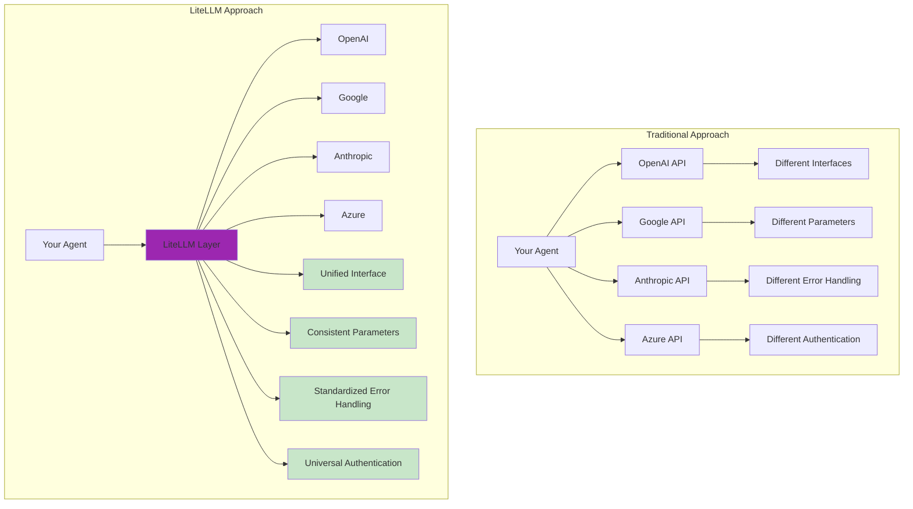
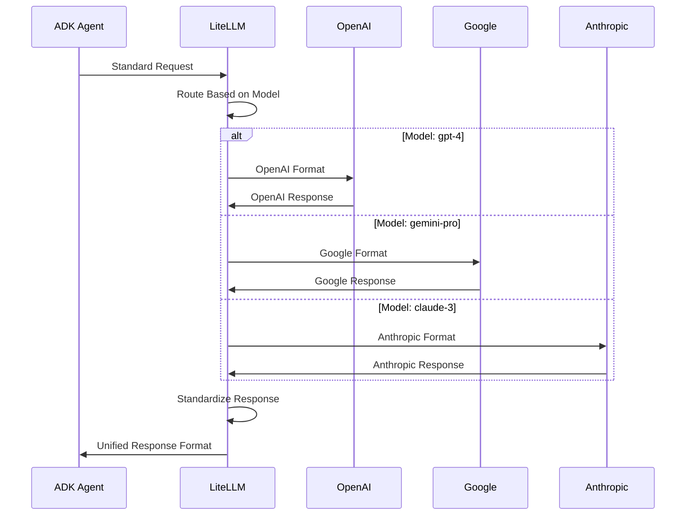
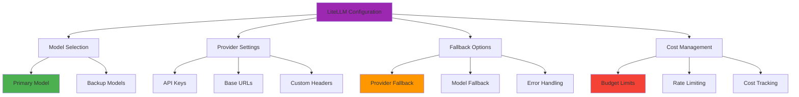

# 🔄 LiteLLM Agent Example

> 🎯 **Master Multi-Provider LLM Integration** - Learn to seamlessly switch between different LLM providers using LiteLLM abstraction

## 🌐 What is a LiteLLM Agent?

A **LiteLLM Agent** is an ADK agent that uses the LiteLLM library to abstract away LLM provider details, enabling you to easily switch between different models from various providers (OpenAI, Anthropic, Google, Azure, etc.) with minimal code changes.

### 🔄 Provider Abstraction Benefits

### 📊 Provider Comparison

| Provider | Models Available | Strengths | Use Cases |
|----------|------------------|-----------|-----------||
| 🤖 **OpenAI** | GPT-4, GPT-3.5 | Strong reasoning, coding | General purpose, creative tasks |
| 🧠 **Anthropic** | Claude 3, Claude 2 | Safety, analysis | Research, detailed analysis |
| 🔍 **Google** | Gemini, PaLM | Multimodal, fast | Search integration, real-time |
| ☁️ **Azure OpenAI** | GPT-4, GPT-3.5 | Enterprise features | Corporate deployments |
| 🌟 **Others** | Cohere, AI21, etc. | Specialized capabilities | Specific domains |

## 🏗️ LiteLLM Architecture

### 🔧 How LiteLLM Works

### 🎛️ Configuration Flexibility

---

### 🎉 Congratulations! 

You've mastered multi-provider LLM integration with LiteLLM! 

*Ready to structure your agent responses? Let's explore Pydantic schemas! 📊*

