# 🔄 LiteLLM Agent Example

[](https://google.github.io/adk-docs/)
[](.)
[](https://www.python.org/downloads/)
[](https://litellm.ai/)

> 🎯 **Master Multi-Provider LLM Integration** - Learn to seamlessly switch between different LLM providers using LiteLLM abstraction

## 🌐 What is a LiteLLM Agent?

A **LiteLLM Agent** is an ADK agent that uses the LiteLLM library to abstract away LLM provider details, enabling you to easily switch between different models from various providers (OpenAI, Anthropic, Google, Azure, etc.) with minimal code changes.

### 🔄 Provider Abstraction Benefits

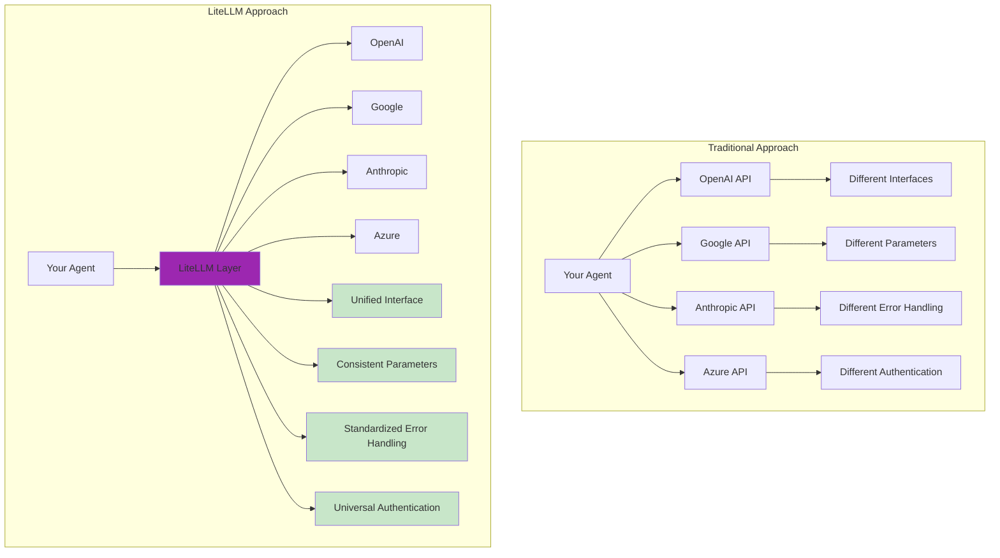

### 📊 Provider Comparison

| Provider | Models Available | Strengths | Use Cases |
|----------|------------------|-----------|-----------|
| 🤖 **OpenAI** | GPT-4, GPT-3.5 | Strong reasoning, coding | General purpose, creative tasks |
| 🧠 **Anthropic** | Claude 3, Claude 2 | Safety, analysis | Research, detailed analysis |
| 🔍 **Google** | Gemini, PaLM | Multimodal, fast | Search integration, real-time |
| ☁️ **Azure OpenAI** | GPT-4, GPT-3.5 | Enterprise features | Corporate deployments |
| 🌟 **Others** | Cohere, AI21, etc. | Specialized capabilities | Specific domains |

## 🏗️ LiteLLM Architecture

### 🔧 How LiteLLM Works

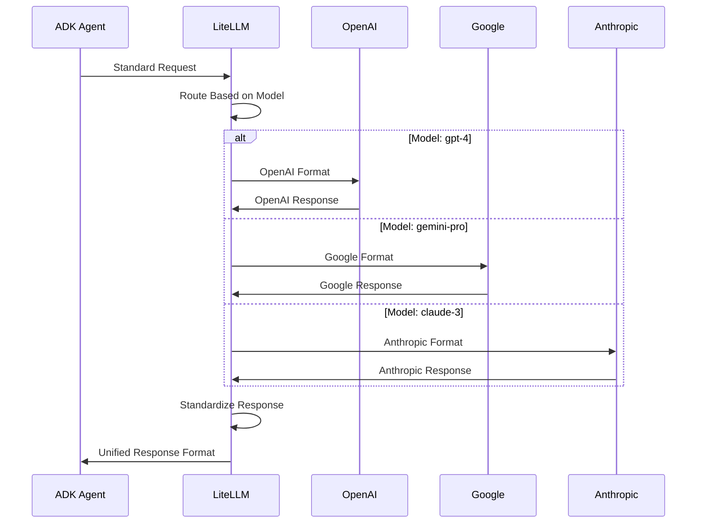

### 🎛️ Configuration Flexibility

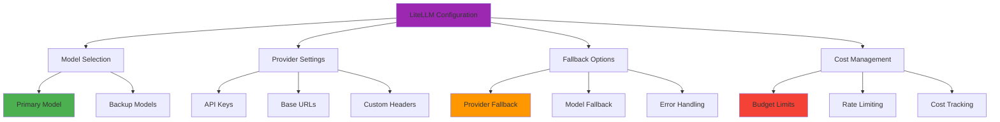

## 🚀 Key Features

### 1️⃣ Unified Interface

**One API to rule them all!** LiteLLM provides a consistent interface across all providers:

| Feature | Benefit | Example |
|---------|---------|---------|
| 🔄 **Consistent Method Calls** | Same code for all providers | `completion()` for all models |
| 📝 **Standardized Parameters** | Universal parameter names | `model`, `messages`, `temperature` |
| 🛡️ **Error Handling** | Unified error types | Consistent exception handling |
| 📊 **Response Format** | Same response structure | Standard message format |

### 2️⃣ Easy Provider Switching

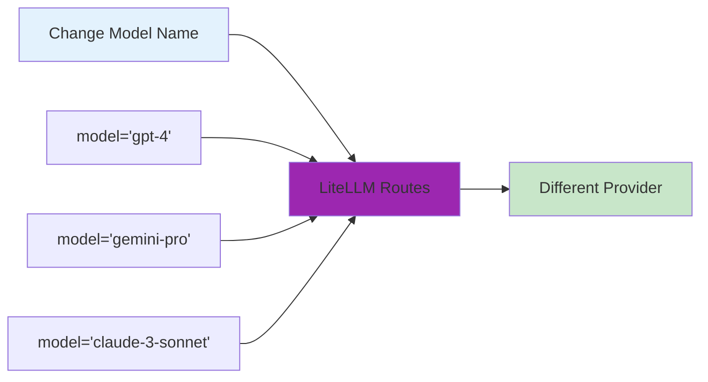

### 3️⃣ Advanced Features

| Feature | Description | Benefit |
|---------|-------------|---------|
| 🔄 **Fallbacks** | Automatic provider switching on failure | High availability |
| 💰 **Cost Tracking** | Monitor usage across providers | Budget management |
| ⚡ **Rate Limiting** | Handle provider limits gracefully | Reliable operation |
| 📊 **Load Balancing** | Distribute requests across models | Performance optimization |
| 🔐 **Key Management** | Secure API key handling | Security best practices |

## 🔧 Implementation Guide

### 📦 Installation Requirements

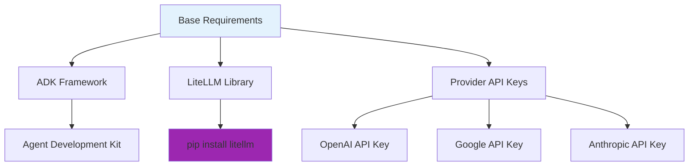

### 🎛️ Configuration Options

#### Basic Configuration

```python
from litellm import completion

# Simple model switching
response = completion(
    model="gpt-4",           # OpenAI
    # model="gemini-pro",    # Google
    # model="claude-3-sonnet", # Anthropic
    messages=[{"role": "user", "content": "Hello!"}]
)
```

#### Advanced Configuration

```python
# With custom settings
response = completion(
    model="gpt-4",
    messages=messages,
    temperature=0.7,
    max_tokens=150,
    fallbacks=["gpt-3.5-turbo", "gemini-pro"],
    timeout=30
)
```

### 🏗️ ADK Integration

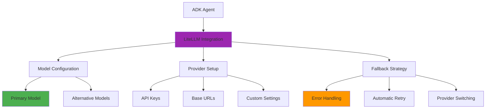

## 🚀 Getting Started

### 📋 Prerequisites Checklist

- [ ] ✅ Virtual environment activated
- [ ] 🔑 Multiple provider API keys (optional but recommended)
- [ ] 📦 LiteLLM library installed
- [ ] 📁 Proper project structure

### 🔧 Environment Setup

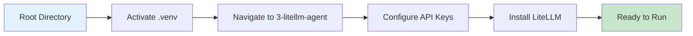

#### 🔌 Virtual Environment Activation

```bash
# 🔌 Activate virtual environment (from parent directory)
# macOS/Linux:
source ../.venv/bin/activate

# Windows CMD:
..\.venv\Scripts\activate.bat

# Windows PowerShell:
..\.venv\Scripts\Activate.ps1
```

#### 📦 Install LiteLLM

```bash
# Install LiteLLM if not already installed
pip install litellm
```

#### 🔑 Multi-Provider API Configuration

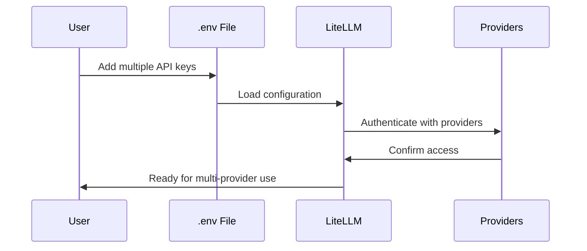

Create or update your `.env` file:

```bash
# Primary providers
OPENAI_API_KEY=your_openai_key_here
GOOGLE_API_KEY=your_google_key_here
ANTHROPIC_API_KEY=your_anthropic_key_here

# Optional providers
AZURE_API_KEY=your_azure_key_here
COHERE_API_KEY=your_cohere_key_here
```

### 🎯 Model Selection Strategy

| Priority | Model | Provider | Use Case |
|----------|-------|----------|----------|
| 1️⃣ | **gpt-4** | OpenAI | Complex reasoning tasks |
| 2️⃣ | **gemini-pro** | Google | Fast, general purpose |
| 3️⃣ | **claude-3-sonnet** | Anthropic | Analysis, safety-focused |
| 4️⃣ | **gpt-3.5-turbo** | OpenAI | Quick, cost-effective |

## 🎮 Running the Example

### 🌐 Interactive Web UI

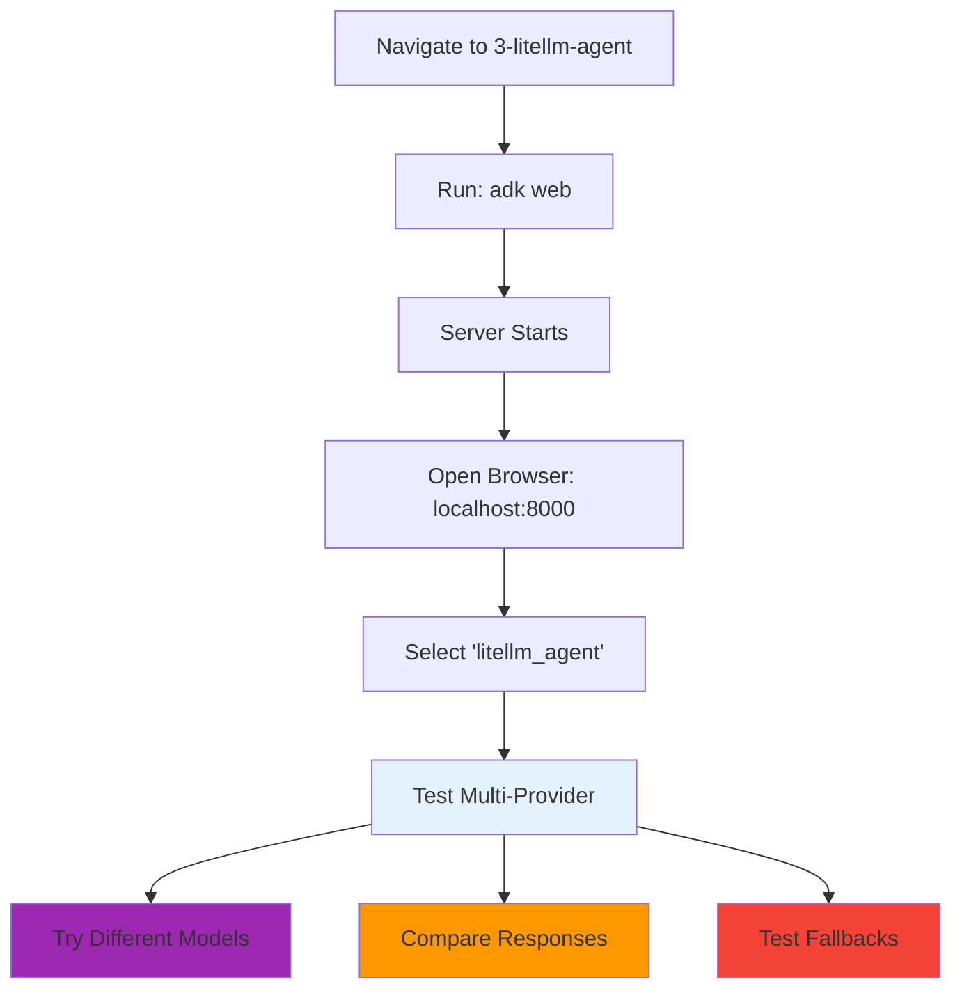

### 🛠️ Available Run Methods

| Method | Command | Interface | Best For |
|--------|---------|-----------|----------|
| 🌐 **Web UI** | `adk web` | Browser-based | Interactive model testing |
| 💻 **Terminal** | `adk run litellm_agent` | Command line | Quick provider validation |
| 🔌 **API Server** | `adk api_server` | REST endpoints | Integration testing |

### 📝 Step-by-Step Process

| Step | Action | Expected Result |
|------|--------|-----------------|
| 1️⃣ | Navigate to directory | `cd 3-litellm-agent` |
| 2️⃣ | Start web server | `adk web` |
| 3️⃣ | Open browser | Visit `http://localhost:8000` |
| 4️⃣ | Select agent | Choose "litellm_agent" from dropdown |
| 5️⃣ | Test functionality | Try model-specific prompts |

## 💬 Example Prompts to Try

### 🔄 Model Comparison Tests

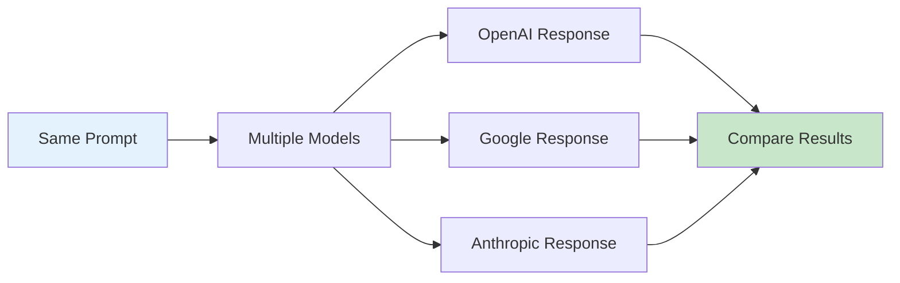

### 📊 Test Categories

| Category | Example Prompts | Purpose |
|----------|-----------------|---------|
| 🧮 **Reasoning** | "Solve this logic puzzle: ..." | Compare analytical capabilities |
| 🎨 **Creativity** | "Write a short story about..." | Test creative differences |
| 💻 **Coding** | "Write a Python function to..." | Compare programming skills |
| 📊 **Analysis** | "Analyze the pros and cons of..." | Test analytical depth |
| 🌐 **Current Events** | "What do you know about..." | Test knowledge cutoffs |

### 🎯 Model-Specific Tests

#### 🤖 OpenAI (GPT-4) Tests
- "Explain quantum computing in simple terms"
- "Debug this Python code: [code snippet]"
- "Create a business plan for a startup"

#### 🔍 Google (Gemini) Tests
- "What's the latest information about AI development?"
- "Help me plan a trip to Japan"
- "Analyze this data and provide insights"

#### 🧠 Anthropic (Claude) Tests
- "Please analyze the ethical implications of..."
- "Help me understand this complex research paper"
- "What are the potential risks and benefits of..."

## 🎉 Success Indicators

### ✅ Your LiteLLM Agent is Working When:

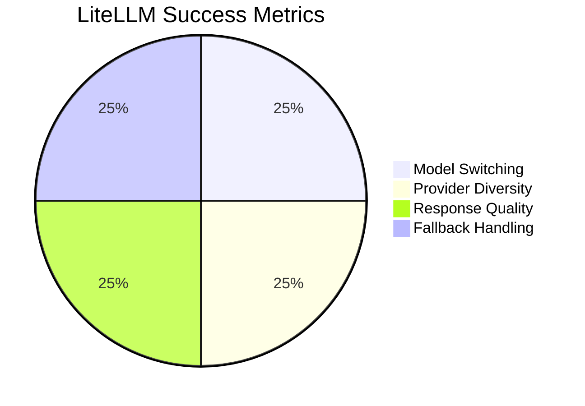

| Indicator | Description | What to Look For |
|-----------|-------------|------------------|
| 🔄 **Model Switching** | Can change providers easily | Different response styles |
| 🌐 **Provider Access** | Multiple providers working | No authentication errors |
| 📊 **Response Quality** | Consistent quality across models | Appropriate responses |
| 🛡️ **Error Handling** | Graceful fallback behavior | Automatic provider switching |

### 🔧 Testing Checklist

- [ ] 🔄 Successfully switch between models
- [ ] 🌐 Multiple providers accessible
- [ ] 🛡️ Fallback mechanisms working
- [ ] 📊 Response quality maintained
- [ ] 💰 Cost tracking functional (if enabled)
- [ ] ⚡ Rate limiting respected

## 🔄 Advanced Features

### 🛡️ Fallback Configuration

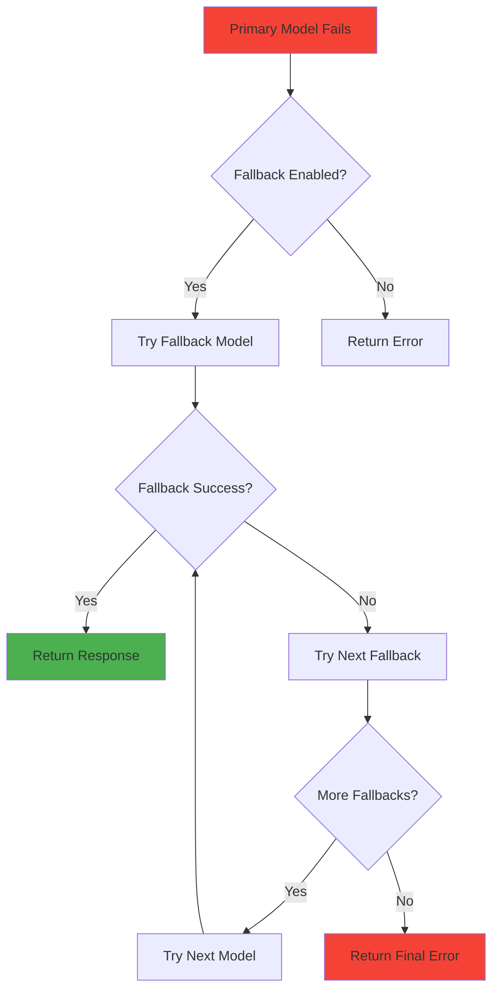

### 💰 Cost Management

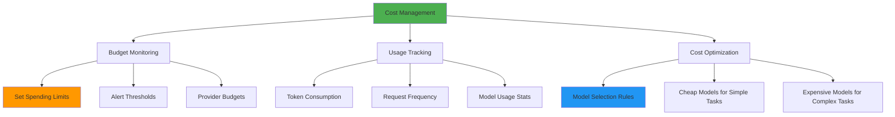

| Feature | Description | Configuration |
|---------|-------------|---------------|
| 🎯 **Budget Limits** | Set spending limits per provider | `max_budget=100` |
| 📊 **Usage Tracking** | Monitor token consumption | `track_cost=True` |
| ⚖️ **Cost Optimization** | Choose cheaper models for simple tasks | Model routing rules |

### ⚡ Performance Optimization

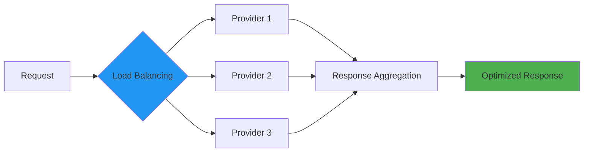

### 🔐 Security Best Practices

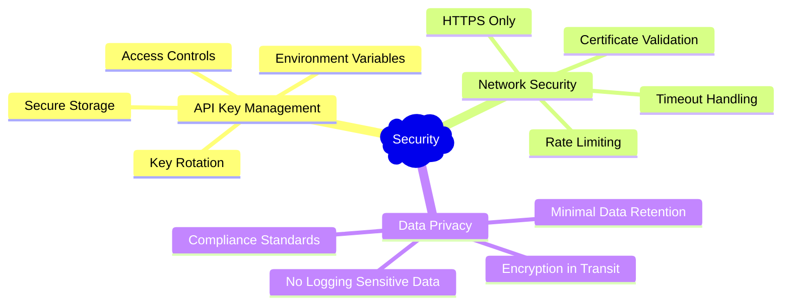

## 🚪 Troubleshooting

### 🔧 Common Issues

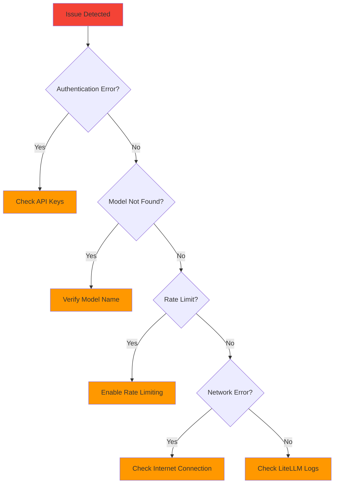

| Issue | Cause | Solution |
|-------|-------|----------|
| 🚫 **Authentication Failed** | Invalid API keys | Check `.env` file configuration |
| 🔍 **Model Not Found** | Incorrect model name | Verify model availability |
| ⚡ **Rate Limit Exceeded** | Too many requests | Enable rate limiting |
| 🌐 **Network Timeout** | Connection issues | Check internet/firewall |
| 💰 **Budget Exceeded** | Cost limits reached | Review usage or increase budget |

### 🛠️ Debug Commands

```bash
# Check LiteLLM configuration
python -c "import litellm; print(litellm.get_supported_openai_params())"

# Test provider connectivity
python -c "from litellm import completion; print(completion(model='gpt-3.5-turbo', messages=[{'role': 'user', 'content': 'test'}]))"

# View available models
python -c "import litellm; print(litellm.model_list)"
```

### 🛑 Exit Options

```bash
# Stop any running ADK command
Ctrl+C
```

## 🎓 What You've Learned

### 🏆 Key Achievements

- [ ] 🔄 Integrated multiple LLM providers seamlessly
- [ ] 🌐 Implemented provider abstraction layer
- [ ] 🛡️ Configured fallback mechanisms
- [ ] 📊 Compared different model capabilities
- [ ] 💰 Understood cost management strategies
- [ ] ⚡ Optimized performance with load balancing
- [ ] 🔐 Applied security best practices
- [ ] 🔧 Mastered troubleshooting techniques

### 🚀 Next Steps

Ready for more advanced concepts?

| Next Example | Focus | Complexity | Key Concepts |
|--------------|-------|------------|--------------|
| 📊 **Structured Outputs** | Data formatting | ⭐⭐ | Pydantic models, schemas |
| 💾 **Sessions & State** | Memory management | ⭐⭐⭐ | State persistence, context |
| 🏪 **Persistent Storage** | Data durability | ⭐⭐⭐ | Database integration |

### 🎯 Advanced Concepts to Explore

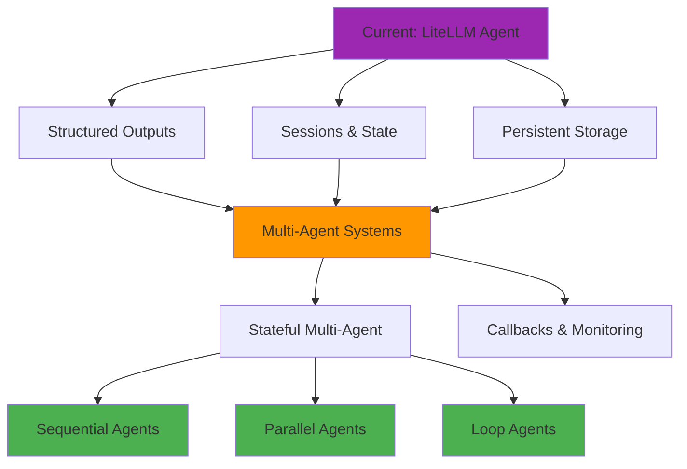

## 📚 Additional Resources

### 🔗 Official Documentation

| Resource | Focus | Link |
|----------|-------|------|
| 📖 **LiteLLM Docs** | Complete LiteLLM guide | [LiteLLM Documentation](https://litellm.ai/) |
| 🔧 **Provider Setup** | API key configuration | [Provider Configuration](https://litellm.vercel.app/docs/providers) |
| 💰 **Cost Management** | Budget and tracking | [Cost Tracking Guide](https://litellm.vercel.app/docs/proxy/cost_tracking) |
| 🛡️ **Fallbacks** | Reliability patterns | [Fallback Configuration](https://litellm.vercel.app/docs/completion/reliable_completions) |

### 🎯 Best Practices

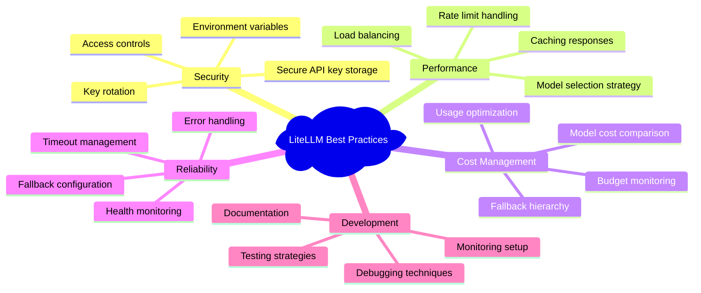

### 📊 Model Performance Comparison

| Aspect | OpenAI GPT-4 | Google Gemini | Anthropic Claude | Azure OpenAI |
|--------|--------------|---------------|------------------|--------------|
| 🧮 **Reasoning** | ⭐⭐⭐⭐⭐ | ⭐⭐⭐⭐ | ⭐⭐⭐⭐⭐ | ⭐⭐⭐⭐⭐ |
| 🎨 **Creativity** | ⭐⭐⭐⭐⭐ | ⭐⭐⭐⭐ | ⭐⭐⭐⭐ | ⭐⭐⭐⭐⭐ |
| 💻 **Coding** | ⭐⭐⭐⭐⭐ | ⭐⭐⭐⭐ | ⭐⭐⭐⭐ | ⭐⭐⭐⭐⭐ |
| ⚡ **Speed** | ⭐⭐⭐ | ⭐⭐⭐⭐⭐ | ⭐⭐⭐ | ⭐⭐⭐ |
| 💰 **Cost** | ⭐⭐ | ⭐⭐⭐⭐ | ⭐⭐⭐ | ⭐⭐ |
| 🛡️ **Safety** | ⭐⭐⭐⭐ | ⭐⭐⭐⭐ | ⭐⭐⭐⭐⭐ | ⭐⭐⭐⭐ |

### 🔄 Migration Guide

If you're migrating from a single-provider setup to LiteLLM:

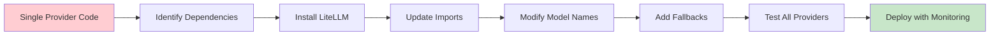

---

<div align="center">

### 🎉 Congratulations! 

You've mastered multi-provider LLM integration with LiteLLM! 

[](../4-structured-outputs/)
[](../2-tool-agent/)
[](../)

*Ready to structure your agent responses? Let's explore Pydantic schemas! 📊*

</div>
