# 📊 Structured Outputs in ADK

[](https://google.github.io/adk-docs/)
[](.)
[](https://www.python.org/downloads/)
[](https://docs.pydantic.dev/)

> 🎯 **Master Consistent Data Formatting** - Learn to implement structured outputs using Pydantic models for guaranteed format consistency

## 📋 What are Structured Outputs?

**Structured Outputs** in ADK enable you to define exact data formats for agent responses using Pydantic models, ensuring consistent, validated, and predictable output formats every time.

### 🔄 Unstructured vs Structured Outputs

```mermaid
graph TB
    subgraph "Unstructured Output"
        A1[User Request] --> B1[LLM Processing]
        B1 --> C1[Free-form Text Response]
        C1 --> D1[Unpredictable Format]
        D1 --> E1[Manual Parsing Required]
        E1 --> F1[Error-Prone Integration]
    end
    
    subgraph "Structured Output"
        A2[User Request] --> B2[LLM Processing]
        B2 --> C2[Pydantic Schema Validation]
        C2 --> D2[Guaranteed JSON Structure]
        D2 --> E2[Automatic Validation]
        E2 --> F2[Seamless Integration]
    end
    
    style C2 fill:#4caf50
    style D2 fill:#4caf50
    style E2 fill:#4caf50
    style F2 fill:#4caf50
    style F1 fill:#f44336
```

### 🏗️ Core Benefits

| Benefit | Description | Impact |
|---------|-------------|--------|
| 🎯 **Controlled Format** | `output_schema` ensures consistent JSON structure | Predictable responses |
| ✅ **Data Validation** | Pydantic validates fields and types | Error prevention |
| 🔄 **Easy Integration** | Structured data works seamlessly with other systems | Reduced complexity |
| 📊 **Type Safety** | Strong typing prevents runtime errors | Better reliability |
| 🛠️ **Developer Experience** | IDE support with autocompletion | Faster development |

## 🏗️ Structured Output Architecture

### 🔧 How Structured Outputs Work

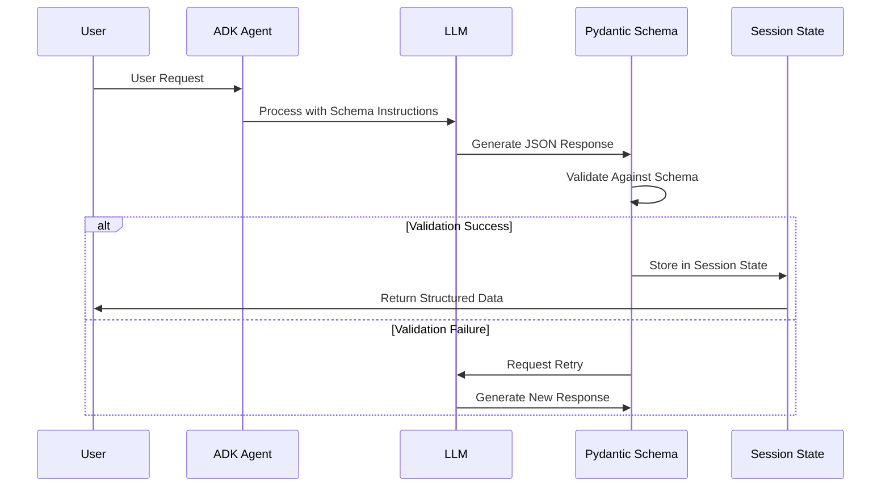

### 📊 Schema Definition Flow

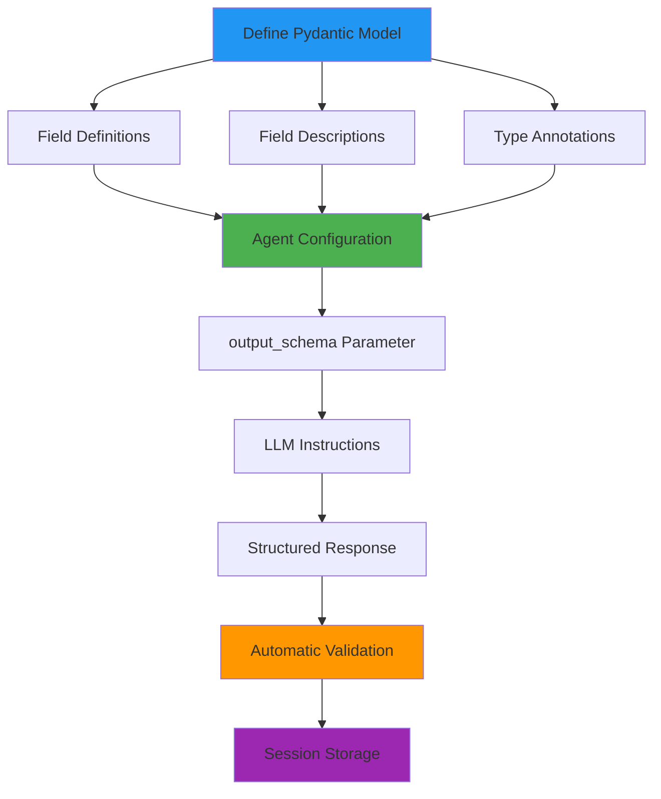

## 📧 Email Generator Example

### 🎯 Use Case Overview

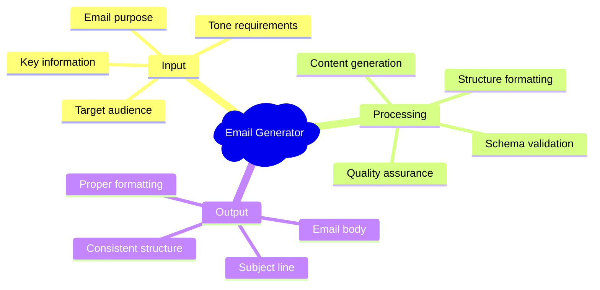

### 📝 Schema Definition

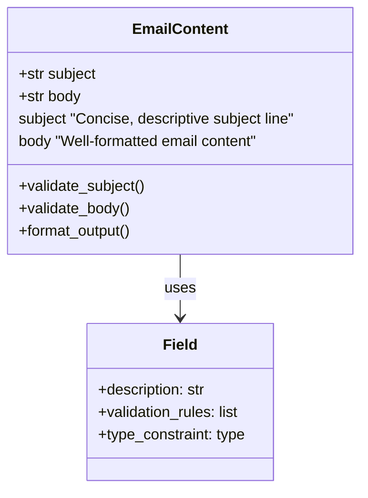

#### 🔧 Pydantic Model Implementation

```python
class EmailContent(BaseModel):
    """Schema for email content with subject and body."""
    
    subject: str = Field(
        description="The subject line of the email. Should be concise and descriptive."
    )
    body: str = Field(
        description="The main content of the email. Should be well-formatted with proper greeting, paragraphs, and signature."
    )
```

### 🔄 Processing Workflow

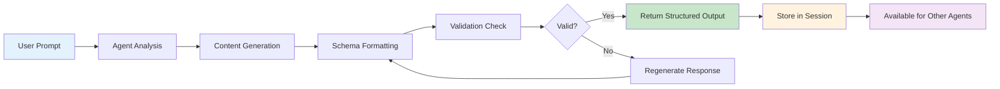

### 📊 Email Content Structure

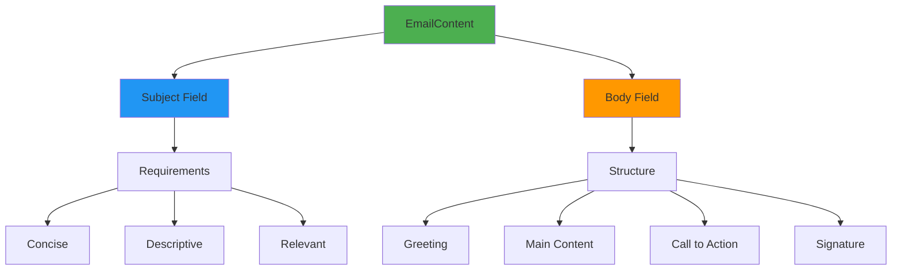

## ⚠️ Important Limitations

### 🚫 Critical Constraints

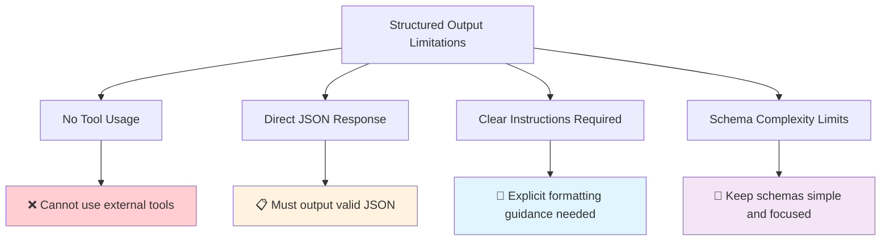

### 🔧 Constraint Details

| Limitation | Description | Workaround |
|------------|-------------|------------|
| 🚫 **No Tools** | Cannot use external tools or APIs | Use separate agents for tool operations |
| 📋 **JSON Only** | Must produce valid JSON matching schema | Provide clear formatting examples |
| 📝 **Explicit Instructions** | LLM needs detailed output guidance | Include schema examples in instructions |
| 🎯 **Single Purpose** | One schema per agent execution | Use multiple agents for complex workflows |

### 🛠️ Workaround Strategies

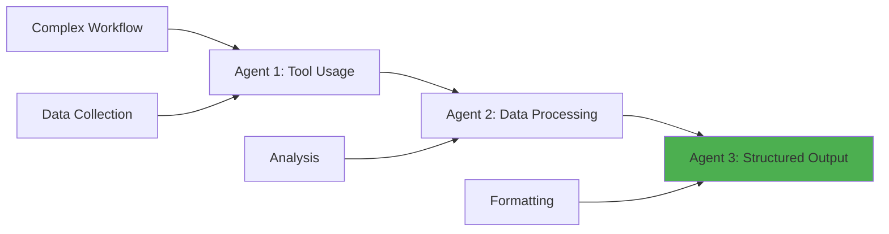

## 🏗️ Project Structure

### 📁 Directory Organization

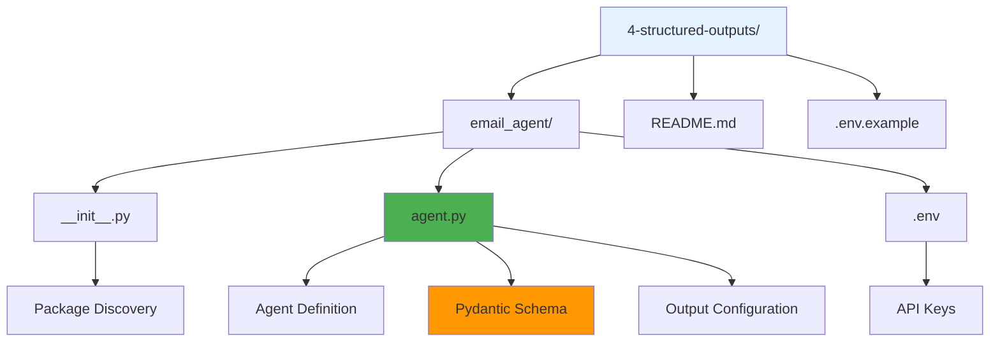

```
4-structured-outputs/
│
├── email_agent/                   # 📧 Email Generator Package
│   ├── __init__.py               # 📦 Package initialization
│   ├── agent.py                  # 🤖 Agent with output schema
│   └── .env                      # 🔑 Environment variables
│
├── .env.example                  # 📋 Environment template
└── README.md                     # 📖 Documentation
```

## 🚀 Getting Started

### 📋 Prerequisites Checklist

- [ ] ✅ Virtual environment activated
- [ ] 🔑 Google API key configured
- [ ] 📦 Pydantic understanding (basic)
- [ ] 📁 Proper project structure

### 🔧 Environment Setup

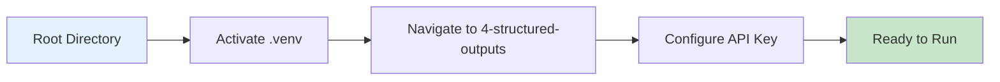

#### 🔌 Virtual Environment Activation

```bash
# 🔌 Activate virtual environment (from parent directory)
# macOS/Linux:
source ../.venv/bin/activate

# Windows CMD:
..\.venv\Scripts\activate.bat

# Windows PowerShell:
..\.venv\Scripts\Activate.ps1
```

#### 🔑 API Key Configuration

| Step | Action | Details |
|------|--------|---------|
| 1️⃣ | **Locate Template** | Find `.env.example` in email_agent folder |
| 2️⃣ | **Create Config** | Copy to `.env` in email_agent folder |
| 3️⃣ | **Add API Key** | `GOOGLE_API_KEY=your_key_here` |
| 4️⃣ | **Verify Setup** | Check agent loads correctly |

## 🎮 Running the Example

### 🌐 Interactive Web UI

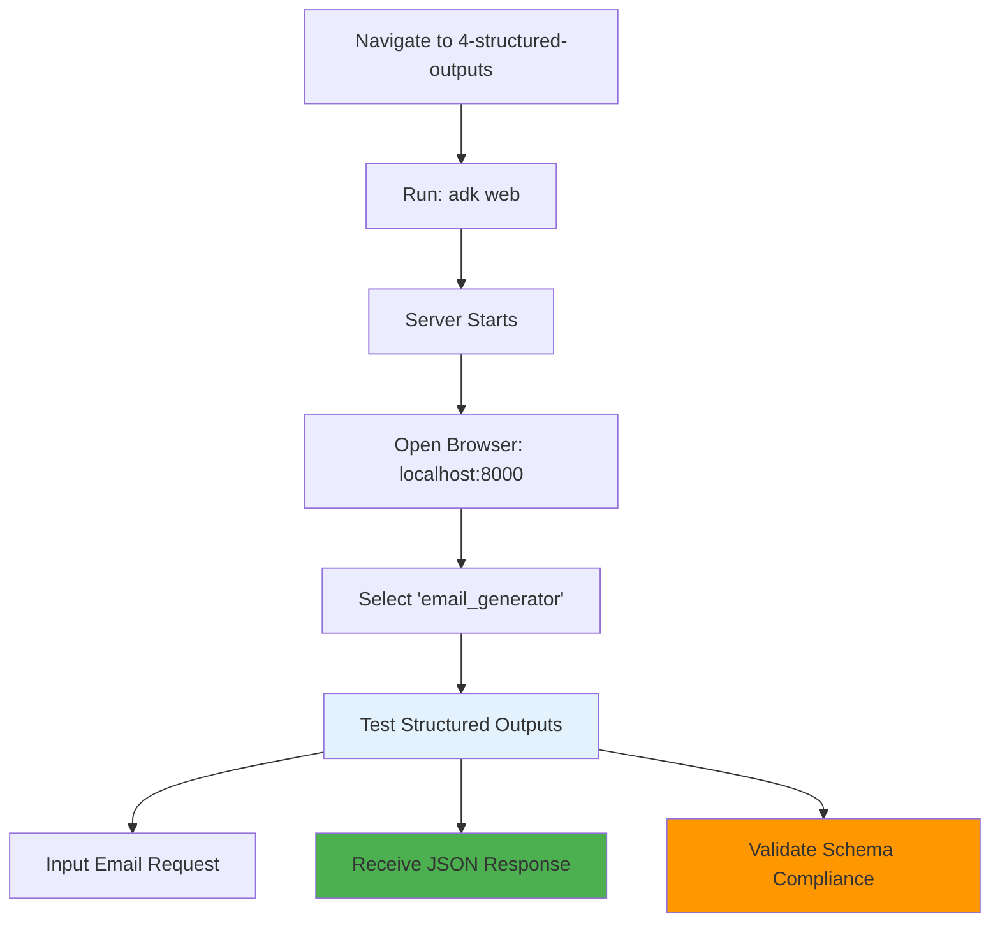

### 🛠️ Available Run Methods

| Method | Command | Interface | Best For |
|--------|---------|-----------|----------|
| 🌐 **Web UI** | `adk web` | Browser-based | Interactive schema testing |
| 💻 **Terminal** | `adk run email_generator` | Command line | Quick validation |
| 🔌 **API Server** | `adk api_server` | REST endpoints | Integration testing |

### 📝 Step-by-Step Process

| Step | Action | Expected Result |
|------|--------|-----------------|
| 1️⃣ | Navigate to directory | `cd 4-structured-outputs` |
| 2️⃣ | Start web server | `adk web` |
| 3️⃣ | Open browser | Visit `http://localhost:8000` |
| 4️⃣ | Select agent | Choose "email_generator" from dropdown |
| 5️⃣ | Test functionality | Input email requests, receive JSON |

## 💬 Example Interactions

### 📧 Email Generation Tests

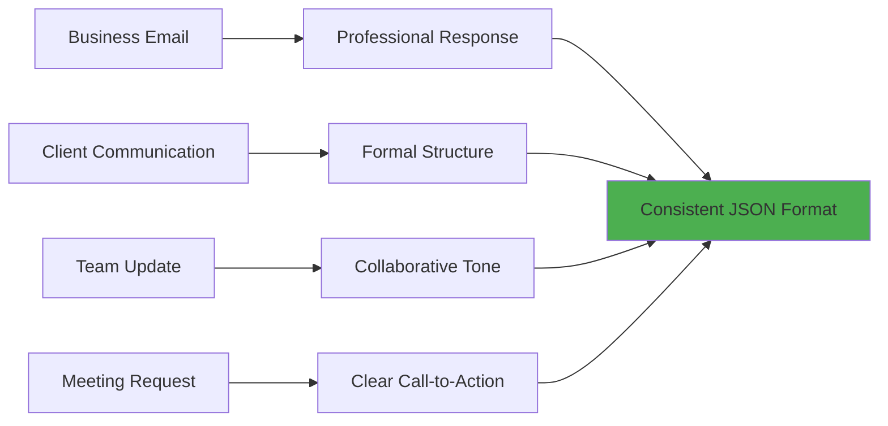

### 📊 Test Categories

| Category | Example Prompts | Expected Output |
|----------|-----------------|-----------------|
| 💼 **Professional** | "Write a professional email to my team about the upcoming project deadline..." | Formal tone, clear structure |
| 📞 **Client Communication** | "Draft an email to a client explaining that we need additional information..." | Professional, helpful tone |
| 📅 **Meeting Requests** | "Create an email to schedule a meeting with the marketing department..." | Clear agenda, action items |
| 📈 **Project Updates** | "Send an update about the quarterly results to stakeholders..." | Informative, data-focused |

### 🎯 Detailed Test Examples

#### 💼 Professional Email Test

**Input:**
```
Write a professional email to my team about the upcoming project deadline that has been extended by two weeks.
```

**Expected Output Structure:**
```json
{
  "subject": "Project Deadline Extension - Updated Timeline",
  "body": "Dear Team,\n\nI hope this email finds you well. I wanted to inform you about an important update regarding our current project timeline...\n\nBest regards,\n[Your Name]"
}
```

#### 📞 Client Communication Test

**Input:**
```
Draft an email to a client explaining that we need additional information before we can proceed with their order.
```

**Expected Output Structure:**
```json
{
  "subject": "Additional Information Required for Your Order",
  "body": "Dear [Client Name],\n\nThank you for your recent order. To ensure we deliver exactly what you need...\n\nBest regards,\n[Your Name]"
}
```

## 🎉 Success Indicators

### ✅ Your Structured Output Agent is Working When:

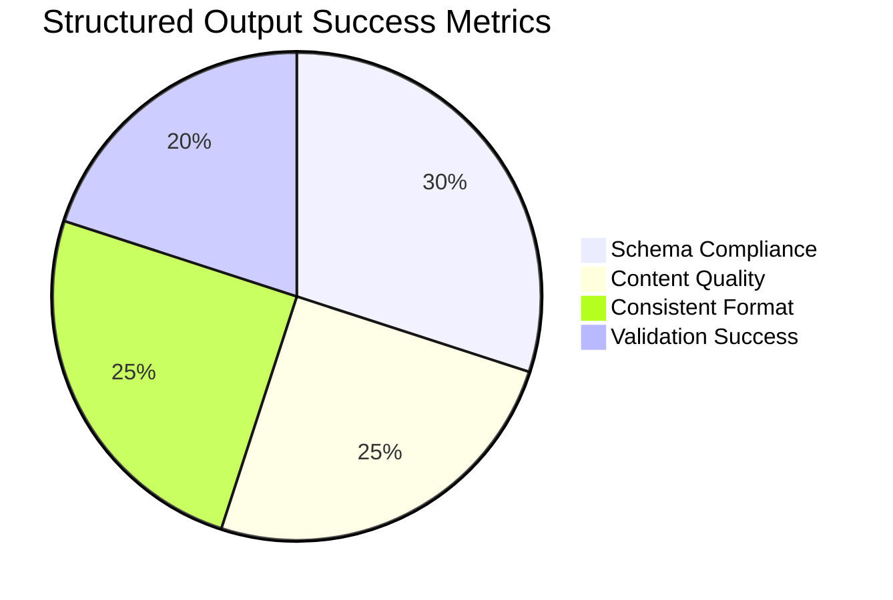

| Indicator | Description | What to Look For |
|-----------|-------------|------------------|
| 📋 **Schema Compliance** | Output matches Pydantic model exactly | Valid JSON with all required fields |
| 📝 **Content Quality** | Generated content is relevant and well-written | Professional, coherent text |
| 🔄 **Consistent Format** | Every response follows same structure | Identical JSON keys and structure |
| ✅ **Validation Success** | No schema validation errors | Clean execution without retries |

### 🔧 Testing Checklist

- [ ] 📋 All responses are valid JSON
- [ ] 📝 Subject lines are concise and descriptive
- [ ] 📧 Email bodies are well-formatted
- [ ] 🔄 Output structure is consistent across requests
- [ ] ✅ No Pydantic validation errors
- [ ] 💾 Results stored correctly in session state

## 🔄 Advanced Schema Concepts

### 🏗️ Complex Schema Design

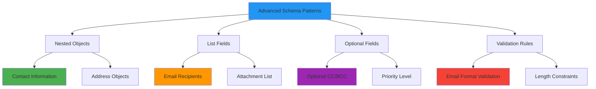

#### 🔧 Advanced Pydantic Example

```python
class AdvancedEmailContent(BaseModel):
    """Advanced email schema with nested objects and validation."""
    
    subject: str = Field(
        description="Email subject line",
        min_length=5,
        max_length=100
    )
    
    body: str = Field(
        description="Email body content",
        min_length=20
    )
    
    priority: Optional[str] = Field(
        default="normal",
        description="Email priority level",
        regex="^(low|normal|high)$"
    )
    
    recipients: List[str] = Field(
        description="List of recipient email addresses",
        min_items=1
    )
    
    metadata: Optional[Dict[str, Any]] = Field(
        default_factory=dict,
        description="Additional email metadata"
    )
```

### 📊 Schema Validation Flow

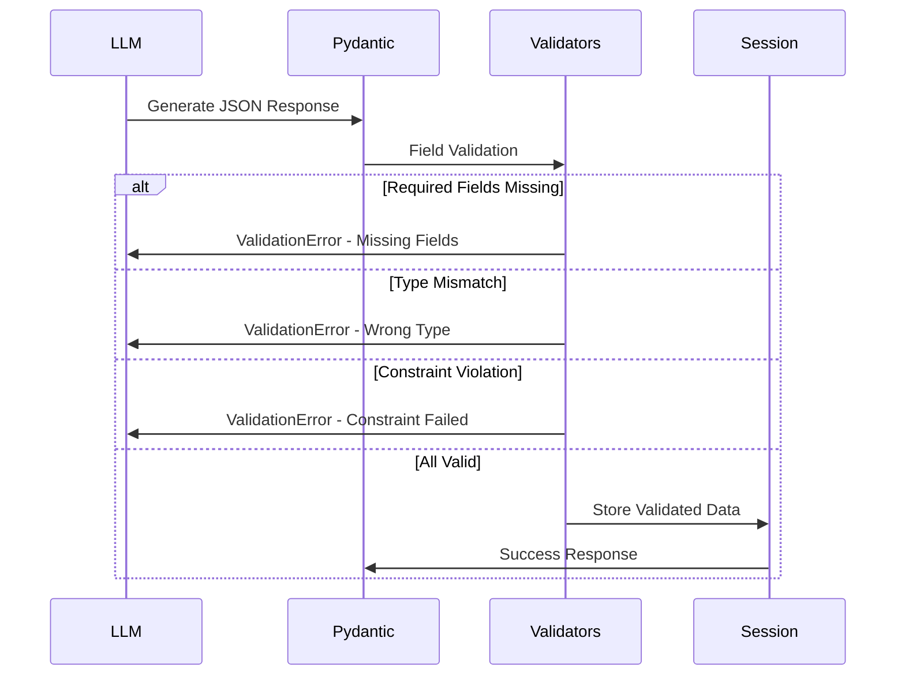

### 🎯 Best Practices for Schema Design

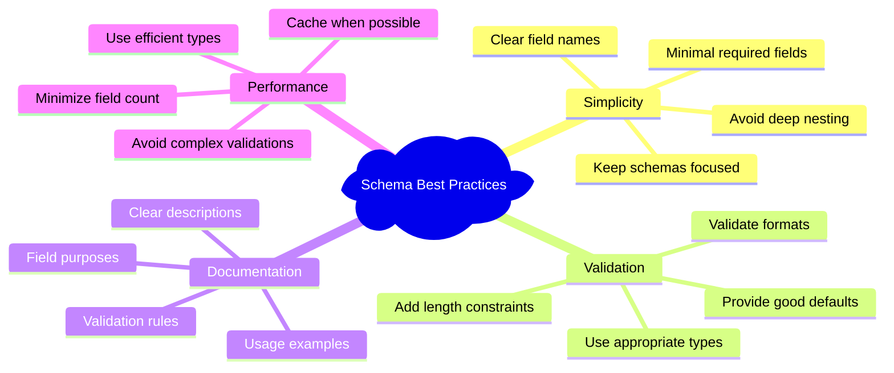

## 🚪 Troubleshooting

### 🔧 Common Issues

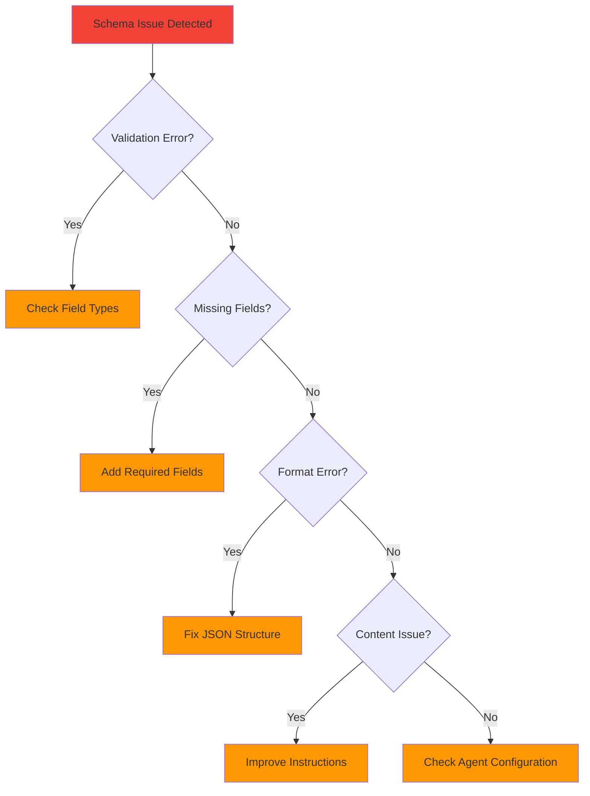

| Issue | Cause | Solution |
|-------|-------|----------|
| 🚫 **Validation Error** | Field type mismatch | Check Pydantic model types |
| 📋 **Missing Fields** | Required field not provided | Update agent instructions |
| 🔧 **Format Error** | Invalid JSON structure | Fix LLM output formatting |
| 📝 **Content Quality** | Poor generated content | Improve prompt engineering |
| ⚙️ **Schema Error** | Pydantic model issues | Validate model definition |

### 🛠️ Debug Commands

```bash
# Test Pydantic model directly
python -c "from email_agent.agent import EmailContent; print(EmailContent.schema())"

# Validate sample data
python -c "from email_agent.agent import EmailContent; EmailContent(subject='Test', body='Test body')"

# Check agent configuration
adk config validate email_generator
```

### 🛑 Exit Options

```bash
# Stop any running ADK command
Ctrl+C
```

## 🎓 What You've Learned

### 🏆 Key Achievements

- [ ] 📊 Implemented structured outputs with Pydantic models
- [ ] 🔧 Configured output schemas for consistent formatting
- [ ] ✅ Applied data validation and type safety
- [ ] 📝 Created professional email generation system
- [ ] 🔄 Understood structured data flow in ADK
- [ ] 🛠️ Mastered schema design best practices
- [ ] 🔧 Learned troubleshooting techniques
- [ ] 💾 Implemented session state storage

### 🚀 Next Steps

Ready for more advanced concepts?

| Next Example | Focus | Complexity | Key Concepts |
|--------------|-------|------------|--------------|
| 💾 **Sessions & State** | Memory management | ⭐⭐⭐ | State persistence, context |
| 🏪 **Persistent Storage** | Data durability | ⭐⭐⭐ | Database integration |
| 🤖 **Multi-Agent** | Agent orchestration | ⭐⭐⭐⭐ | Agent coordination |

### 🎯 Advanced Concepts to Explore

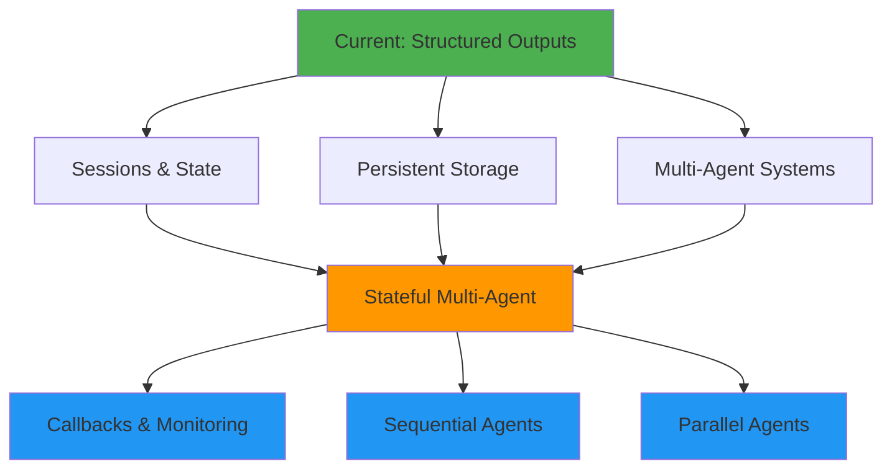

## 📚 Additional Resources

### 🔗 Official Documentation

| Resource | Focus | Link |
|----------|-------|------|
| 📖 **ADK Structured Data** | Complete structured data guide | [ADK Documentation](https://google.github.io/adk-docs/agents/llm-agents/#structuring-data-input_schema-output_schema-output_key) |
| 🔧 **Pydantic Models** | Schema definition and validation | [Pydantic Documentation](https://docs.pydantic.dev/latest/) |
| 📋 **JSON Schema** | Understanding JSON Schema format | [JSON Schema Guide](https://json-schema.org/) |
| ✅ **Data Validation** | Advanced validation techniques | [Pydantic Validators](https://docs.pydantic.dev/latest/usage/validators/) |

### 🎯 Schema Design Patterns

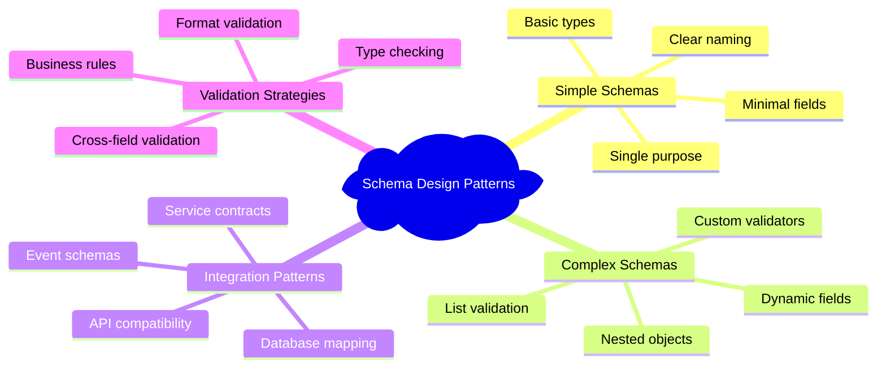

### 📊 Performance Considerations

| Aspect | Simple Schema | Complex Schema | Recommendation |
|--------|---------------|----------------|----------------|
| ⚡ **Validation Speed** | Fast | Slower | Keep schemas focused |
| 🧠 **LLM Performance** | Better | More challenging | Provide clear examples |
| 🔧 **Maintenance** | Easy | Complex | Document thoroughly |
| 🎯 **Error Rate** | Low | Higher | Test extensively |

---

<div align="center">

### 🎉 Congratulations! 

You've mastered structured outputs with Pydantic schemas! 

[](../5-sessions-state/)
[](../3-litellm-agent/)
[](../)

*Ready to add memory to your agents? Let's explore sessions and state! 💾*

</div>
