# 💾 Sessions and State Management in ADK

[](https://google.github.io/adk-docs/)
[](.)
[](https://www.python.org/downloads/)
[](.)

> 🎯 **Give Your Agents Memory** - Learn to create stateful agents that remember user information and maintain context across interactions

## 🧠 What Are Sessions in ADK?

**Sessions** in ADK provide persistent memory for your agents, enabling them to maintain context, store user data, and build relationships over time rather than forgetting everything between interactions.

### 🔄 Stateless vs Stateful Agents

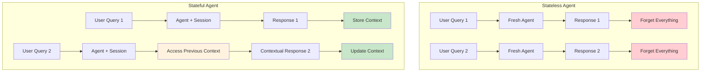

### 🏗️ Core Session Capabilities

| Capability | Description | Benefit |
|------------|-------------|---------|
| 💾 **Maintain State** | Store user data and preferences persistently | Personalized experiences |
| 📜 **Conversation History** | Automatic message history tracking | Context-aware responses |
| 🎯 **Personalization** | Use stored information for tailored responses | Better user relationships |
| 🔄 **Context Continuity** | Remember previous interactions | Seamless multi-turn conversations |
| 📊 **User Profiling** | Build comprehensive user profiles over time | Adaptive behavior |

## 🏗️ Session Architecture

### 🔧 Session Lifecycle

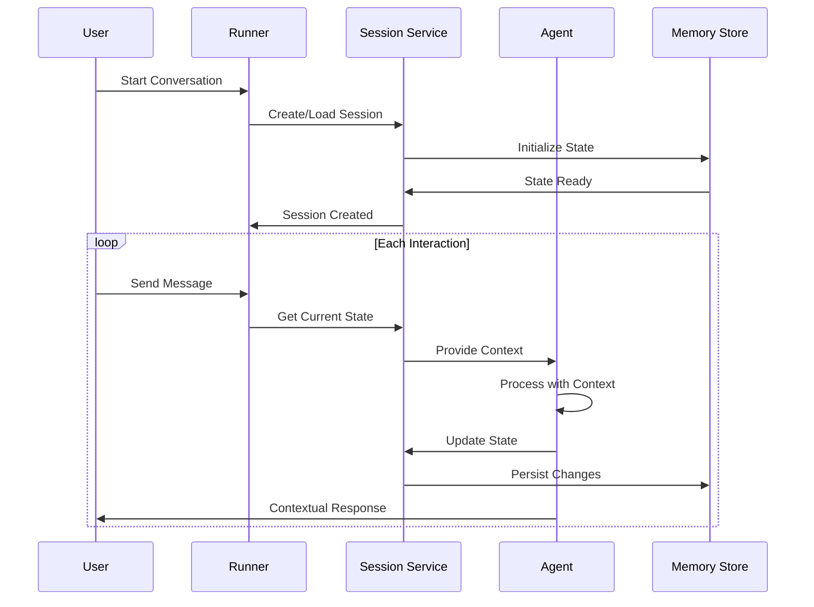

### 📊 State Management Flow

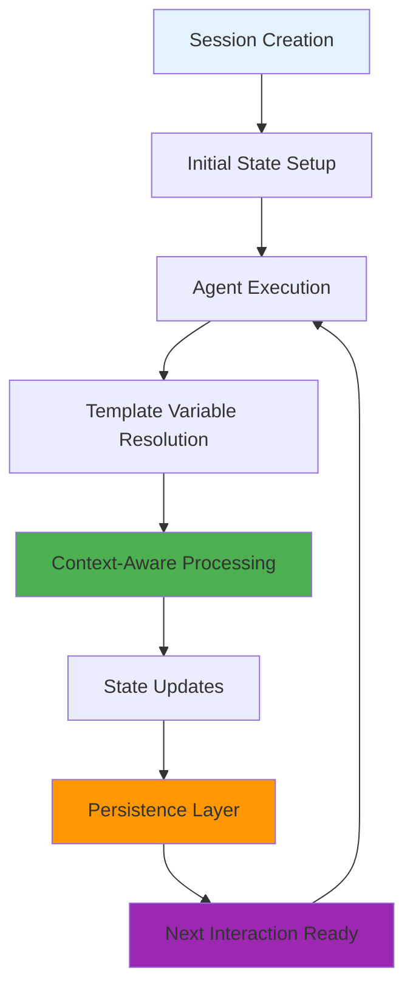

### 🗄️ Session Components

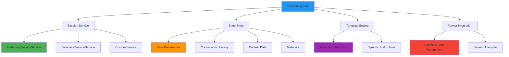

## 🎯 Example Overview

### 👤 User Profile Management

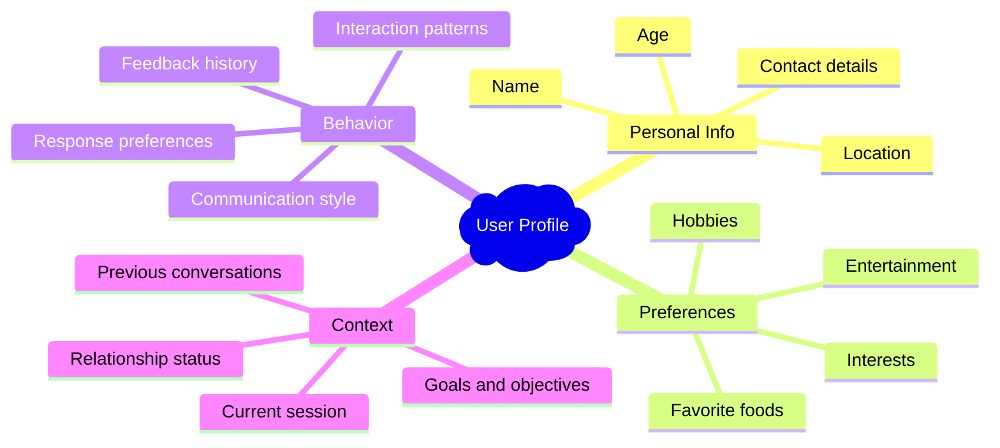

### 🔄 State Updates and Access

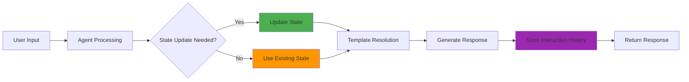

## 🏗️ Project Structure

### 📁 Directory Organization

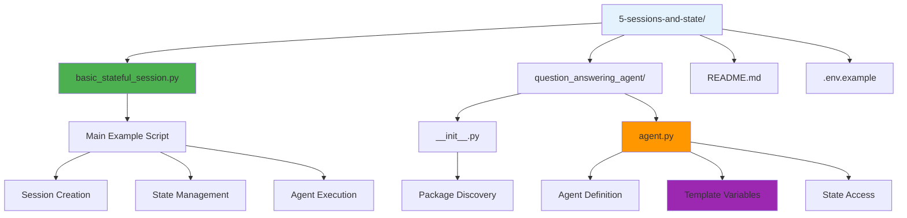

```
5-sessions-and-state/
│
├── basic_stateful_session.py      # 🚀 Main example execution
│   ├── Session creation
│   ├── State initialization  
│   ├── Agent configuration
│   └── Interactive demonstration
│
├── question_answering_agent/      # 🤖 Stateful Agent Package
│   ├── __init__.py               # 📦 Package initialization
│   └── agent.py                  # 🧠 Agent with template variables
│
├── .env.example                  # 📋 Environment template
└── README.md                     # 📖 Documentation
```

## 🔧 Key Components Deep Dive

### 1️⃣ Session Service Types

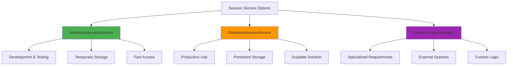

| Service Type | Use Case | Persistence | Scalability |
|--------------|----------|-------------|-------------|
| 💾 **InMemory** | Development, testing | Temporary | Single instance |
| 🗄️ **Database** | Production, enterprise | Permanent | Highly scalable |
| 🔧 **Custom** | Specialized needs | Configurable | Depends on implementation |

### 2️⃣ Initial State Configuration

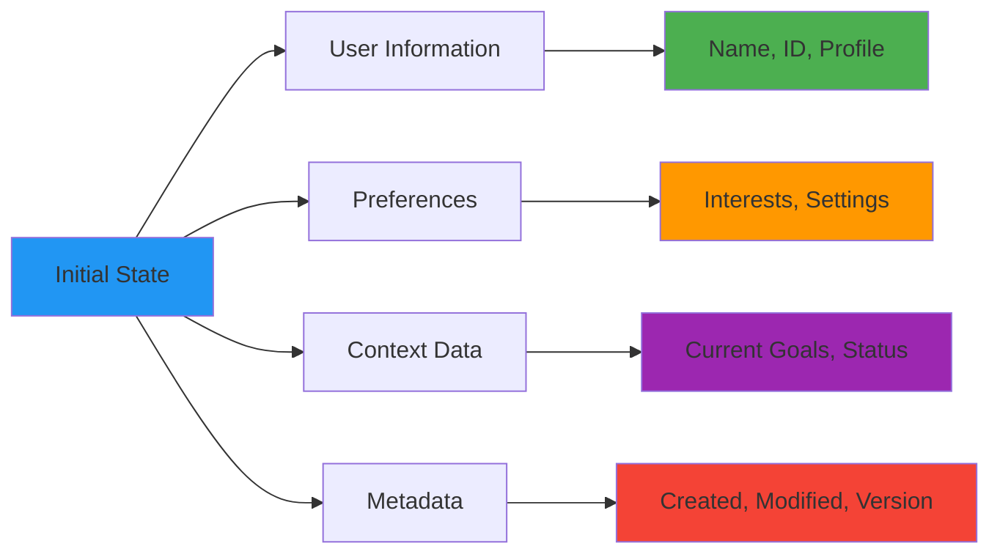

#### 📋 State Structure Example

```python
initial_state = {
    # User Identity
    "user_name": "Brandon Hancock",
    "user_id": "user_12345",
    
    # Preferences & Interests
    "user_preferences": {
        "sports": ["Pickleball", "Disc Golf", "Tennis"],
        "food": ["Mexican", "Italian"],
        "entertainment": ["Game of Thrones", "YouTube"],
        "communication_style": "casual_friendly"
    },
    
    # Context & Goals
    "current_context": {
        "session_goal": "learning_about_preferences",
        "interaction_count": 0,
        "last_topic": None
    },
    
    # History & Metadata
    "session_metadata": {
        "created_at": "2023-11-01T10:00:00Z",
        "last_updated": "2023-11-01T10:00:00Z",
        "version": "1.0"
    }
}
```

### 3️⃣ Template Variables in Action

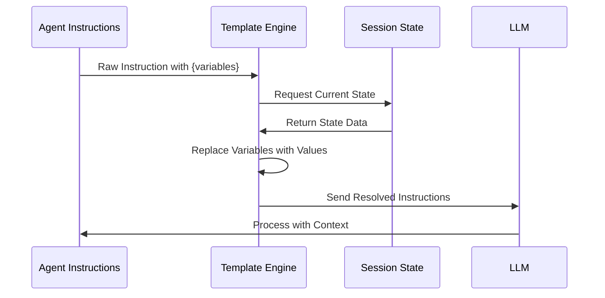

#### 🔧 Template Resolution Example

```python
# Original instruction with template variables
instruction = """
You are a helpful assistant for {user_name}.

User Preferences:
{user_preferences}

Current Context:
{current_context}
"""

# After template resolution
resolved_instruction = """
You are a helpful assistant for Brandon Hancock.

User Preferences:
Sports: Pickleball, Disc Golf, Tennis
Food: Mexican cuisine
Shows: Game of Thrones

Current Context:
Goal: Learning about user preferences
Interaction: 3rd conversation
"""
```

## 🚀 Getting Started

### 📋 Prerequisites Checklist

- [ ] ✅ Virtual environment activated
- [ ] 🔑 Google API key configured
- [ ] 🧠 Understanding of agent basics
- [ ] 📊 Familiarity with data structures

### 🔧 Environment Setup

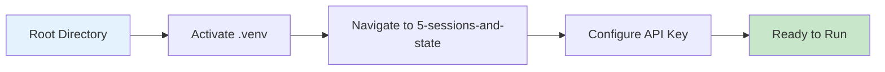

#### 🔌 Virtual Environment Activation

```bash
# 🔌 Activate virtual environment (from parent directory)
# macOS/Linux:
source ../.venv/bin/activate

# Windows CMD:
..\.venv\Scripts\activate.bat

# Windows PowerShell:
..\.venv\Scripts\Activate.ps1
```

#### 🔑 API Key Configuration

Create `.env` file in the project directory:

```bash
# Copy template and configure
cp .env.example .env

# Add your API key
GOOGLE_API_KEY=your_google_api_key_here
```

## 🎮 Running the Example

### 🖥️ Script Execution

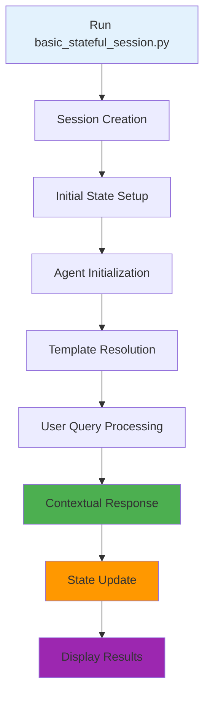

### 📝 Step-by-Step Execution

| Step | Action | Expected Result |
|------|--------|-----------------|
| 1️⃣ | **Navigate to directory** | `cd 5-sessions-and-state` |
| 2️⃣ | **Run example script** | `python basic_stateful_session.py` |
| 3️⃣ | **Observe session creation** | Session initialized with user data |
| 4️⃣ | **Watch template resolution** | Variables replaced with actual values |
| 5️⃣ | **View contextual response** | Agent responds using stored preferences |

### 🔄 Execution Flow

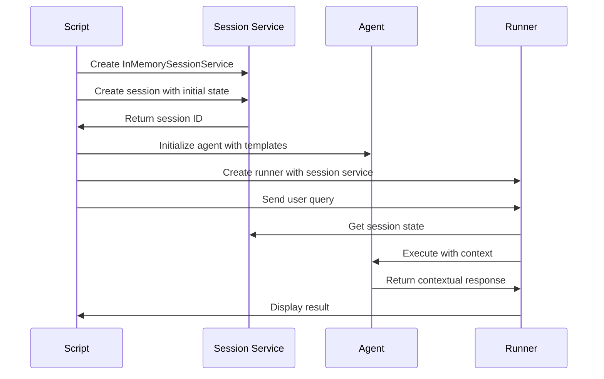

## 💬 Example Interactions and Results

### 🎯 Sample Queries and Responses

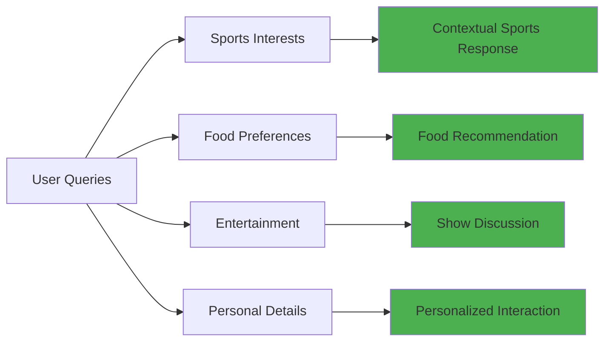

### 📊 Response Quality Comparison

| Query Type | Without Session | With Session | Improvement |
|------------|-----------------|--------------|-------------|
| 🏓 **Sports** | Generic sports info | Personalized to pickleball, disc golf, tennis | 🎯 Highly targeted |
| 🌮 **Food** | General food advice | Mexican cuisine focus | 🎯 Preference-aware |
| 📺 **Entertainment** | Random suggestions | Game of Thrones references | 🎯 Interest-aligned |
| 👤 **Personal** | Formal responses | Uses name "Brandon" | 🎯 Relationship building |

### 🔄 State Evolution

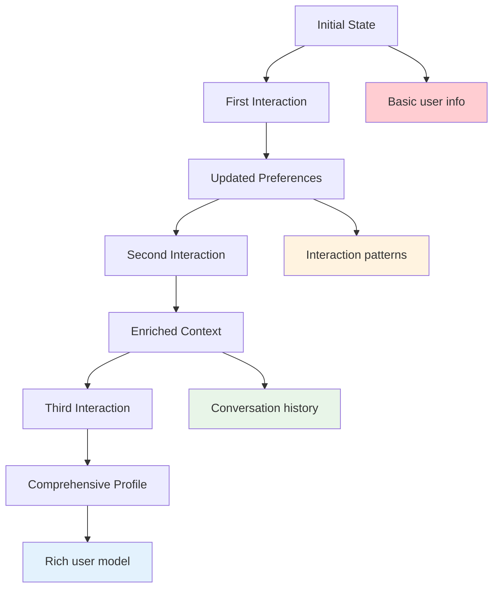

## 🎉 Success Indicators

### ✅ Your Session Management is Working When:

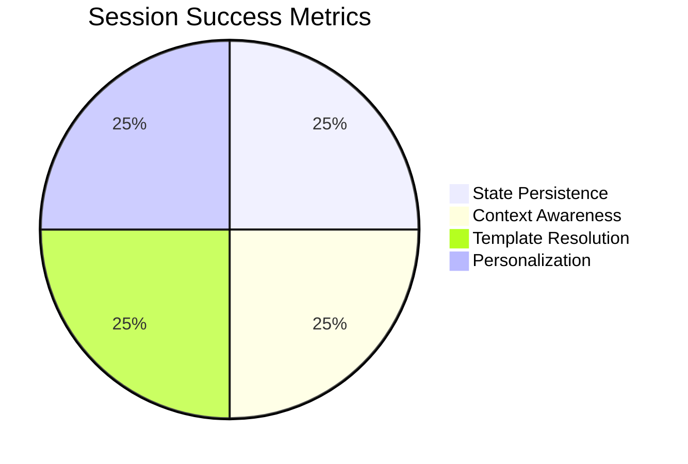

| Indicator | Description | What to Look For |
|-----------|-------------|------------------|
| 💾 **State Persistence** | Data survives between interactions | Preferences remembered |
| 🧠 **Context Awareness** | Agent uses stored information | Relevant, personalized responses |
| 🔧 **Template Resolution** | Variables properly substituted | Instructions include user data |
| 🎯 **Personalization** | Responses tailored to user | Name usage, preference alignment |

### 🔧 Testing Checklist

- [ ] 💾 Session created successfully
- [ ] 📋 Initial state populated correctly
- [ ] 🔧 Template variables resolved
- [ ] 🧠 Agent accesses session data
- [ ] 🎯 Responses show personalization
- [ ] 🔄 State updates between interactions
- [ ] 📊 Conversation history maintained

## 🔄 Advanced Session Patterns

### 🏗️ Complex State Management

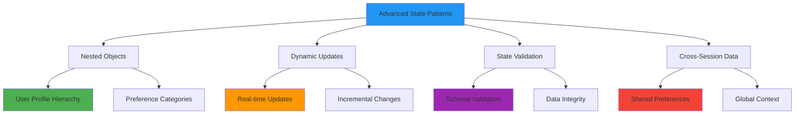

### 📊 State Schema Design

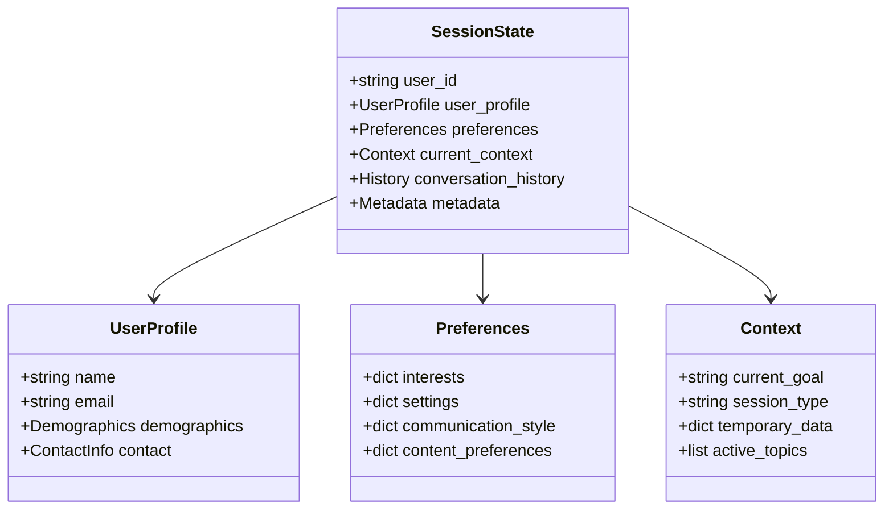

### 🔐 Session Security and Privacy

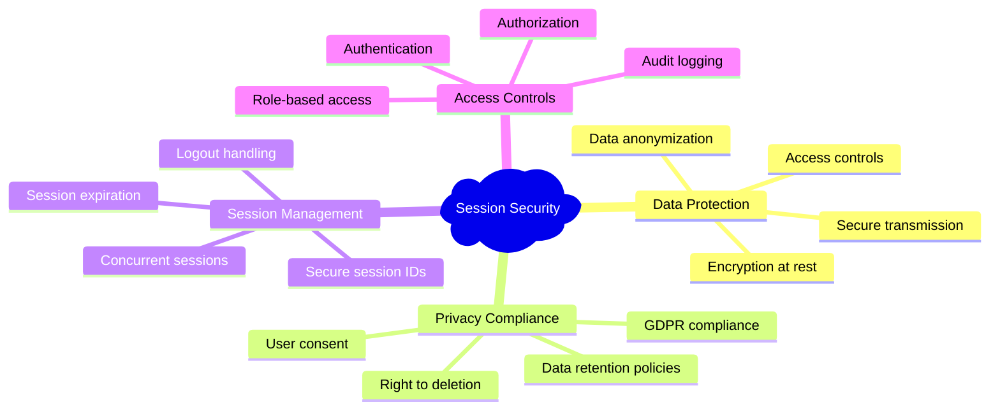

## 🚪 Troubleshooting

### 🔧 Common Issues

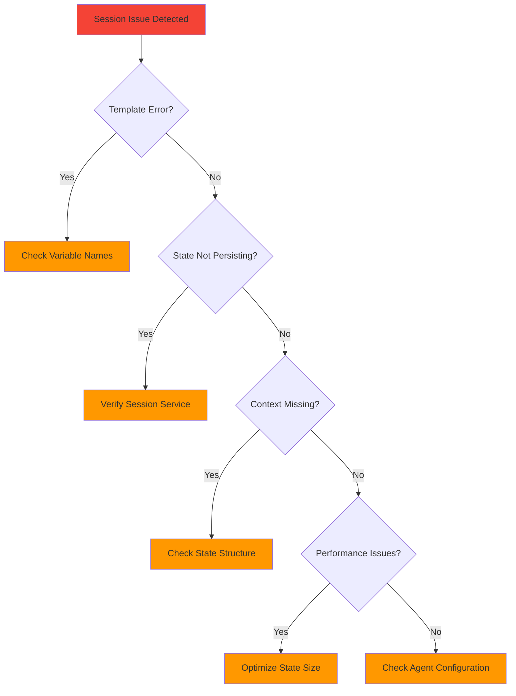

| Issue | Cause | Solution |
|-------|-------|----------|
| 🔧 **Template Errors** | Variable name mismatch | Check variable naming consistency |
| 💾 **State Not Persisting** | Session service misconfiguration | Verify session service setup |
| 🧠 **Missing Context** | Incorrect state structure | Validate state schema |
| ⚡ **Performance Issues** | Large state objects | Optimize state data size |
| 🔍 **Variables Not Resolving** | Template syntax errors | Check template syntax |

### 🛠️ Debug Commands

```bash
# Test session creation
python -c "from basic_stateful_session import *; test_session_creation()"

# Inspect session state
python -c "from basic_stateful_session import *; print_session_state()"

# Validate template resolution
python -c "from basic_stateful_session import *; test_template_resolution()"
```

### 🛑 Exit Options

```bash
# Stop script execution
Ctrl+C
```

## 🎓 What You've Learned

### 🏆 Key Achievements

- [ ] 🧠 Implemented persistent memory for agents
- [ ] 💾 Created and managed session services
- [ ] 🔧 Used template variables for dynamic instructions
- [ ] 📊 Built comprehensive user state models
- [ ] 🎯 Achieved personalized agent responses
- [ ] 🔄 Managed state lifecycle and updates
- [ ] 🛠️ Mastered session troubleshooting
- [ ] 🔐 Understood security considerations

### 🚀 Next Steps

Ready for more advanced concepts?

| Next Example | Focus | Complexity | Key Concepts |
|--------------|-------|------------|--------------|
| 🏪 **Persistent Storage** | Database integration | ⭐⭐⭐ | Data durability, scaling |
| 🤖 **Multi-Agent** | Agent orchestration | ⭐⭐⭐⭐ | Agent coordination |
| 🔄 **Stateful Multi-Agent** | Complex state management | ⭐⭐⭐⭐⭐ | Distributed state |

### 🎯 Advanced Concepts to Explore

```mermaid
graph TD
    A[Current: Sessions & State] --> B[Persistent Storage]
    A --> C[Multi-Agent Systems]
    A --> D[Stateful Multi-Agent]
    
    B --> E[Database Integration]
    B --> F[Data Scaling]
    
    C --> G[Agent Coordination]
    C --> H[Message Passing]
    
    D --> I[Distributed State]
    D --> J[Complex Workflows]
    
    style A fill:#4caf50
    style B fill:#ff9800
    style C fill:#2196f3
    style D fill:#9c27b0
```

## 📚 Additional Resources

### 🔗 Official Documentation

| Resource | Focus | Link |
|----------|-------|------|
| 📖 **ADK Sessions** | Complete session guide | [ADK Sessions Documentation](https://google.github.io/adk-docs/sessions/session/) |
| 🔧 **State Management** | Advanced state techniques | [State Management Guide](https://google.github.io/adk-docs/sessions/state/) |
| 🛠️ **Session Services** | Service implementation patterns | [Session Service Patterns](https://google.github.io/adk-docs/sessions/session_service/) |
| 📊 **Template Variables** | Dynamic instruction generation | [Template Documentation](https://google.github.io/adk-docs/sessions/template_variables/) |

### 🎯 Best Practices

```mermaid
mindmap
  root)Session Best Practices(
    State Design
      Keep states focused
      Avoid deep nesting
      Use clear naming
      Plan for scalability
    Performance
      Minimize state size
      Efficient updates
      Lazy loading
      Cache frequently used data
    Security
      Encrypt sensitive data
      Validate inputs
      Implement access controls
      Audit state changes
    Maintenance
      Document state schema
      Version state structure
      Handle migrations
      Monitor usage patterns
```

### 📊 Session Performance Patterns

| Pattern | Use Case | Benefits | Considerations |
|---------|----------|----------|----------------|
| 🔄 **Minimal State** | Simple preferences | Fast access, low memory | Limited context |
| 📋 **Rich Profiles** | Complex personalization | Deep context, better UX | Higher resource usage |
| 🗂️ **Hierarchical State** | Organized data | Structured access | Complexity overhead |
| ⚡ **Cached State** | High-frequency access | Performance optimized | Cache invalidation |

---

<div align="center">

### 🎉 Congratulations! 

You've mastered sessions and state management in ADK! 

[](../6-persistent-storage/)
[](../4-structured-outputs/)
[](../)

*Ready to make your data permanent? Let's explore persistent storage! 🏪*

</div>
