# 🤖 Multi-Agent Systems in ADK

[](https://google.github.io/adk-docs/)
[](.)
[](https://www.python.org/downloads/)
[](.)

> 🎯 **Orchestrate Intelligent Agent Teams** - Learn to create sophisticated multi-agent systems where specialized agents collaborate to solve complex problems

## 🌐 What is a Multi-Agent System?

A **Multi-Agent System (MAS)** is an advanced architectural pattern in ADK where multiple specialized agents collaborate to handle complex tasks. Each agent focuses on a specific domain, and they work together through intelligent delegation and communication.

### 🎭 Single Agent vs Multi-Agent Comparison

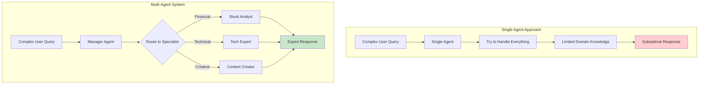

### 🏗️ Multi-Agent Benefits

| Benefit | Description | Impact |
|---------|-------------|--------|
| 🎯 **Specialization** | Each agent excels in its domain | Higher quality responses |
| 🔄 **Modularity** | Independent, reusable components | Easier maintenance |
| 📈 **Scalability** | Add new specialists without rebuilding | Flexible system growth |
| 🛡️ **Fault Tolerance** | Failure isolation to specific agents | Better reliability |
| 🚀 **Parallel Processing** | Multiple agents can work simultaneously | Improved performance |

## 🏗️ Multi-Agent Architecture Patterns

### 🎛️ Architecture Options Overview

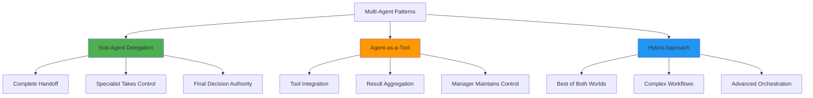

### 1️⃣ Sub-Agent Delegation Model

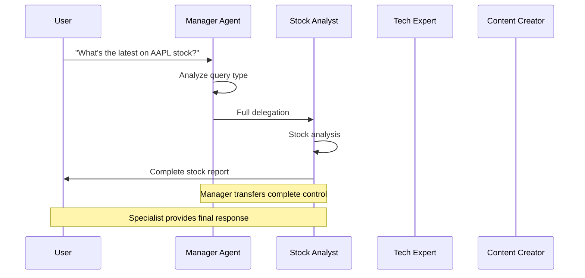

**Characteristics:**
- 🎯 **Complete Delegation**: Specialist takes full control
- 🔄 **Final Authority**: Sub-agent's response is final
- 🎭 **Role-Based Routing**: Manager acts as intelligent router

### 2️⃣ Agent-as-a-Tool Model

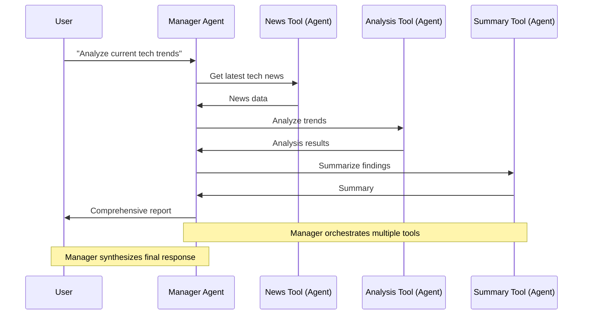

**Characteristics:**
- 🛠️ **Tool Integration**: Agents used as specialized tools
- 🔄 **Result Aggregation**: Manager combines multiple responses
- 🎯 **Maintained Control**: Manager retains conversation ownership

## 📁 Project Structure Requirements

### 🏗️ Required Directory Structure

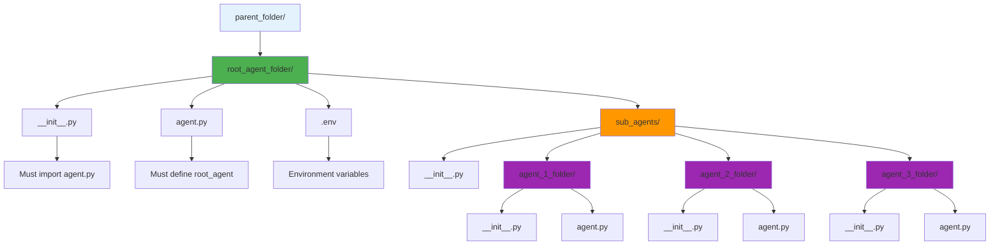

```
7-multi-agent/
├── manager/                     # 🎯 Root Agent Package
│   ├── __init__.py             # 📦 Must import agent.py
│   ├── agent.py                # 🤖 Must define root_agent
│   ├── .env                    # 🔑 Environment variables
│   └── sub_agents/             # 🏢 Specialists Directory
│       ├── __init__.py         # 📦 Optional imports
│       ├── stock_analyst/      # 📈 Financial Specialist
│       │   ├── __init__.py     # 📦 Must import agent.py
│       │   └── agent.py        # 🤖 Stock analysis agent
│       ├── funny_nerd/         # 😄 Comedy Specialist
│       │   ├── __init__.py     # 📦 Must import agent.py
│       │   └── agent.py        # 🤖 Humor generation agent
│       └── news_analyst/       # 📰 News Specialist
│           ├── __init__.py     # 📦 Must import agent.py
│           └── agent.py        # 🤖 News analysis agent
```

### 🔧 Essential Structure Components

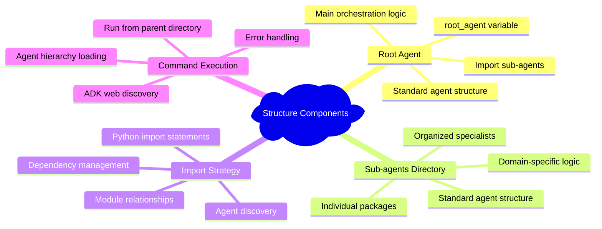

## 🎯 Agent Orchestration Examples

### 🎭 Our Multi-Agent Cast

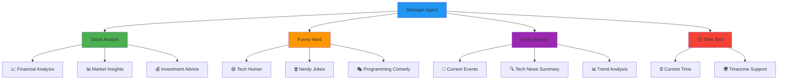

### 🔄 Query Routing Intelligence

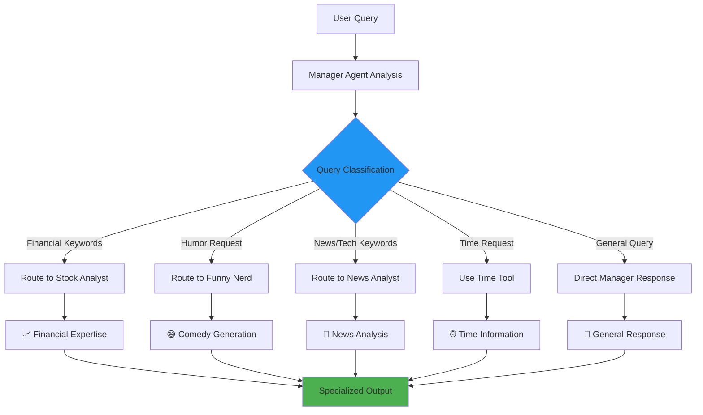

## ⚠️ Limitations and Constraints

### 🚫 Critical Multi-Agent Limitations

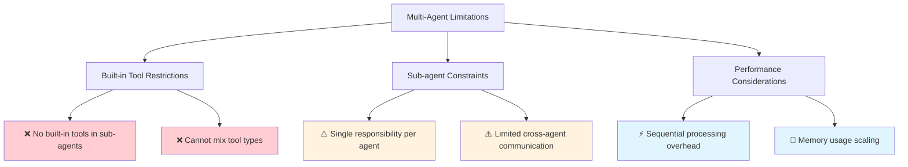

### 🛠️ Workaround Strategies

#### ❌ Not Supported Pattern

```python
# This approach does NOT work
search_agent = Agent(
    name='SearchAgent',
    tools=[google_search],  # Built-in tool
)
coding_agent = Agent(
    name='CodeAgent', 
    tools=[built_in_code_execution],  # Built-in tool
)
root_agent = Agent(
    name="RootAgent",
    sub_agents=[search_agent, coding_agent]  # ❌ NOT SUPPORTED
)
```

#### ✅ Supported Workaround

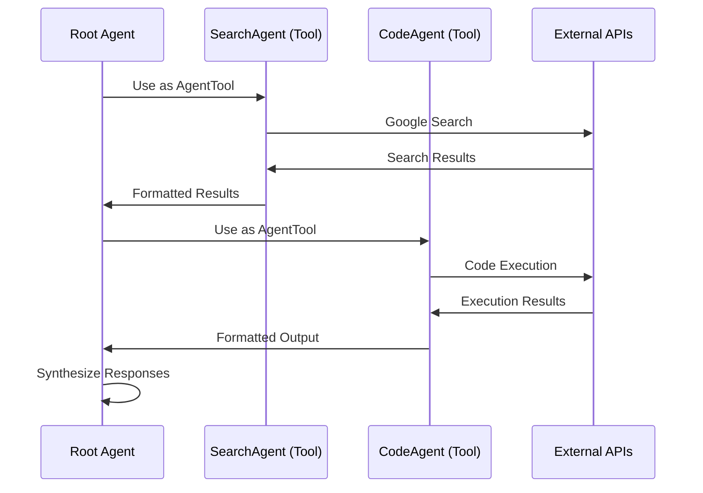

```python
# This approach WORKS
from google.adk.tools.agent_tool import AgentTool

search_agent = Agent(
    name='SearchAgent',
    tools=[google_search],
)
coding_agent = Agent(
    name='CodeAgent',
    tools=[built_in_code_execution],
)
root_agent = Agent(
    name="RootAgent",
    tools=[
        AgentTool(agent=search_agent),    # ✅ SUPPORTED
        AgentTool(agent=coding_agent)     # ✅ SUPPORTED
    ],
)
```

## 🚀 Getting Started

### 📋 Prerequisites Checklist

- [ ] ✅ Virtual environment activated
- [ ] 🔑 Google API key configured
- [ ] 🏗️ Understanding of agent basics
- [ ] 📊 Familiarity with project structure patterns

### 🔧 Environment Setup

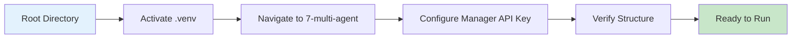

#### 🔌 Virtual Environment Activation

```bash
# 🔌 Activate virtual environment (from parent directory)
# macOS/Linux:
source ../.venv/bin/activate

# Windows CMD:
..\.venv\Scripts\activate.bat

# Windows PowerShell:
..\.venv\Scripts\Activate.ps1
```

#### 🔑 API Key Configuration

| Step | Action | Location |
|------|--------|----------|
| 1️⃣ | **Locate Template** | Find `.env.example` in manager folder |
| 2️⃣ | **Create Config** | Copy to `.env` in manager folder |
| 3️⃣ | **Add API Key** | `GOOGLE_API_KEY=your_key_here` |
| 4️⃣ | **Verify Setup** | Check all agents load correctly |

## 🎮 Running the Multi-Agent System

### 🌐 Interactive Web UI

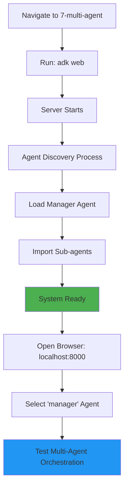

### 🛠️ Available Run Methods

| Method | Command | Interface | Best For |
|--------|---------|-----------|----------|
| 🌐 **Web UI** | `adk web` | Browser-based | Interactive multi-agent testing |
| 💻 **Terminal** | `adk run manager` | Command line | Quick validation |
| 🔌 **API Server** | `adk api_server` | REST endpoints | Integration testing |

### 📝 Step-by-Step Process

| Step | Action | Expected Result |
|------|--------|-----------------|
| 1️⃣ | Navigate to directory | `cd 7-multi-agent` |
| 2️⃣ | Start web server | `adk web` |
| 3️⃣ | Open browser | Visit `http://localhost:8000` |
| 4️⃣ | Select manager agent | Choose "manager" from dropdown |
| 5️⃣ | Test orchestration | Try specialist-specific queries |

## 💬 Example Interactions and Routing

### 🎯 Query Classification and Routing

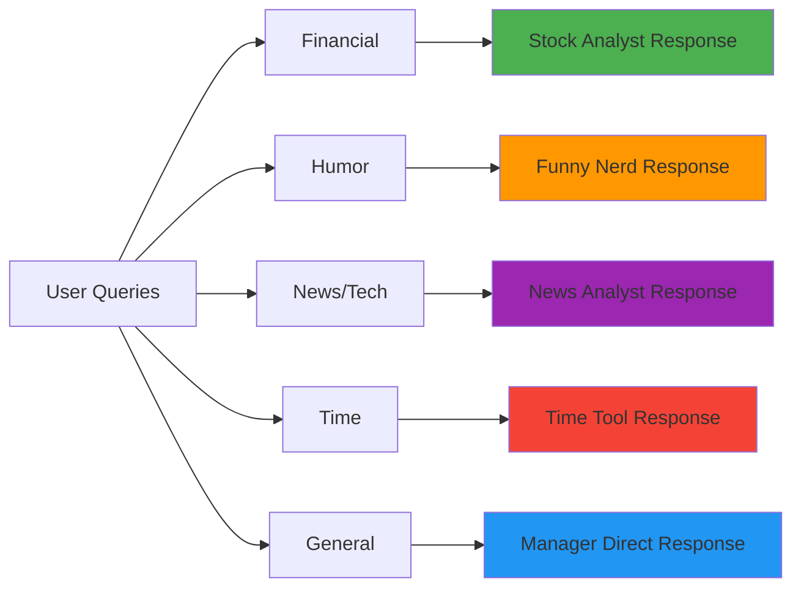

### 📊 Interaction Examples by Category

#### 📈 Financial Queries (→ Stock Analyst)

| User Input | Routing Decision | Specialist Response |
|------------|------------------|-------------------|
| "What's the latest on AAPL stock?" | → Stock Analyst | Detailed financial analysis |
| "Should I invest in tech stocks?" | → Stock Analyst | Investment recommendations |
| "Explain market volatility" | → Stock Analyst | Market insights |

#### 😄 Humor Requests (→ Funny Nerd)

| User Input | Routing Decision | Specialist Response |
|------------|------------------|-------------------|
| "Tell me a programming joke" | → Funny Nerd | Tech-focused humor |
| "Make me laugh about databases" | → Funny Nerd | Database comedy |
| "Something funny about AI" | → Funny Nerd | AI-themed jokes |

#### 📰 Tech News (→ News Analyst as Tool)

| User Input | Routing Decision | Specialist Response |
|------------|------------------|-------------------|
| "What's happening in tech today?" | → News Analyst Tool | Current tech news summary |
| "Latest AI developments" | → News Analyst Tool | AI news compilation |
| "Tech industry trends" | → News Analyst Tool | Trend analysis report |

#### ⏰ Time Queries (→ Time Tool)

| User Input | Routing Decision | Tool Response |
|------------|------------------|---------------|
| "What time is it?" | → Time Tool | Current timestamp |
| "What's the current time?" | → Time Tool | Formatted time display |

### 🔄 Multi-Turn Conversation Flow

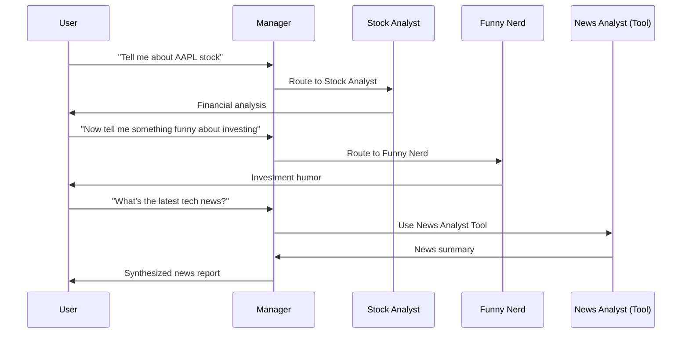

## 🎉 Success Indicators

### ✅ Your Multi-Agent System is Working When:

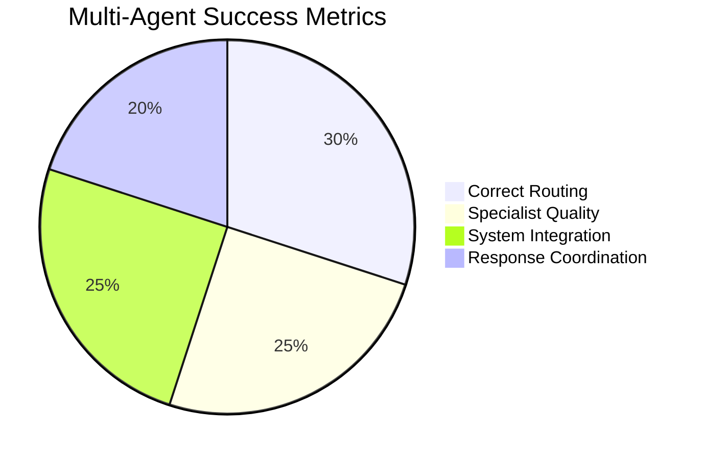

| Indicator | Description | What to Look For |
|-----------|-------------|------------------|
| 🎯 **Correct Routing** | Queries reach appropriate specialists | Financial queries → Stock Analyst |
| 🏆 **Specialist Quality** | Each agent excels in its domain | High-quality domain responses |
| 🔗 **System Integration** | All agents work together seamlessly | No import or discovery errors |
| 🎭 **Response Coordination** | Smooth handoffs and tool usage | Clean conversation flow |

### 🔧 Testing Checklist

- [ ] 🎯 Manager agent loads correctly
- [ ] 📈 Stock Analyst handles financial queries
- [ ] 😄 Funny Nerd generates appropriate humor
- [ ] 📰 News Analyst provides tech summaries
- [ ] ⏰ Time tool responds to time queries
- [ ] 🔄 Routing decisions are intelligent
- [ ] 🎭 No agent conflicts or errors
- [ ] 📊 System performance is acceptable

## 🔄 Advanced Multi-Agent Patterns

### 🏗️ Complex Orchestration Strategies

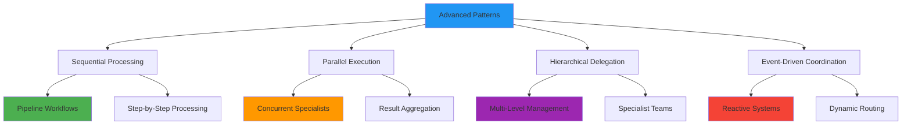

### 📊 Scaling Multi-Agent Systems

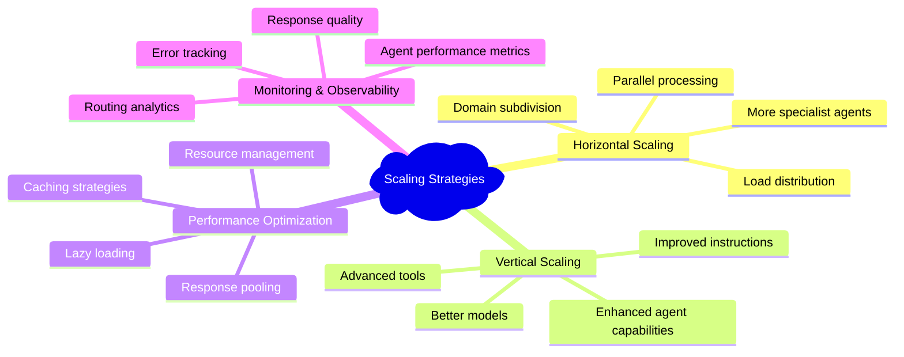

### 🎯 Best Practices for Multi-Agent Design

| Practice | Description | Implementation |
|----------|-------------|----------------|
| 🎯 **Clear Responsibilities** | Each agent has distinct domain | Avoid overlapping capabilities |
| 📝 **Descriptive Names** | Agent names reflect their purpose | `stock_analyst`, `content_creator` |
| 🔄 **Loose Coupling** | Agents work independently | Minimal inter-agent dependencies |
| 📊 **Consistent Interfaces** | Standardized communication patterns | Common input/output formats |
| 🛡️ **Error Isolation** | Failures don't cascade | Graceful degradation strategies |

## 🚪 Troubleshooting

### 🔧 Common Multi-Agent Issues

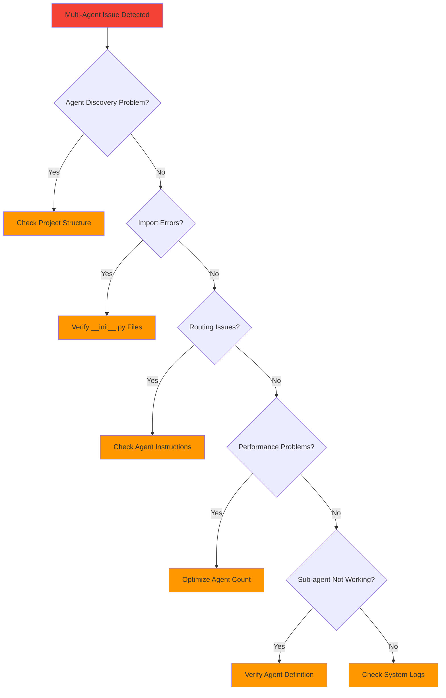

| Issue | Symptoms | Cause | Solution |
|-------|----------|-------|---------|
| 🚫 **Agent Not Found** | Missing from dropdown | Project structure issues | Verify folder structure and imports |
| 📋 **Import Errors** | Python import failures | Missing `__init__.py` files | Add proper import statements |
| 🎯 **Wrong Routing** | Queries go to wrong agent | Poor instruction clarity | Improve agent descriptions |
| ⚡ **Slow Performance** | Long response times | Too many agents | Optimize agent selection |
| 🔧 **Sub-agent Issues** | Specialists don't respond | Agent definition problems | Check `root_agent` variable |

### 🛠️ Debug Commands

```bash
# Test agent structure
python -c "from manager.agent import root_agent; print(root_agent.name)"

# Check sub-agent imports
python -c "from manager.sub_agents.stock_analyst.agent import stock_analyst; print(stock_analyst.name)"

# Verify agent discovery
adk config list-agents

# Test individual agents
adk run manager --debug
```

### 🛑 Exit Options

```bash
# Stop any running ADK command
Ctrl+C
```

## 🎓 What You've Learned

### 🏆 Key Achievements

- [ ] 🤖 Implemented sophisticated multi-agent orchestration
- [ ] 🎯 Designed specialist agents with clear responsibilities
- [ ] 🔄 Mastered both sub-agent and agent-tool patterns
- [ ] 🏗️ Built proper multi-agent project structures
- [ ] 📊 Created intelligent query routing systems
- [ ] 🛠️ Applied workarounds for built-in tool limitations
- [ ] 🔧 Troubleshot complex multi-agent systems
- [ ] 📈 Understood scaling and performance considerations

### 🚀 Next Steps

Ready for even more advanced coordination?

| Next Example | Focus | Complexity | Key Concepts |
|--------------|-------|------------|--------------|
| 🔄 **Stateful Multi-Agent** | Complex state management | ⭐⭐⭐⭐⭐ | Shared state, coordination |
| 📊 **Callbacks** | Event monitoring | ⭐⭐⭐ | Real-time monitoring |
| ⚡ **Sequential Agent** | Pipeline workflows | ⭐⭐⭐ | Step-by-step processing |

### 🎯 Advanced Concepts to Explore

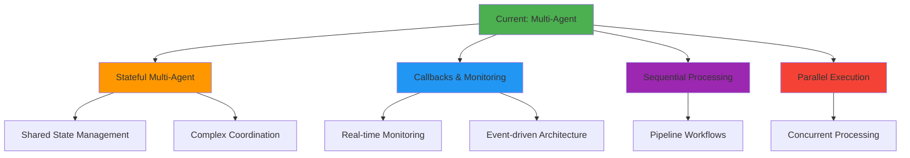

## 📚 Additional Resources

### 🔗 Official Documentation

| Resource | Focus | Link |
|----------|-------|------|
| 📖 **Multi-Agent Systems** | Complete orchestration guide | [ADK Multi-Agent Documentation](https://google.github.io/adk-docs/agents/multi-agent-systems/) |
| 🛠️ **Agent Tools** | Agent-as-a-tool patterns | [Agent Tools Documentation](https://google.github.io/adk-docs/tools/function-tools/#3-agent-as-a-tool) |
| 🏗️ **System Architecture** | Design patterns and best practices | [Architecture Guide](https://google.github.io/adk-docs/agents/architecture/) |
| 📊 **Performance Optimization** | Scaling multi-agent systems | [Performance Guide](https://google.github.io/adk-docs/performance/) |

### 🎯 Design Patterns

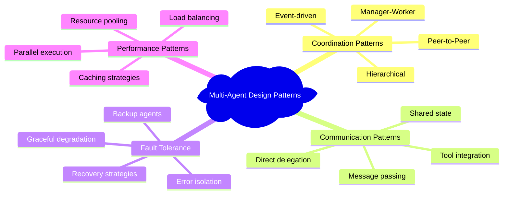

### 📊 Multi-Agent System Metrics

| Metric | Description | Target | Monitoring |
|--------|-------------|--------|------------|
| 🎯 **Routing Accuracy** | Correct specialist selection | >95% | Query classification logs |
| ⚡ **Response Time** | End-to-end latency | <3 seconds | Performance monitoring |
| 🏆 **Quality Score** | Response relevance | >4.5/5 | User feedback |
| 🔄 **System Availability** | Uptime percentage | >99% | Health checks |

---

<div align="center">

### 🎉 Congratulations! 

You've mastered multi-agent orchestration and coordination! 

[](../8-stateful-multi-agent/)
[](../6-persistent-storage/)
[](../)

*Ready for complex state coordination? Let's explore stateful multi-agent systems! 🔄*

</div>
