# 🔄 Stateful Multi-Agent Systems in ADK

[](https://google.github.io/adk-docs/)
[](.)
[](https://www.python.org/downloads/)
[](.)
[](.)

> 🎯 **Master Complex Agent Coordination with Memory** - Learn to build sophisticated systems where specialized agents share persistent state and coordinate intelligent responses

## 🧠 What is a Stateful Multi-Agent System?

A **Stateful Multi-Agent System** represents the pinnacle of ADK capabilities, combining persistent memory with intelligent agent orchestration. This creates sophisticated agent ecosystems that remember, learn, and coordinate across complex interactions.

### 🔄 Evolution of Agent Architectures

```mermaid
graph TB
    subgraph "Single Agent"
        A1[User Query] --> B1[Single Agent]
        B1 --> C1[Limited Response]
        
        style C1 fill:#ffcdd2
    end
    
    subgraph "Multi-Agent"
        A2[User Query] --> B2[Manager Agent]
        B2 --> C2[Specialist Routing]
        C2 --> D2[Expert Response]
        
        style D2 fill:#fff3e0
    end
    
    subgraph "Stateful Multi-Agent"
        A3[User Query] --> B3[Stateful Manager]
        B3 --> C3[Context + History]
        C3 --> D3[Specialist + Memory]
        D3 --> E3[Personalized Expert Response]
        
        style E3 fill:#c8e6c9
    end
```

### 🏗️ Core Capabilities Matrix

| Capability | Single Agent | Multi-Agent | Stateful Multi-Agent | Impact |
|------------|---------------|-------------|---------------------|--------|
| 🎯 **Specialization** | ❌ | ✅ | ✅ | Domain expertise |
| 🧠 **Memory** | ❌ | ❌ | ✅ | Personalization |
| 🔄 **Context Continuity** | ❌ | ❌ | ✅ | Relationship building |
| 🎭 **Dynamic Routing** | ❌ | ✅ | ✅ | Intelligent delegation |
| 📊 **Shared State** | ❌ | ❌ | ✅ | Coordinated responses |
| 🎯 **Adaptive Behavior** | ❌ | ❌ | ✅ | Learning from interactions |

## 🏗️ Stateful Multi-Agent Architecture

### 🔧 System Components and Flow

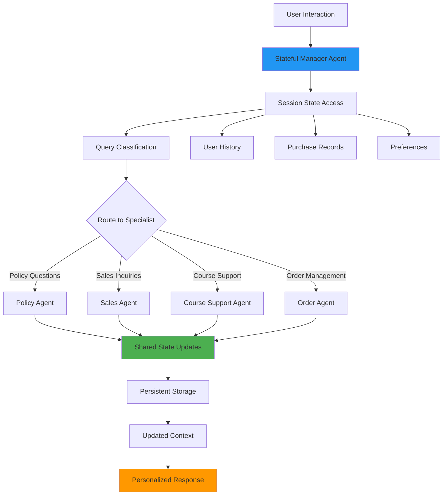

### 🔄 State Sharing Mechanics

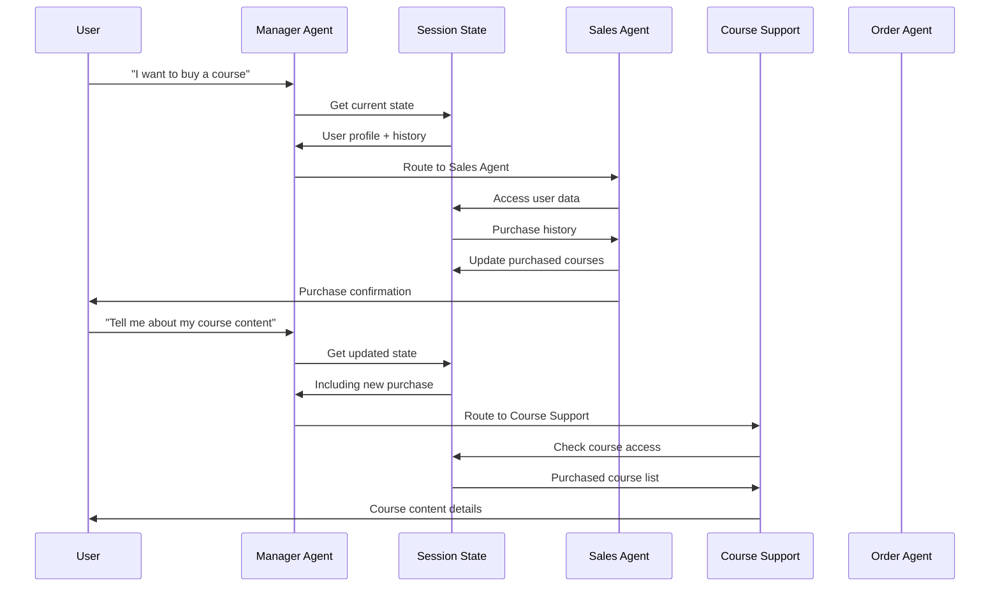

### 🗄️ Shared State Architecture

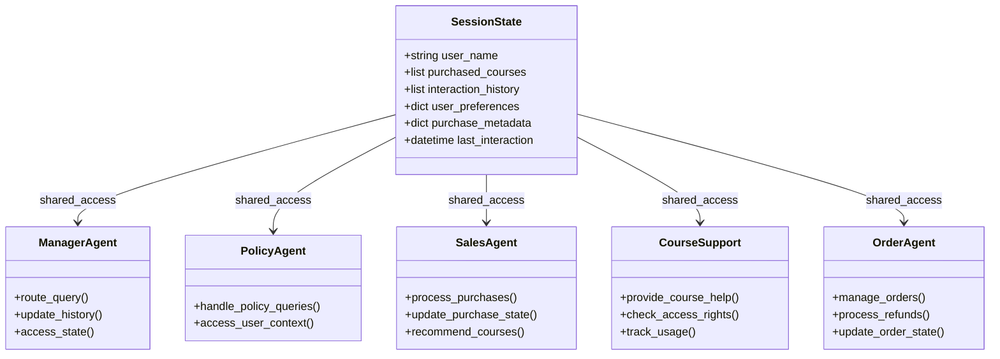

## 🎯 Customer Service System Example

### 🏢 AI Developer Accelerator Support

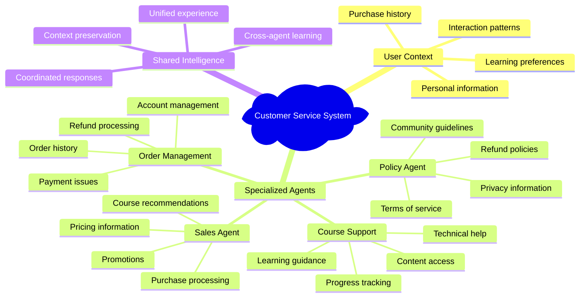

### 🔄 Dynamic Access Control

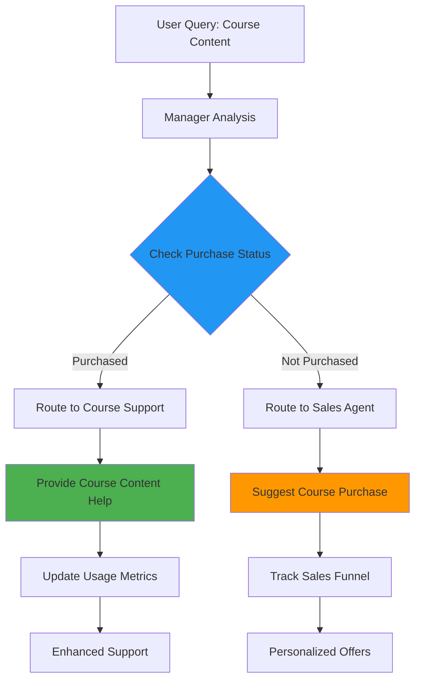

## 🏗️ Project Structure

### 📁 Advanced Directory Organization

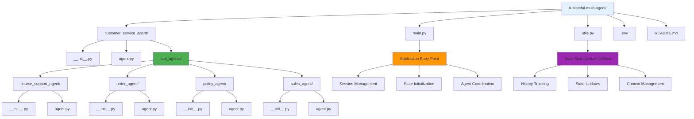

```
8-stateful-multi-agent/
│
├── customer_service_agent/         # 🎯 Main Agent Package
│   ├── __init__.py                # 📦 Package discovery
│   ├── agent.py                   # 🤖 Root agent with state access
│   └── sub_agents/                # 🏢 Specialist Team
│       ├── course_support_agent/  # 📚 Course content support
│       │   ├── __init__.py        # 📦 Agent package
│       │   └── agent.py           # 🎓 Learning specialist
│       ├── order_agent/           # 📦 Order management
│       │   ├── __init__.py        # 📦 Agent package
│       │   └── agent.py           # 💳 Transaction specialist
│       ├── policy_agent/          # 📋 Policy information
│       │   ├── __init__.py        # 📦 Agent package
│       │   └── agent.py           # 📝 Policy specialist
│       └── sales_agent/           # 💼 Sales and marketing
│           ├── __init__.py        # 📦 Agent package
│           └── agent.py           # 🎯 Sales specialist
│
├── main.py                        # 🚀 Application entry point
├── utils.py                       # 🛠️ State management utilities
├── .env                          # 🔑 Environment variables
└── README.md                     # 📖 Documentation
```

## 🔧 Key Components Deep Dive

### 1️⃣ Advanced Session Management

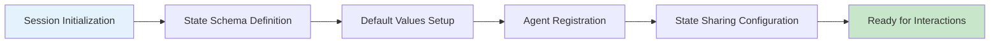

#### 📊 State Schema Design

```python
def initialize_state():
    """Comprehensive state initialization for multi-agent coordination."""
    return {
        # User Identity & Profile
        "user_name": "Brandon Hancock",
        "user_id": "user_12345",
        "email": "brandon@example.com",
        
        # Purchase & Access Management
        "purchased_courses": [],
        "access_permissions": {},
        "subscription_status": "active",
        
        # Interaction & Learning History
        "interaction_history": [],
        "learning_progress": {},
        "support_tickets": [],
        
        # Personalization & Preferences
        "communication_style": "friendly",
        "preferred_topics": [],
        "notification_settings": {},
        
        # System & Analytics
        "session_metadata": {
            "created_at": datetime.now().isoformat(),
            "last_active": datetime.now().isoformat(),
            "interaction_count": 0,
            "agent_usage": {}
        }
    }
```

### 2️⃣ Intelligent State Updates

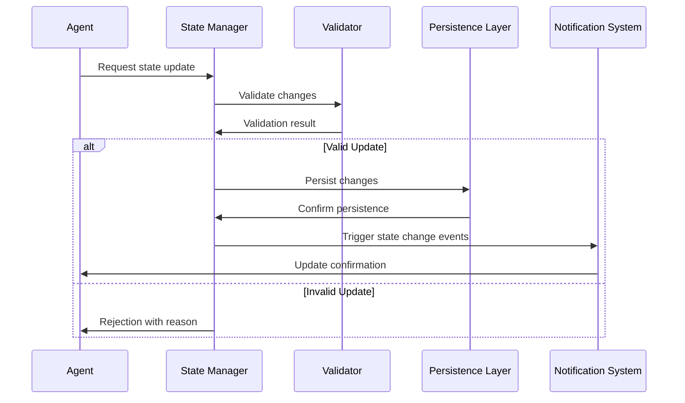

### 3️⃣ Cross-Agent Communication

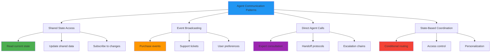

## 🚀 Getting Started

### 📋 Prerequisites Checklist

- [ ] ✅ Virtual environment activated
- [ ] 🔑 Google API key configured
- [ ] 🧠 Understanding of multi-agent systems
- [ ] 💾 Familiarity with state management concepts
- [ ] 🏗️ Knowledge of complex system architectures

### 🔧 Environment Setup

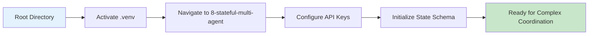

#### 🔌 Virtual Environment Activation

```bash
# 🔌 Activate virtual environment (from parent directory)
# macOS/Linux:
source ../.venv/bin/activate

# Windows CMD:
..\.venv\Scripts\activate.bat

# Windows PowerShell:
..\.venv\Scripts\Activate.ps1
```

#### 🔑 Environment Configuration

```bash
# Configure environment variables
GOOGLE_API_KEY=your_google_api_key_here
SESSION_PERSISTENCE=memory  # or 'database' for production
LOG_LEVEL=INFO
```

## 🎮 Running the Complex System

### 🖥️ Interactive Stateful Session

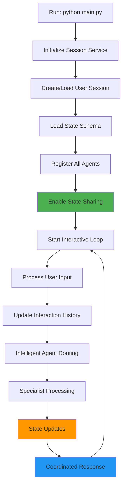

### 📝 Execution Flow

| Step | Action | Expected Result |
|------|--------|-----------------|
| 1️⃣ | **Navigate to directory** | `cd 8-stateful-multi-agent` |
| 2️⃣ | **Run application** | `python main.py` |
| 3️⃣ | **Session initialization** | State schema loaded with defaults |
| 4️⃣ | **Agent registration** | All specialists connected to shared state |
| 5️⃣ | **Interactive mode** | Complex multi-agent coordination begins |

### 🔄 System Startup Sequence

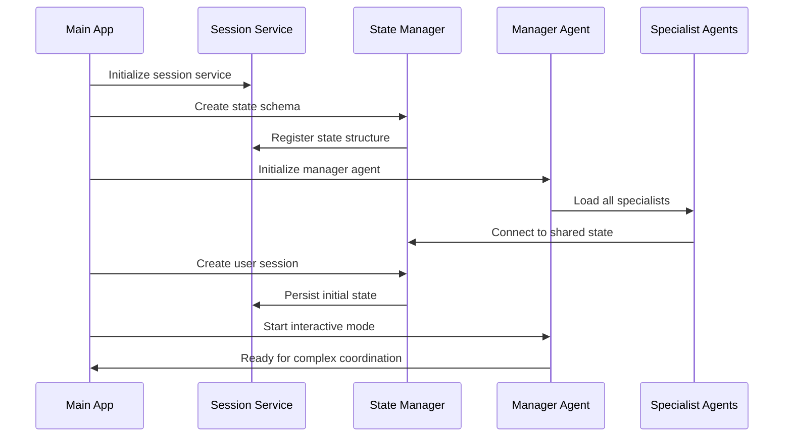

## 💬 Advanced Conversation Flows

### 🎯 Comprehensive Customer Journey

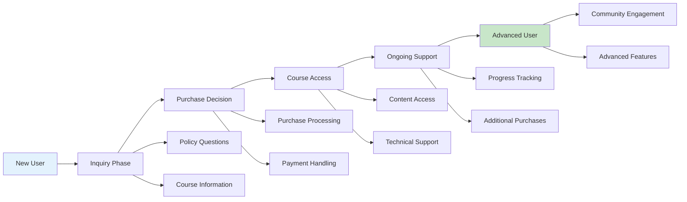

### 📊 State Evolution Through Interactions

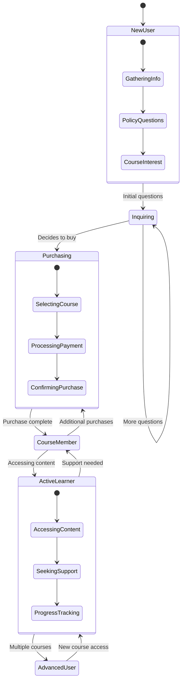

### 🎭 Multi-Agent Conversation Examples

#### 📚 Complete Customer Journey

**Phase 1: Initial Inquiry**
```
User: "What courses do you offer?"
→ Manager Agent routes to Sales Agent
→ State: interaction_history updated
→ Sales Agent: Provides course catalog based on user profile
→ State: tracks interest areas
```

**Phase 2: Purchase Decision**
```
User: "I want to buy the AI Marketing Platform course"
→ Manager Agent routes to Sales Agent
→ Sales Agent: Processes purchase
→ State: purchased_courses updated
→ State: access_permissions granted
→ Sales Agent: Confirms purchase and access
```

**Phase 3: Course Access**
```
User: "How do I access my course content?"
→ Manager Agent: Checks purchase status in state
→ Manager Agent routes to Course Support Agent
→ Course Support: Verifies access in state
→ Course Support: Provides personalized access instructions
→ State: learning_progress initialized
```

**Phase 4: Support Interaction**
```
User: "I'm having trouble with lesson 3"
→ Manager Agent routes to Course Support Agent
→ Course Support: Checks progress in state
→ Course Support: Provides targeted help
→ State: support_tickets updated
→ State: learning_progress updated
```

## 🎉 Success Indicators

### ✅ Your Stateful Multi-Agent System is Working When:

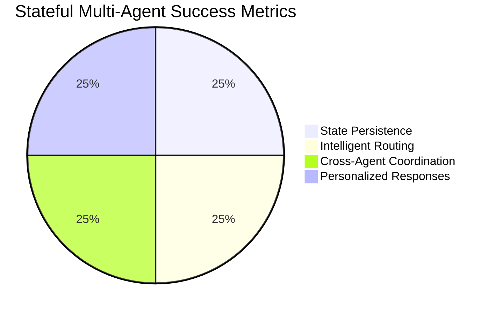

| Indicator | Description | What to Look For |
|-----------|-------------|------------------|
| 💾 **State Persistence** | Information survives across agent switches | Purchase data available to all agents |
| 🎯 **Intelligent Routing** | Queries reach most appropriate specialists | Context-aware agent selection |
| 🔄 **Cross-Agent Coordination** | Agents work together seamlessly | Shared state updates and access |
| 🎭 **Personalized Responses** | Responses adapt to user history | Different responses based on purchase status |

### 🔧 Advanced Testing Checklist

- [ ] 💾 State persists across agent delegations
- [ ] 🎯 Manager routes queries intelligently
- [ ] 📚 Course Support checks purchase status
- [ ] 💼 Sales Agent updates purchase records
- [ ] 📋 Policy Agent provides relevant policies
- [ ] 📦 Order Agent accesses transaction history
- [ ] 🔄 State updates propagate to all agents
- [ ] 🎭 Responses become increasingly personalized
- [ ] 📊 Interaction history influences future routing
- [ ] 🛡️ Access control works correctly

## 🔄 Advanced Stateful Patterns

### 🏗️ Complex State Management Strategies

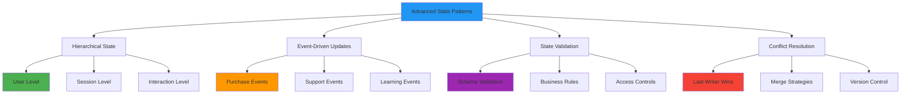

### 📊 State Synchronization Patterns

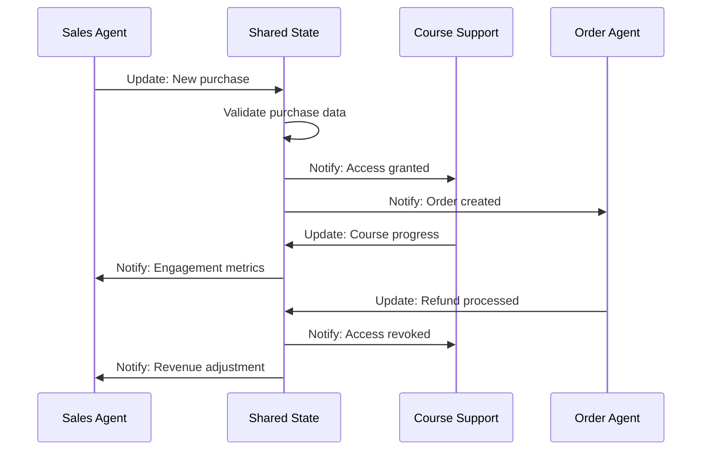

### 🎯 Personalization Engine

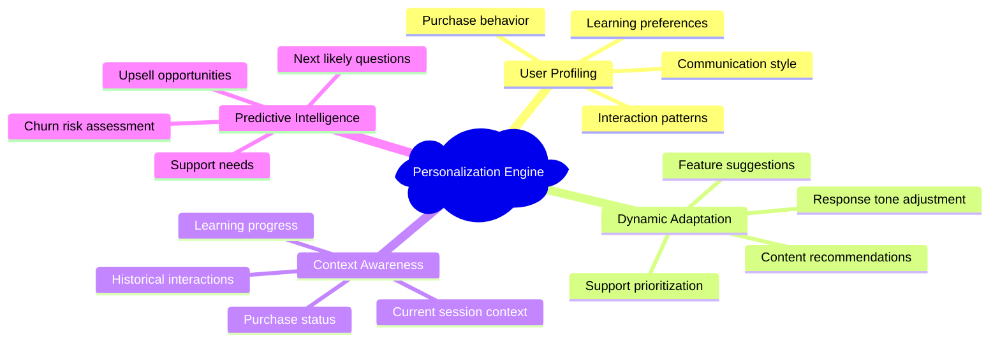

## 🏭 Production Scaling Considerations

### 🗄️ Enterprise State Management

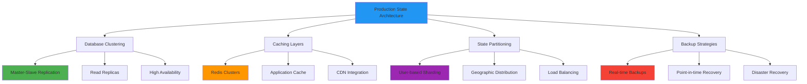

### 📊 Performance Optimization

| Optimization | Implementation | Benefits | Considerations |
|--------------|----------------|----------|----------------|
| 🚀 **State Caching** | Redis/Memcached | Faster access | Cache invalidation |
| 📊 **Lazy Loading** | On-demand state loading | Reduced memory | Initial latency |
| 🔄 **State Compression** | JSON compression | Reduced storage | CPU overhead |
| ⚡ **Async Updates** | Background processing | Better responsiveness | Eventual consistency |

### 🔐 Security and Privacy

```mermaid
mindmap
  root)Security Considerations(
    Data Protection
      Encryption at rest
      Encryption in transit
      Key management
      Access logging
    Privacy Compliance
      GDPR compliance
      Data minimization
      User consent
      Right to deletion
    Access Controls
      Role-based permissions
      Agent authorization
      State isolation
      Audit trails
    Monitoring
      Security events
      Access patterns
      Anomaly detection
      Incident response
```

## 🚪 Troubleshooting

### 🔧 Complex System Issues

```mermaid
flowchart TD
    A[System Issue Detected] --> B{State Sync Problem?}
    B -->|Yes| C[Check State Consistency]
    B -->|No| D{Agent Coordination Issue?}
    D -->|Yes| E[Verify Agent Communication]
    D -->|No| F{Performance Issue?}
    F -->|Yes| G[Analyze State Size]
    F -->|No| H{Memory Issue?}
    H -->|Yes| I[Check State Cleanup]
    H -->|No| J{Routing Problem?}
    J -->|Yes| K[Verify Agent Logic]
    J -->|No| L[Check System Logs]
    
    style A fill:#f44336
    style C fill:#ff9800
    style E fill:#ff9800
    style G fill:#ff9800
    style I fill:#ff9800
    style K fill:#ff9800
    style L fill:#ff9800
```

| Issue | Symptoms | Likely Cause | Solution |
|-------|----------|--------------|---------|
| 🔄 **State Desync** | Agents see different data | Concurrent updates | Implement state locking |
| 🎯 **Wrong Routing** | Incorrect agent selection | State-dependent logic issues | Review routing conditions |
| 💾 **Memory Bloat** | Increasing memory usage | Large state objects | Implement state cleanup |
| ⚡ **Slow Response** | Performance degradation | Complex state operations | Optimize state access |
| 🔧 **Agent Conflicts** | Conflicting agent actions | Race conditions | Add coordination protocols |

### 🛠️ Debug Commands

```bash
# Test state access
python -c "from main import *; test_state_access()"

# Verify agent coordination
python -c "from main import *; test_agent_coordination()"

# Check state consistency
python -c "from utils import *; validate_state_schema()"

# Monitor state changes
python -c "from main import *; enable_state_monitoring()"
```

### 🛑 System Recovery

```mermaid
graph TD
    A[System Failure] --> B{State Corruption?}
    B -->|Yes| C[Restore from Backup]
    B -->|No| D{Agent Failure?}
    D -->|Yes| E[Restart Failed Agents]
    D -->|No| F{Network Issue?}
    F -->|Yes| G[Check Connectivity]
    F -->|No| H[Full System Restart]
    
    C --> I[Validate State Integrity]
    E --> J[Verify Agent Health]
    G --> K[Restore Connections]
    H --> L[Complete System Check]
    
    style C fill:#4caf50
    style I fill:#c8e6c9
    style J fill:#c8e6c9
    style K fill:#c8e6c9
    style L fill:#c8e6c9
```

## 🎓 What You've Learned

### 🏆 Key Achievements

- [ ] 🔄 Implemented complex stateful multi-agent coordination
- [ ] 💾 Designed sophisticated shared state management
- [ ] 🎯 Created intelligent context-aware agent routing
- [ ] 🏗️ Built enterprise-grade agent communication systems
- [ ] 📊 Mastered cross-agent state synchronization
- [ ] 🎭 Developed personalized, adaptive agent behaviors
- [ ] 🔧 Applied advanced troubleshooting for complex systems
- [ ] 🏭 Understood production scaling and optimization strategies

### 🚀 Next Steps

Ready for the final advanced patterns?

| Next Example | Focus | Complexity | Key Concepts |
|--------------|-------|------------|--------------|
| 📊 **Callbacks** | Event monitoring | ⭐⭐⭐ | Real-time system monitoring |
| ⚡ **Sequential Agent** | Pipeline workflows | ⭐⭐⭐ | Step-by-step processing |
| 🔄 **Parallel Agent** | Concurrent execution | ⭐⭐⭐⭐ | Parallel coordination |
| 🔁 **Loop Agent** | Iterative refinement | ⭐⭐⭐⭐⭐ | Self-improving systems |

### 🎯 Mastery Concepts Achieved

```mermaid
graph TD
    A[Stateful Multi-Agent Mastery] --> B[Advanced Coordination]
    A --> C[Enterprise Architecture]
    A --> D[Production Readiness]
    
    B --> E[Complex State Management]
    B --> F[Intelligent Routing]
    B --> G[Cross-Agent Communication]
    
    C --> H[Scalable Design]
    C --> I[Security Implementation]
    C --> J[Performance Optimization]
    
    D --> K[Monitoring & Observability]
    D --> L[Error Handling]
    D --> M[Recovery Strategies]
    
    style A fill:#4caf50
    style B fill:#2196f3
    style C fill:#ff9800
    style D fill:#9c27b0
```

## 📚 Additional Resources

### 🔗 Official Documentation

| Resource | Focus | Link |
|----------|-------|------|
| 📖 **ADK Sessions** | Advanced session management | [ADK Sessions Documentation](https://google.github.io/adk-docs/sessions/session/) |
| 🤖 **Multi-Agent Systems** | Agent orchestration patterns | [Multi-Agent Documentation](https://google.github.io/adk-docs/agents/multi-agent-systems/) |
| 📊 **State Management** | Complex state strategies | [State Management Guide](https://google.github.io/adk-docs/sessions/state/) |
| 🏗️ **Architecture Patterns** | Enterprise design patterns | [Architecture Documentation](https://google.github.io/adk-docs/architecture/) |

### 🎯 Advanced Design Patterns

```mermaid
mindmap
  root)Stateful Multi-Agent Patterns(
    Coordination Patterns
      State-based routing
      Event-driven coordination
      Hierarchical delegation
      Peer-to-peer communication
    State Management
      Optimistic concurrency
      Pessimistic locking
      Event sourcing
      CQRS implementation
    Scalability Patterns
      State partitioning
      Agent clustering
      Load balancing
      Caching strategies
    Reliability Patterns
      Circuit breakers
      Retry mechanisms
      Graceful degradation
      Backup strategies
```

### 📊 System Performance Metrics

| Metric | Target | Monitoring | Optimization |
|--------|--------|------------|-------------|
| 🎯 **Routing Accuracy** | >98% | Agent selection logs | Improve decision logic |
| ⚡ **Response Time** | <2 seconds | End-to-end latency | State access optimization |
| 💾 **State Consistency** | 100% | State validation checks | Synchronization protocols |
| 🔄 **Agent Coordination** | >95% success | Inter-agent communication | Error handling improvement |

---

<div align="center">

### 🎉 Congratulations! 

You've mastered the most complex agent coordination patterns! 

[](../9-callbacks/)
[](../7-multi-agent/)
[](../)

*Ready to monitor your systems in real-time? Let's explore callbacks! 📊*

</div>
