# 📊 Callbacks and Event Monitoring in ADK

[](https://google.github.io/adk-docs/)
[](.)
[](https://www.python.org/downloads/)
[](.)
[](.)

> 🎯 **Monitor Your Agents in Real-Time** - Learn to implement sophisticated event monitoring, real-time feedback, and comprehensive system observability

## 📡 What are Callbacks in ADK?

**Callbacks** in ADK provide real-time event monitoring and observability for your agent systems. They enable you to track agent behavior, monitor performance, collect analytics, and respond to events as they happen.

### 🔄 System Observability Evolution

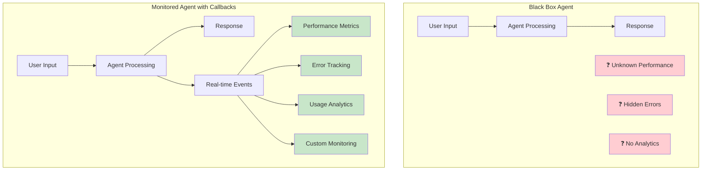

### 🏗️ Callback System Benefits

| Benefit | Description | Impact |
|---------|-------------|--------|
| 👁️ **Real-time Visibility** | See agent behavior as it happens | Immediate issue detection |
| 📊 **Performance Monitoring** | Track response times and usage | System optimization |
| 🚨 **Error Detection** | Catch and respond to failures | Improved reliability |
| 📈 **Analytics Collection** | Gather user interaction data | Data-driven insights |
| 🔄 **Dynamic Response** | React to events in real-time | Adaptive system behavior |

## 🏗️ Callback Architecture

### 🔧 Event-Driven Monitoring System

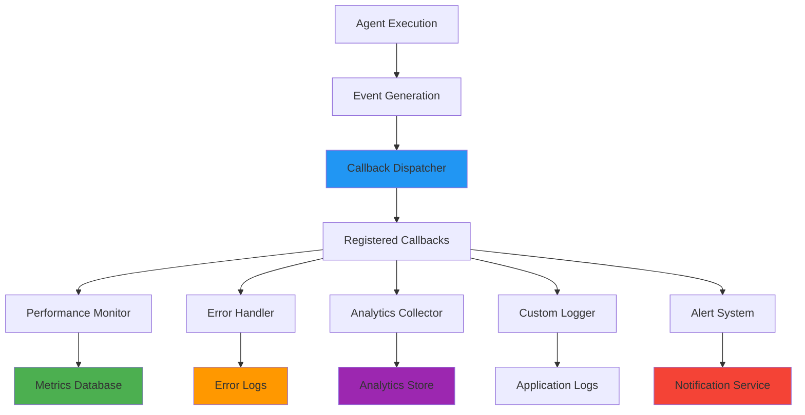

### 📡 Callback Event Flow

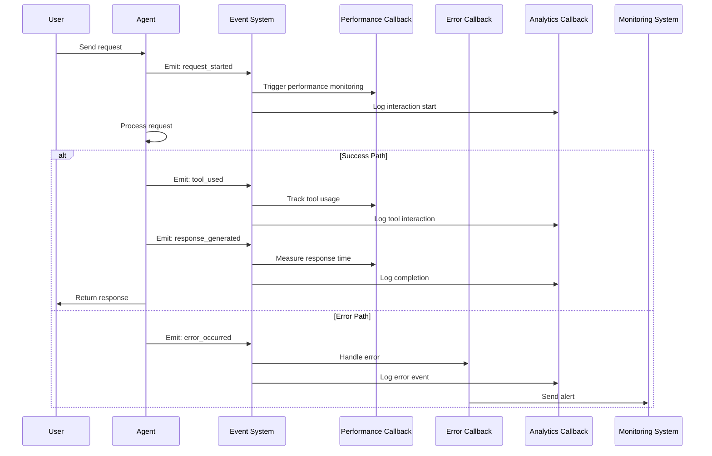

### 🎭 Callback Types and Purposes

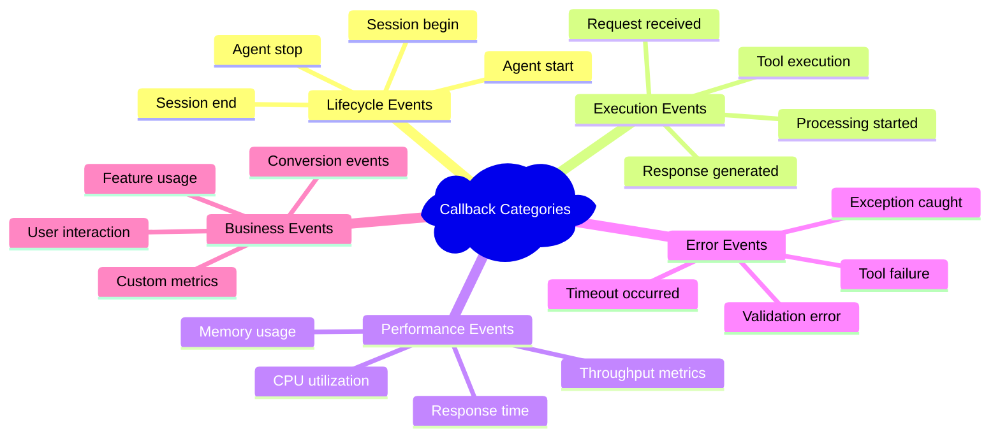

## 🔧 Callback Implementation Patterns

### 1️⃣ Performance Monitoring Callbacks

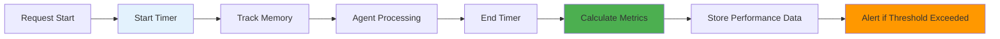

#### 📊 Performance Metrics Collection

```python
class PerformanceCallback:
    def __init__(self):
        self.start_time = None
        self.memory_start = None
        
    def on_request_start(self, event):
        self.start_time = time.time()
        self.memory_start = psutil.Process().memory_info().rss
        
    def on_response_complete(self, event):
        duration = time.time() - self.start_time
        memory_used = psutil.Process().memory_info().rss - self.memory_start
        
        metrics = {
            "response_time": duration,
            "memory_usage": memory_used,
            "agent_name": event.agent_name,
            "timestamp": datetime.now().isoformat()
        }
        
        self.store_metrics(metrics)
        if duration > self.alert_threshold:
            self.send_alert(metrics)
```

### 2️⃣ Error Handling and Alerting

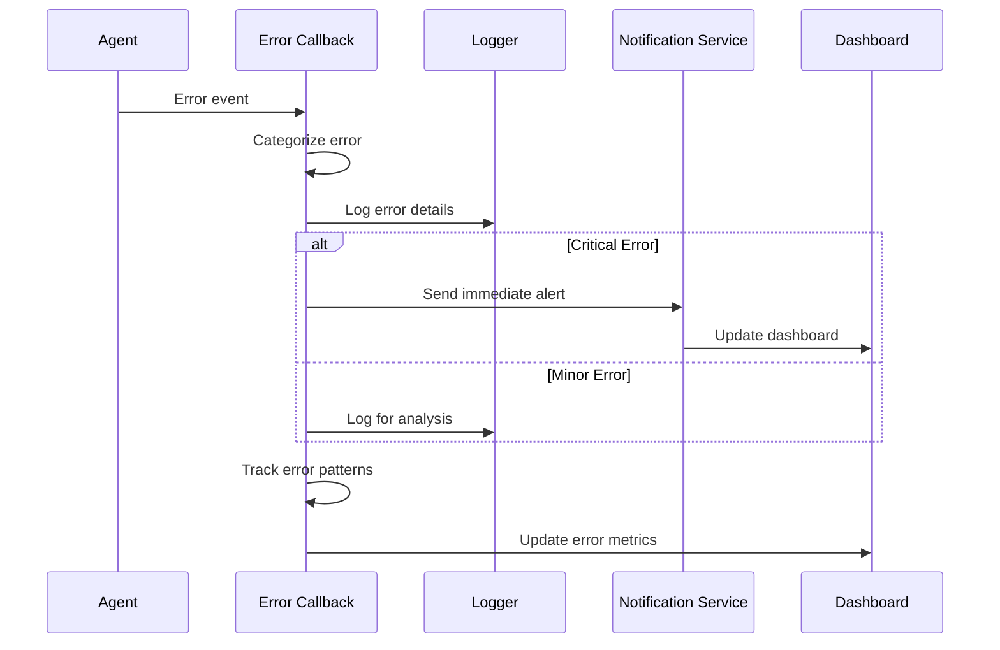

### 3️⃣ Analytics and User Insights

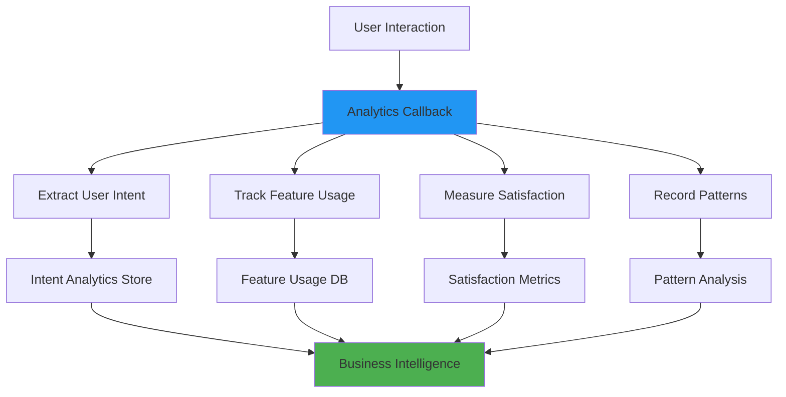

## 🎯 Real-World Callback Examples

### 🏢 Customer Service Monitoring System

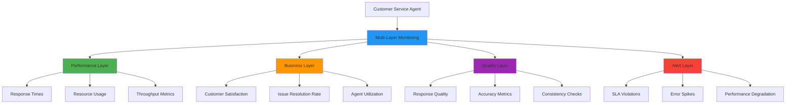

### 📊 Comprehensive Monitoring Dashboard

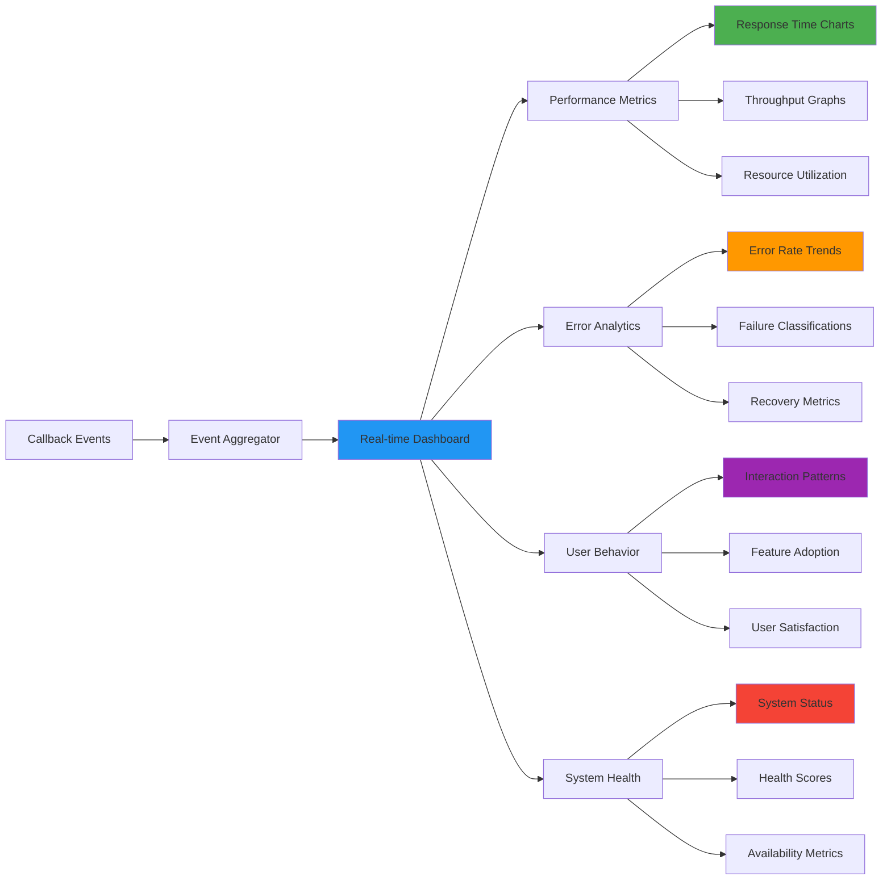

## 🏗️ Project Structure

### 📁 Callback System Organization

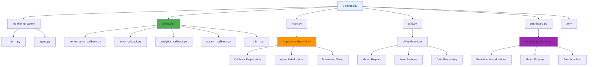

```
9-callbacks/
│
├── monitoring_agent/              # 🤖 Monitored Agent Package
│   ├── __init__.py               # 📦 Package discovery
│   └── agent.py                  # 🎯 Agent with callback integration
│
├── callbacks/                    # 📊 Callback System
│   ├── __init__.py              # 📦 Callback package
│   ├── performance_callback.py   # ⚡ Performance monitoring
│   ├── error_callback.py        # 🚨 Error handling and alerts
│   ├── analytics_callback.py    # 📈 User analytics collection
│   └── custom_callback.py       # 🔧 Custom monitoring logic
│
├── main.py                       # 🚀 Application with callbacks
├── utils.py                      # 🛠️ Monitoring utilities
├── dashboard.py                  # 📊 Real-time monitoring dashboard
├── .env                         # 🔑 Environment variables
└── README.md                    # 📖 Documentation
```

## 🔧 Callback Implementation Guide

### 1️⃣ Basic Callback Structure

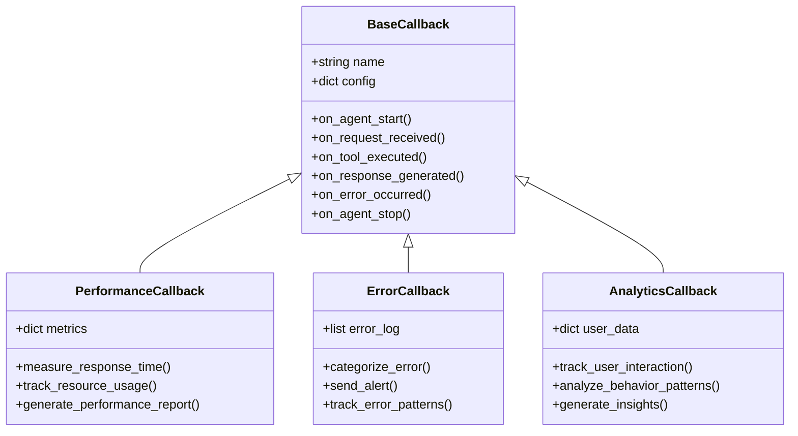

### 2️⃣ Event Registration System

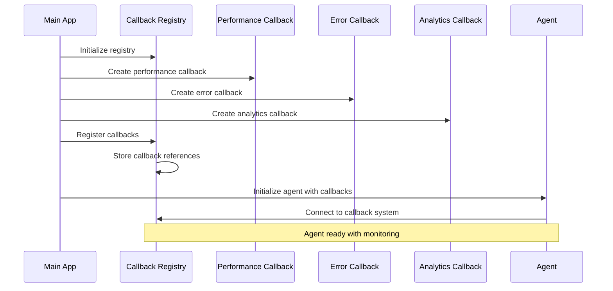

### 3️⃣ Dynamic Callback Configuration

```python
callback_config = {
    "performance": {
        "enabled": True,
        "metrics": ["response_time", "memory_usage", "cpu_usage"],
        "alert_thresholds": {
            "response_time": 3.0,
            "memory_usage": 500 * 1024 * 1024  # 500MB
        }
    },
    "error_handling": {
        "enabled": True,
        "alert_levels": ["critical", "warning"],
        "notification_channels": ["email", "slack"]
    },
    "analytics": {
        "enabled": True,
        "track_user_behavior": True,
        "collect_feedback": True,
        "export_format": "json"
    }
}
```

## 🚀 Getting Started

### 📋 Prerequisites Checklist

- [ ] ✅ Virtual environment activated
- [ ] 🔑 Google API key configured
- [ ] 📊 Understanding of event-driven systems
- [ ] 🔧 Familiarity with monitoring concepts
- [ ] 📈 Basic knowledge of metrics and analytics

### 🔧 Environment Setup

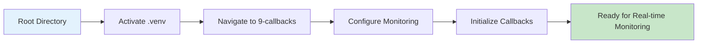

#### 🔌 Virtual Environment Activation

```bash
# 🔌 Activate virtual environment (from parent directory)
# macOS/Linux:
source ../.venv/bin/activate

# Windows CMD:
..\.venv\Scripts\activate.bat

# Windows PowerShell:
..\.venv\Scripts\Activate.ps1
```

#### 🔑 Environment Configuration

```bash
# Configure environment variables
GOOGLE_API_KEY=your_google_api_key_here
MONITORING_ENABLED=true
DASHBOARD_PORT=8080
ALERT_EMAIL=admin@yourcompany.com
LOG_LEVEL=INFO
```

## 🎮 Running the Monitored System

### 🖥️ Interactive Monitoring Session

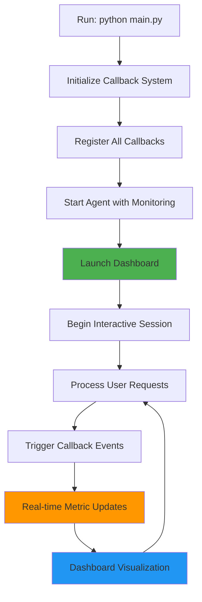

### 📝 Monitoring Execution Flow

| Step | Action | Expected Result |
|------|--------|-----------------|
| 1️⃣ | **Navigate to directory** | `cd 9-callbacks` |
| 2️⃣ | **Run application** | `python main.py` |
| 3️⃣ | **Callback initialization** | All monitoring systems activated |
| 4️⃣ | **Dashboard launch** | Real-time monitoring interface |
| 5️⃣ | **Interactive mode** | Agent with full observability |

### 🔄 System Startup with Monitoring

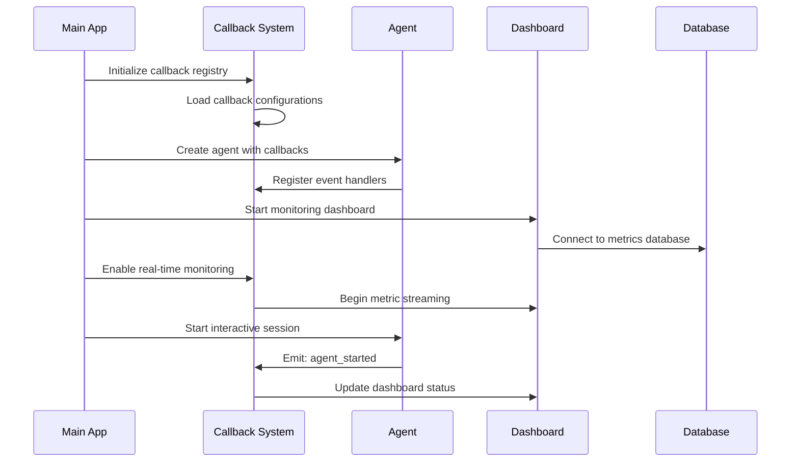

## 💬 Real-Time Monitoring Examples

### 📊 Performance Monitoring in Action

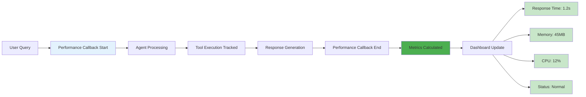

### 🚨 Error Detection and Alerting

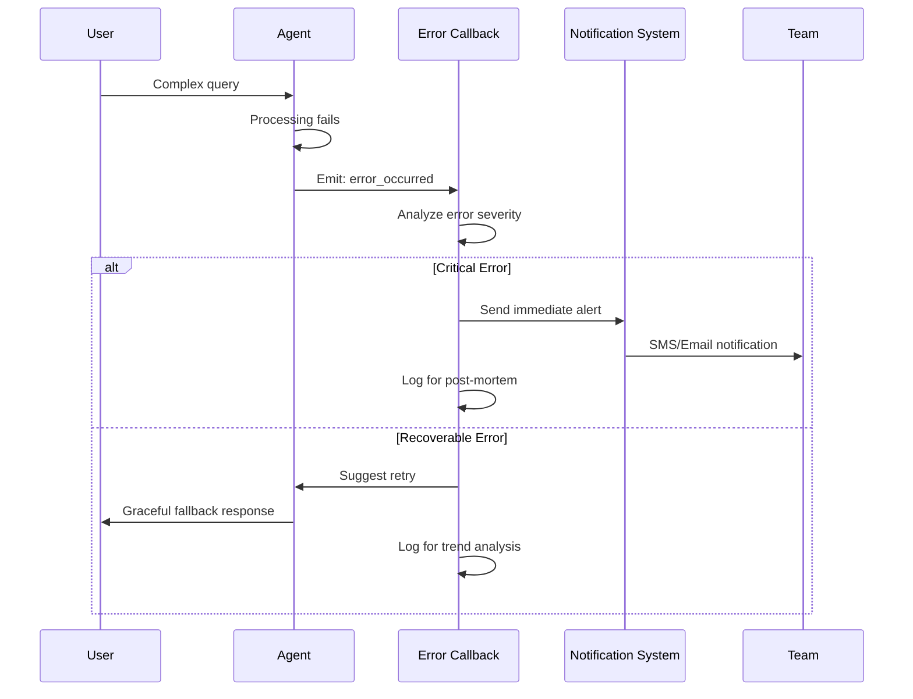

### 📈 Analytics Collection Flow

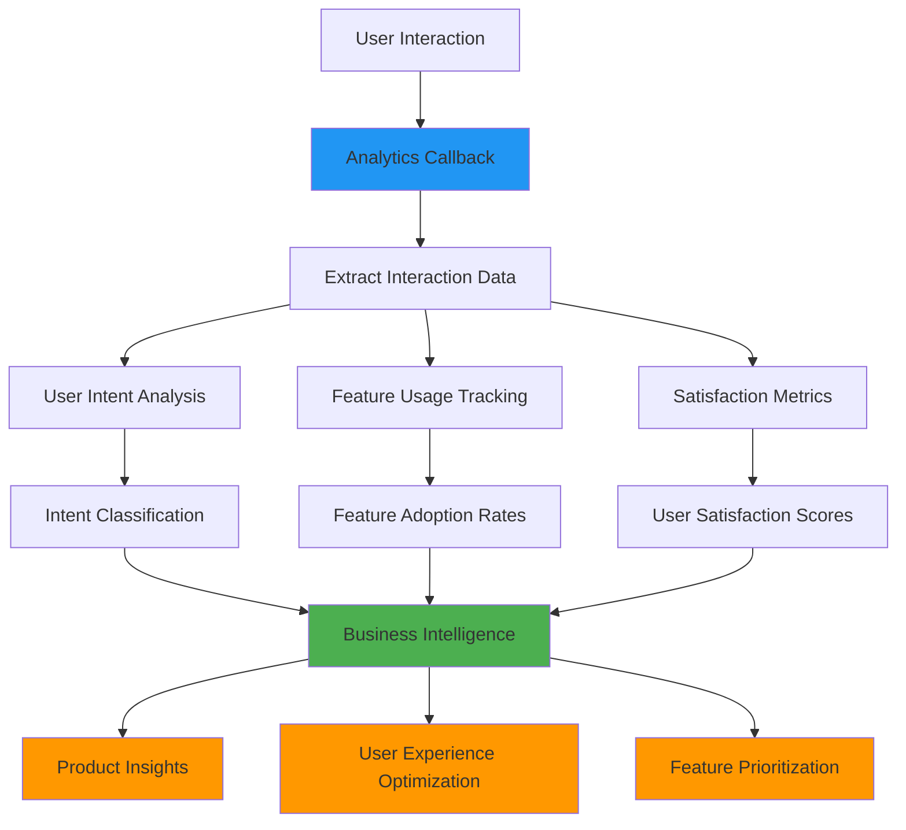

## 🎉 Success Indicators

### ✅ Your Callback System is Working When:

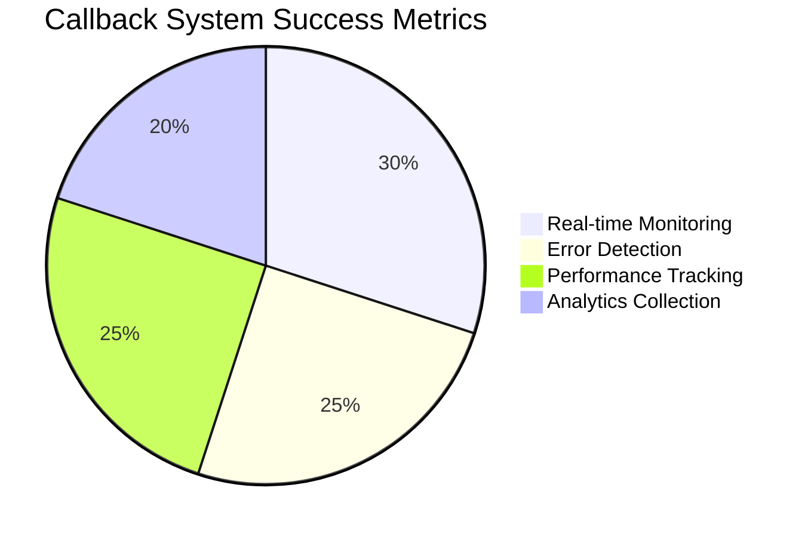

| Indicator | Description | What to Look For |
|-----------|-------------|------------------|
| 📊 **Real-time Monitoring** | Live metrics and dashboards | Continuous data flow, updated visualizations |
| 🚨 **Error Detection** | Immediate error alerts | Rapid notification of issues |
| ⚡ **Performance Tracking** | Response time and resource monitoring | Consistent metric collection |
| 📈 **Analytics Collection** | User behavior insights | Rich interaction data capture |

### 🔧 Monitoring System Checklist

- [ ] 📊 Dashboard displays real-time metrics
- [ ] ⚡ Response time monitoring active
- [ ] 💾 Memory usage tracking working
- [ ] 🚨 Error alerts functioning
- [ ] 📈 User analytics collecting data
- [ ] 🔄 Custom callbacks responding to events
- [ ] 📋 Logs capturing all interactions
- [ ] 🎯 Performance thresholds configured
- [ ] 📧 Notification system operational
- [ ] 📊 Historical data accumulating

## 🔄 Advanced Callback Patterns

### 🏗️ Complex Event Processing

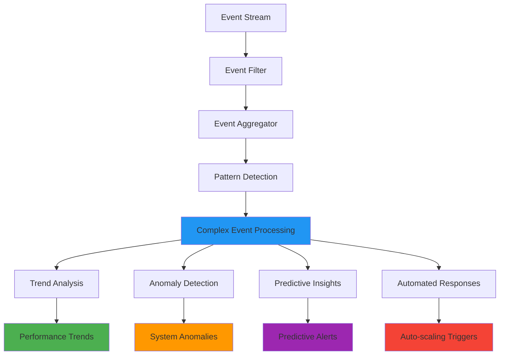

### 📊 Multi-Dimensional Monitoring

```mermaid
mindmap
  root)Advanced Monitoring Dimensions(
    Technical Metrics
      Response times
      Error rates
      Resource usage
      Throughput
    Business Metrics
      User satisfaction
      Conversion rates
      Feature adoption
      Revenue impact
    Operational Metrics
      System availability
      Service level adherence
      Incident response time
      Recovery metrics
    User Experience
      Interaction patterns
      Journey completion
      Friction points
      Engagement levels
```

### 🎯 Intelligent Alerting

```mermaid
graph LR
    A[Raw Events] --> B[Smart Filter]
    B --> C[Severity Analysis]
    C --> D[Context Evaluation]
    D --> E[Alert Decision]
    E --> F{Alert Type}
    
    F -->|Critical| G[Immediate Notification]
    F -->|Warning| H[Batched Alert]
    F -->|Info| I[Dashboard Update]
    
    G --> J[SMS + Email + Slack]
    H --> K[Email Summary]
    I --> L[Metric Dashboard]
    
    style E fill:#2196f3
    style G fill:#f44336
    style H fill:#ff9800
    style I fill:#4caf50
```

## 🏭 Production Monitoring Considerations

### 🗄️ Enterprise Observability Stack

```mermaid
graph TD
    A[ADK Callbacks] --> B[Event Aggregation Layer]
    B --> C[Metrics Processing]
    B --> D[Log Processing]
    B --> E[Trace Processing]
    
    C --> F[Time Series Database]
    D --> G[Log Storage]
    E --> H[Distributed Tracing]
    
    F --> I[Grafana Dashboards]
    G --> J[ELK Stack]
    H --> K[Jaeger/Zipkin]
    
    I --> L[Operations Team]
    J --> L
    K --> L
    
    style B fill:#2196f3
    style F fill:#4caf50
    style G fill:#ff9800
    style H fill:#9c27b0
```

### 📊 Scalable Monitoring Architecture

| Component | Purpose | Technology Options | Scaling Considerations |
|-----------|---------|-------------------|----------------------|
| 📡 **Event Collection** | Gather callback events | Custom, Kafka, RabbitMQ | High throughput, low latency |
| 🗄️ **Metrics Storage** | Store time-series data | InfluxDB, Prometheus | Retention policies, compression |
| 📋 **Log Management** | Centralized logging | Elasticsearch, Splunk | Indexing, search performance |
| 📊 **Visualization** | Dashboards and charts | Grafana, Kibana | Real-time updates, customization |
| 🚨 **Alerting** | Notification systems | PagerDuty, Slack | Smart routing, escalation |

### 🔐 Security and Privacy in Monitoring

```mermaid
mindmap
  root)Monitoring Security(
    Data Protection
      Anonymize user data
      Encrypt sensitive metrics
      Secure transmission
      Access controls
    Privacy Compliance
      GDPR considerations
      Data retention limits
      User consent
      Right to deletion
    Monitoring Security
      Secure dashboard access
      Authentication required
      Role-based permissions
      Audit monitoring access
    Alert Security
      Secure notification channels
      Encrypted messages
      Access verification
      Incident response
```

## 🚪 Troubleshooting

### 🔧 Callback System Issues

```mermaid
flowchart TD
    A[Monitoring Issue Detected] --> B{Callbacks Not Firing?}
    B -->|Yes| C[Check Callback Registration]
    B -->|No| D{Missing Metrics?}
    D -->|Yes| E[Verify Event Emission]
    D -->|No| F{Dashboard Issues?}
    F -->|Yes| G[Check Data Pipeline]
    F -->|No| H{Performance Impact?}
    H -->|Yes| I[Optimize Callback Logic]
    H -->|No| J{Alert Failures?}
    J -->|Yes| K[Check Notification Config]
    J -->|No| L[Review System Logs]
    
    style A fill:#f44336
    style C fill:#ff9800
    style E fill:#ff9800
    style G fill:#ff9800
    style I fill:#ff9800
    style K fill:#ff9800
    style L fill:#ff9800
```

| Issue | Symptoms | Likely Cause | Solution |
|-------|----------|--------------|---------|
| 📊 **No Metrics** | Empty dashboard | Callbacks not registered | Verify callback initialization |
| 🚨 **Missing Alerts** | No notifications | Alert configuration error | Check notification settings |
| ⚡ **Slow Performance** | System lag | Heavy callback processing | Optimize callback logic |
| 📋 **Incomplete Data** | Partial metrics | Event emission issues | Check agent event triggers |
| 🔄 **Dashboard Errors** | Display problems | Data pipeline failure | Verify data flow |

### 🛠️ Debug Commands

```bash
# Test callback registration
python -c "from main import *; test_callback_registration()"

# Verify event emission
python -c "from main import *; test_event_emission()"

# Check metric collection
python -c "from callbacks import *; validate_metric_collection()"

# Test alert system
python -c "from utils import *; test_alert_system()"
```

### 🛑 Monitoring Recovery

```mermaid
graph TD
    A[Monitoring System Failure] --> B{Data Loss?}
    B -->|Yes| C[Restore from Backups]
    B -->|No| D{Dashboard Down?}
    D -->|Yes| E[Restart Dashboard Service]
    D -->|No| F{Callback Failure?}
    F -->|Yes| G[Reinitialize Callbacks]
    F -->|No| H[Check External Dependencies]
    
    C --> I[Verify Data Integrity]
    E --> J[Confirm Dashboard Access]
    G --> K[Test Callback Functionality]
    H --> L[Restore Service Connections]
    
    style C fill:#4caf50
    style I fill:#c8e6c9
    style J fill:#c8e6c9
    style K fill:#c8e6c9
    style L fill:#c8e6c9
```

## 🎓 What You've Learned

### 🏆 Key Achievements

- [ ] 📊 Implemented comprehensive real-time monitoring
- [ ] 🚨 Built intelligent error detection and alerting
- [ ] 📈 Created sophisticated analytics collection systems
- [ ] 🔧 Developed custom callback patterns for specific needs
- [ ] 🏗️ Designed enterprise-ready observability architectures
- [ ] 📊 Mastered dashboard creation and metric visualization
- [ ] 🔄 Applied event-driven programming for system monitoring
- [ ] 🏭 Understood production monitoring and scaling considerations

### 🚀 Next Steps

Ready for specialized agent patterns?

| Next Example | Focus | Complexity | Key Concepts |
|--------------|-------|------------|--------------|
| ⚡ **Sequential Agent** | Pipeline workflows | ⭐⭐⭐ | Step-by-step processing |
| 🔄 **Parallel Agent** | Concurrent execution | ⭐⭐⭐⭐ | Parallel coordination |
| 🔁 **Loop Agent** | Iterative refinement | ⭐⭐⭐⭐⭐ | Self-improving systems |

### 🎯 Monitoring Mastery Concepts

```mermaid
graph TD
    A[Callback Monitoring Mastery] --> B[Real-time Observability]
    A --> C[Event-Driven Architecture]
    A --> D[Production Readiness]
    
    B --> E[Performance Monitoring]
    B --> F[Error Detection]
    B --> G[Analytics Collection]
    
    C --> H[Event Processing]
    C --> I[Smart Alerting]
    C --> J[Pattern Recognition]
    
    D --> K[Scalable Architecture]
    D --> L[Security Implementation]
    D --> M[Enterprise Integration]
    
    style A fill:#4caf50
    style B fill:#2196f3
    style C fill:#ff9800
    style D fill:#9c27b0
```

## 📚 Additional Resources

### 🔗 Official Documentation

| Resource | Focus | Link |
|----------|-------|------|
| 📖 **ADK Callbacks** | Callback system guide | [ADK Callbacks Documentation](https://google.github.io/adk-docs/callbacks/) |
| 📊 **Monitoring Patterns** | Observability best practices | [Monitoring Guide](https://google.github.io/adk-docs/monitoring/) |
| 🚨 **Error Handling** | Error management strategies | [Error Handling Documentation](https://google.github.io/adk-docs/error-handling/) |
| 📈 **Analytics Integration** | Business intelligence setup | [Analytics Guide](https://google.github.io/adk-docs/analytics/) |

### 🎯 Monitoring Best Practices

```mermaid
mindmap
  root)Monitoring Best Practices(
    Design Principles
      Minimal performance impact
      Actionable metrics only
      Clear alert criteria
      Comprehensive coverage
    Implementation
      Async event processing
      Batched metric collection
      Smart sampling
      Efficient storage
    Operations
      Clear escalation paths
      Runbook documentation
      Regular review cycles
      Continuous improvement
    Security
      Data anonymization
      Secure channels
      Access controls
      Compliance adherence
```

### 📊 Monitoring Metrics Framework

| Metric Category | Examples | Collection Method | Analysis Purpose |
|----------------|----------|-------------------|------------------|
| 📊 **Performance** | Response time, throughput | Real-time callbacks | System optimization |
| 🚨 **Reliability** | Error rates, uptime | Error callbacks | Stability improvement |
| 👥 **User Experience** | Satisfaction, engagement | Analytics callbacks | Product enhancement |
| 💰 **Business** | Conversion, retention | Custom callbacks | Revenue optimization |

---

<div align="center">

### 🎉 Congratulations! 

You've mastered real-time monitoring and event-driven observability! 

[](../10-sequential-agent/)
[](../8-stateful-multi-agent/)
[](../)

*Ready to build step-by-step processing workflows? Let's explore sequential agents! ⚡*

</div>
