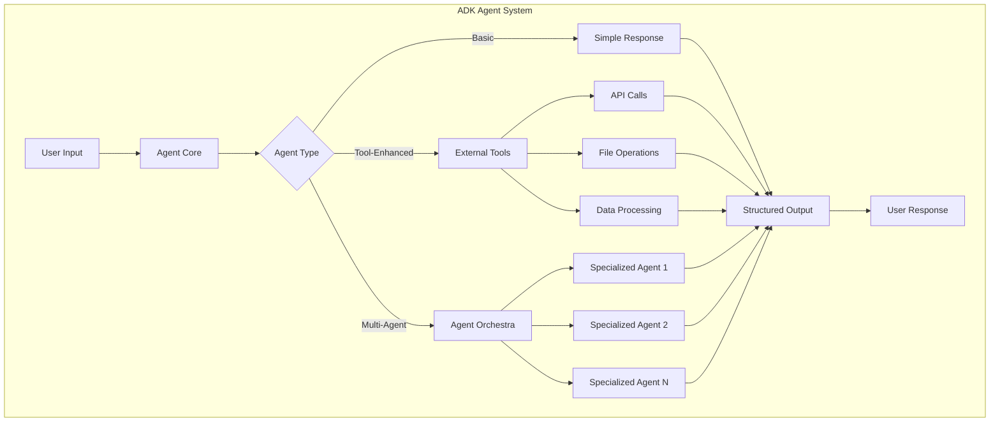
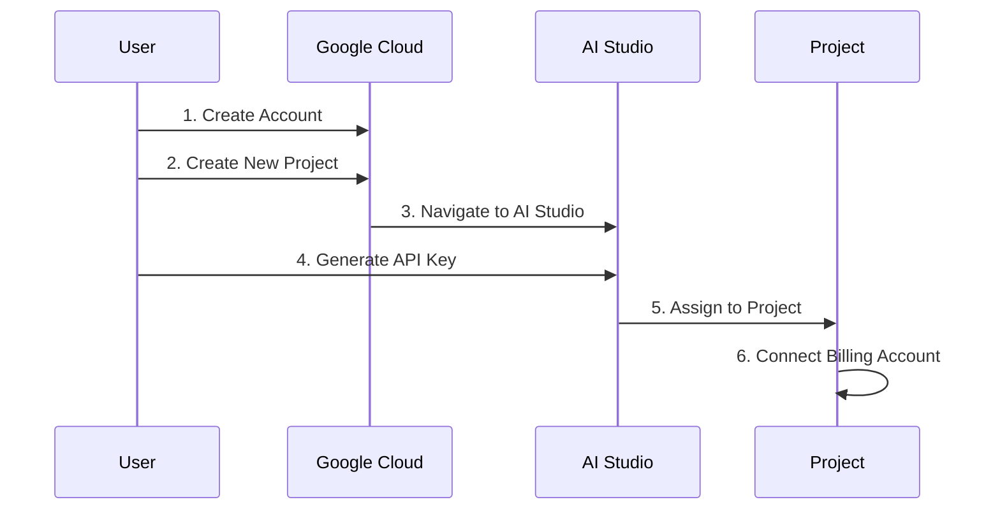
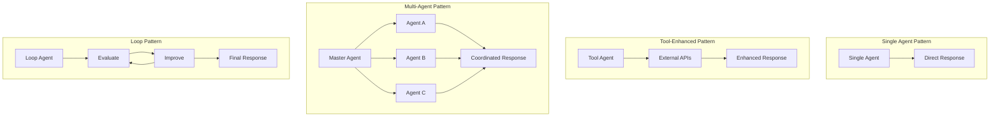
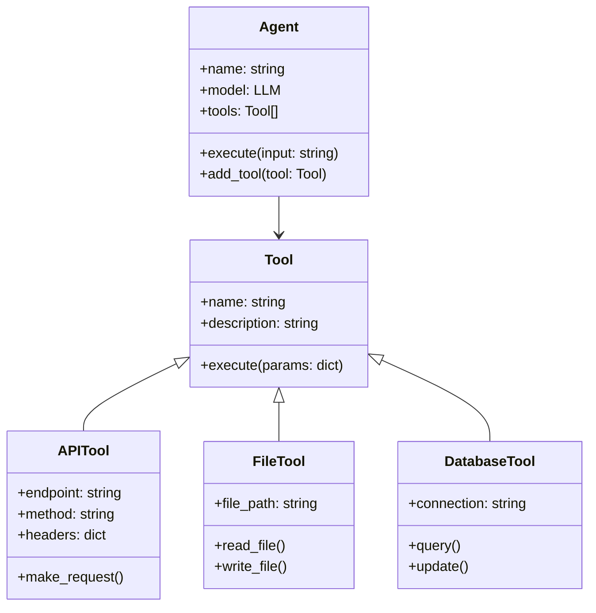
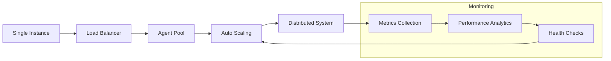
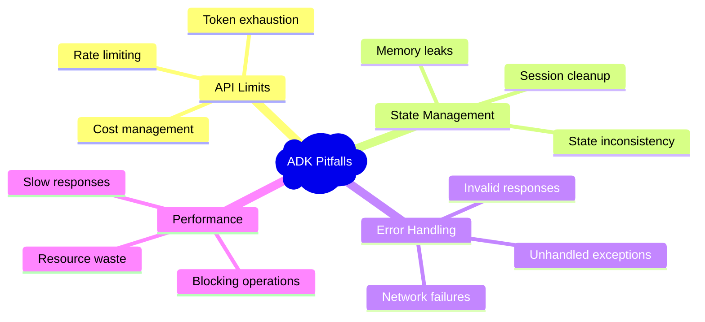

# Agent Development Kit (ADK) Crash Course 🚀

[](https://opensource.org/licenses/MIT)
[](https://www.python.org/downloads/)
[](https://google.github.io/adk-docs/)

> 🎯 **Master Google's Agent Development Kit** - A comprehensive crash course for building intelligent LLM-powered agents

## 📖 Overview

This repository contains hands-on examples for learning Google's Agent Development Kit (ADK), a powerful framework for building sophisticated LLM-powered agents. From basic interactions to complex multi-agent systems, this course covers everything you need to become proficient with ADK.

## 🏗️ Agent Development Architecture



## 🚀 Quick Start Guide

### 🔧 Environment Setup

Follow this one-time setup to get started with all examples:

```bash
# 📦 Create virtual environment in the root directory
python -m venv .venv

# 🔌 Activate virtual environment
# macOS/Linux:
source .venv/bin/activate
# Windows CMD:
.venv\Scripts\activate.bat
# Windows PowerShell:
.venv\Scripts\Activate.ps1

# 📥 Install dependencies
pip install -r requirements.txt
```

> 💡 **Pro Tip**: This single environment works for all examples in the repository!

### 🔑 API Key Configuration



| Step | Action | Description |
|------|--------|-------------|
| 1️⃣ | **Create Account** | Sign up at [Google Cloud](https://cloud.google.com/?hl=en) |
| 2️⃣ | **New Project** | Create a new project in Google Cloud Console |
| 3️⃣ | **Get API Key** | Visit [AI Studio](https://aistudio.google.com/apikey) |
| 4️⃣ | **Assign Key** | Link the API key to your project |
| 5️⃣ | **Billing Setup** | Connect to a billing account |

#### 📋 Per-Project Configuration

For each example you want to run:

```bash
# Navigate to example folder
cd example-folder/

# Copy environment template
cp .env.example .env

# Edit .env file with your API key
echo "GOOGLE_API_KEY=your_api_key_here" > .env
```

## 📚 Learning Path & Examples

### 🗺️ Course Progression Map



```mermaid
graph LR
    A[Basic Agent] --> B[Tool Agent]
    B --> C[LiteLLM Agent]
    C --> D[Structured Outputs]
    D --> E[Sessions & State]
    E --> F[Persistent Storage]
    F --> G[Multi-Agent]
    G --> H[Stateful Multi-Agent]
    H --> I[Callbacks]
    I --> J[Sequential Agent]
    J --> K[Parallel Agent]
    K --> L[Loop Agent]
    
    style A fill:#e1f5fe
    style G fill:#f3e5f5
    style L fill:#e8f5e8
```

### 📖 Detailed Examples Breakdown

| Example | 🎯 Focus Area | 📊 Complexity | 🛠️ Key Concepts |
|---------|---------------|---------------|------------------|
| **1. Basic Agent** | Foundation | ⭐ | Simple queries, basic responses |
| **2. Tool Agent** | Enhancement | ⭐⭐ | External tools, action capabilities |
| **3. LiteLLM Agent** | Flexibility | ⭐⭐ | Model abstraction, provider switching |
| **4. Structured Outputs** | Data Format | ⭐⭐ | Pydantic models, consistent responses |
| **5. Sessions & State** | Memory | ⭐⭐⭐ | State management, conversation context |
| **6. Persistent Storage** | Durability | ⭐⭐⭐ | Data persistence, session recovery |
| **7. Multi-Agent** | Orchestration | ⭐⭐⭐⭐ | Agent coordination, task delegation |
| **8. Stateful Multi-Agent** | Advanced State | ⭐⭐⭐⭐ | Complex state, multi-turn conversations |
| **9. Callbacks** | Monitoring | ⭐⭐⭐ | Event handling, real-time feedback |
| **10. Sequential Agent** | Workflows | ⭐⭐⭐ | Pipeline processing, step-by-step execution |
| **11. Parallel Agent** | Performance | ⭐⭐⭐⭐ | Concurrent operations, efficiency optimization |
| **12. Loop Agent** | Iteration | ⭐⭐⭐⭐⭐ | Feedback loops, iterative refinement |

### 🎓 Learning Outcomes by Category

#### 🔰 **Beginner Level (Examples 1-4)**
- ✅ Create basic ADK agents
- ✅ Integrate external tools
- ✅ Switch between LLM providers
- ✅ Structure agent outputs

#### 🎯 **Intermediate Level (Examples 5-8)**
- ✅ Manage agent state and memory
- ✅ Implement persistent data storage
- ✅ Orchestrate multiple agents
- ✅ Handle complex conversations

#### 🚀 **Advanced Level (Examples 9-12)**
- ✅ Monitor agent behavior with callbacks
- ✅ Create sequential workflows
- ✅ Optimize with parallel processing
- ✅ Build self-improving agents

## 🏛️ Agent Architecture Patterns

### 🔄 Agent Interaction Patterns



### 🔧 Tool Integration Framework



## 📊 Performance & Scalability

### 🚀 Agent Performance Comparison

| Agent Type | Response Time | Memory Usage | Scalability | Use Case |
|------------|---------------|--------------|-------------|----------|
| Basic | < 1s | Low | ⭐⭐⭐ | Simple Q&A |
| Tool-Enhanced | 1-3s | Medium | ⭐⭐⭐⭐ | API Integration |
| Multi-Agent | 2-5s | High | ⭐⭐⭐⭐⭐ | Complex Tasks |
| Parallel | 1-2s | High | ⭐⭐⭐⭐⭐ | High Throughput |

### 📈 Scaling Strategies



## 🌟 Best Practices & Tips

### ✨ Development Guidelines

> 🎯 **Golden Rules for ADK Development**

| Principle | Description | Example |
|-----------|-------------|---------|
| 🎨 **Single Responsibility** | Each agent should have one clear purpose | Search Agent, Analysis Agent |
| 🔗 **Loose Coupling** | Agents should be independently testable | Use interfaces for communication |
| 📝 **Clear Documentation** | Document agent capabilities and limitations | API docs, usage examples |
| ⚡ **Performance First** | Optimize for response time and resource usage | Async operations, caching |
| 🛡️ **Error Handling** | Graceful failure and recovery mechanisms | Try-catch blocks, fallbacks |

### 🚨 Common Pitfalls to Avoid



## 📚 Official Resources

### 🔗 Essential Links

| Resource | Description | Link |
|----------|-------------|------|
| 📖 **Official Docs** | Complete ADK documentation | [ADK Documentation](https://google.github.io/adk-docs/get-started/quickstart) |
| 🎥 **Video Tutorials** | Step-by-step video guides | Coming Soon |
| 💬 **Community Forum** | Get help from developers | [AI Developer Accelerator](https://www.skool.com/ai-developer-accelerator/about) |
| 🐛 **Issue Tracker** | Report bugs and request features | GitHub Issues |

## 🤝 Community & Support

### 💬 Join Our Community

Need help or want to connect with other AI developers? Join our **free** AI Developer Accelerator community:

🌟 **[AI Developer Accelerator Community](https://www.skool.com/ai-developer-accelerator/about)**

#### 🎁 Community Benefits

| Benefit | Description |
|---------|-------------|
| 🎤 **Weekly Coaching** | Live support calls with experts |
| 🚀 **Early Access** | Get code from YouTube projects first |
| 🌐 **Developer Network** | Connect with AI developers worldwide |
| 👀 **Behind the Scenes** | See how real apps are built |
| 🆘 **24/7 Support** | Community help whenever you need it |

### 🤝 Contributing

We welcome contributions! Here's how you can help:

```mermaid
gitgraph
    commit id: "Fork Repo"
    branch feature
    checkout feature
    commit id: "Add Feature"
    commit id: "Add Tests"
    commit id: "Update Docs"
    checkout main
    merge feature
    commit id: "Release"
```

1. 🍴 Fork the repository
2. 🌟 Create a feature branch
3. 🔧 Make your changes
4. ✅ Add tests
5. 📝 Update documentation
6. 🚀 Submit a pull request

---

<div align="center">

### 🎉 Ready to Build Amazing AI Agents?

**Start with Example 1 and work your way through the course!**

[](./01-basic-agent/)
[](https://www.skool.com/ai-developer-accelerator/about)

*Made with ❤️ for the AI developer community*

</div>